# Harjoitus 2.1: javascript ja Svelte-sovelluskehys

Lue ensin:

1. javascript-teoriaosuus tiedostosta: [`/materiaali/02-javascript.md`](/materiaali/02-javascript.md)
2. svelten teoriaosuus tiedostosta: [`/materiaali/02-01-js-ja-svelte.md`](/materiaali/02-01-js-ja-svelte.md)

## Harjoitusten kansio ja svelten käynnistys

### Harjoitusten kansio

Harjoitukset tehdään kansioon `/harjoitukset/02-javascript/01-svelte`.

Tältä osin on tärkeää, että käytät tehtävien tiedostoniminä tarkasti tehtävänannossa määritettyjä tiedostonimiä ja kansioita.

### Harjoitusten alkutyöt

Javascript projektit vaativat, että niiden käyttämät javascript-kirjastot asennetaan, 
ennen kuin niitä voidaan käyttää.

Tähän käytämme konttiteknologiaa, ja podman-konttityökalua.

#### Podmanilla kontin ajo

Palvelimen ajamiseen käytämme podman-konttityökalua.

Huomaa, että joudut windowsilla käynnistämään ensin aina podman-desktop-ohjelman, 
ennenkuin pystyt ajamaan podmania komentoriviltä.

##### Podmanin asennus

###### Alkuvalmistelut

Aja powershellissä, mahdollisesti pääkäyttäjän oikeuksilla komento:

```cmd
wsl --update
```

Jos koneellasi ei ole viimeisintä versiota WSL:stä (windows subsystem for linux), 
komento lataa ja päivittää koneellesi uusimman version WSL:stä.

###### Asennus

Podman löytyy osoitteesta [podman.io](https://podman.io).
Lataa ja asenna sekä podman-desktop, että podman-komentorivityökalu.

Valitse podman-desktop:in asennuksen aikana käyttöön wsl, ja valitse, 
että asennusohjelma konfiguroi wsl:n toimimaan podmanin kanssa.

###### Podman-desktop-työkalun konfigurointi

Podman vaatii ensimmäisen käynnistyksen yhteydessä konfiguroinnin. 
Tämä onnistuu klikkaamalla etusivulta nappia jossa mainitaan jotain podmanin konfiguroinnista.
Avautuvasta wizardista valitse aina next-nappi, kun edellinen vaihe valmistuu.
Lopulta kun kaikki on konfiguroitu, olet valmis siirtymään komentoriville.

##### Kontin käynnistys

Käynnistä kontti komennolla:

```cmd
podman compose -f compose.yml up
```

Tällöin storybook avautuu selaimessa osoitteeseen [`localhost:6006`](http://localhost:6006).

Komento ajaa podmanin compose-aliohjelman, 
ja antaa sille konfiguraatiotiedostoksi tämän repositorion juuresta löytyvän `compose.yml`-tiedoston.
Lopussa oleva `up` kertoo komposelle, että haluat nostaa kontit pystyyn.

Composen sammuttaminen tapahtuu terminaalissa näppäinkomennolla `ctrl + C`.

HUOM: Joudut toistaiseksi jokaisen koodiin tapahtuvan muutoksen jälkeen käynnistämään composen uudelleen,
jotta muutokset näkyvät palvelimella.

Kontin voi sammuttamisen jälkeen ajaa alas komennolla:

```cmd
podman compose -f compose.yml down
```

Tarvittaessa, jos käynnistys ei onnistu, voit alasajon jälkeen poistaa kontin komennolla:

```cmd
podman rmi localhost/nodejs
```

Tämä poistaa "localhost/nodejs"-nimisen kontin. 
Olemme antaneet `Containerfile`-tiedostossa kontillemme nimeksi juuri kyseisen "localhost/nodejs"-nimen,
käyttäen `index`-attribuuttia.

#### Ilman podman-konttia

Jos et halua tai voi käyttää podmania (tai muuta konttityökalua, kuten docker:ia),
voit myös käynnistää palvelimen komentoriviltä.

Tällöin edellytyksenä on, että olet asentanut sopivan [nodejs](https://nodejs.org)-version.

Käynnistys koostuu kahdesta vaiheesta:

1. pakettien asennus / päivitys
2. storybookin käynnistys

##### Pakettien asennus ja päivitys

Pakettien asennus ja päivitys onnistuu komennolla (repositorion juuressa):

```cmd
yarn
```

Tämä komento pitää ajaa ennen ensimmäistä käynnistystä.

Toisinaan, kun tehtäviä päivitetään, pitää se ajaa uudelleen.
Esimerkiksi, jos uudessa tehtävässä on otettu uusi javascript-kirjasto käyttöön,
kyseinen kirjasto ei asennu projektiisi ennen kuin ajat install-komennon uudelleen.

Virhetapauksissa, jos svelte-palvelin ei käynnisty, tai tehtävät eivät toimi oikein -
sen jälkeen kun olet ladannut päivitetyt tehtävänannot -
voit kokeilla ajaa uudelleen `yarn`-komennon.

##### Harjoitusten käynnistys

Harjoitukset käynnistetään ajamalla komentorivillä, repositorion juurikansiossa, komento:

```cmd
yarn run storybook
```

Tämä käynnistää palvelimen, ja avaa sivun selaimeen. 

Sivun pitäisi tällöin löytyä url-osoitteesta: `localhost:6006`.

### Harjoitusten palautus

Tällä kertaa tiedostot on luotu jo valmiiksi harjoitus-kansion alle, 
ja niihin tarvitsee vain lisätä oikeat ratkaisut.

Tarkasta siis tehtävän yhteydessä, mitä tiedostoa tehtävässä on tarkoitus muokata.

## Tehtävät

### Tehtävä 1 - heippa-komponentti

**palautettavien tiedostojen nimet:** 

* `teht01.svelte` (kansiossa: `harjoitukset/02-javascript/01-svelte/teht01.svelte`)

Tehdään yksinkertainen svelte-komponentti, joka näyttää `h1`-elementin sisällä tervehdyksen.

Tiedoston pitäisi näyttää seuraavalta:

```svelte
<h1>Tervepä terve, maailma!</h1>
```

### Tehtävä 2 - heippa-komponentti, javascriptillä ja css:llä

**palautettavien tiedostojen nimet:** 

* `teht02.svelte` (kansiossa: `harjoitukset/02-javascript/01-svelte/teht02.svelte`)

Tehdään vähän monimutkaisempi svelte-komponentti, joka:

* näyttää `h1`-elementin sisällä tervehdyksen,
* tyylittää `h1`-elementin tekstin siniseksi,
* tulostaa konsoliin viestin "Tämä tulostui konsoliin.".

Tiedoston pitäisi näyttää seuraavalta:

```svelte
<script>
  console.log("Tämä tulostui konsoliin.")
</script>

<style>
  h1 {
    color: blue;
  }
</style>

<h1>Tervepä terve, maailma!</h1>
```

### Tehtävä 3 - heippa-komponentti muuttujan arvolla

**palautettavien tiedostojen nimet:** 

* `teht03.svelte` (kansiossa: `harjoitukset/02-javascript/01-svelte/teht03.svelte`)

Lisää tiedostoon seuraava muuttujalla html:ään tietoa vievä koodi.

```svelte
<script>
  let tervehdittävä = "muailmo";
</script>


<h1>Tervepä terve, {tervehdittävä}!</h1>
```

### Tehtävä 4 - heippa-komponentti, toistuvalla muuttujan arvolla

**palautettavien tiedostojen nimet:** 

* `teht04.svelte` (kansiossa: `harjoitukset/02-javascript/01-svelte/teht04.svelte`)

Miksi sitten muuttujat ovat svelten yhteydessä hyödyllisiä? 
Niitä voidaan käyttää useaan kertaan.

Voimme siis tallentaa arvon muuttujaan kerran, ja sen jälkeen käyttää sitä monta kertaa eri yhteyksissä.

Lisää tiedostoon seuraava muuttujalla html:ään tietoa vievä koodi, joka käyttää muuttujaa useamman kerran.

```svelte
<script>
  let tervehdittävä = "muailmo";
</script>


<h1>Tervepä terve, {tervehdittävä}!</h1>
<h2>Heippa vaan, {tervehdittävä}!</h2>
```

### Tehtävä 5 - heippa-komponentti, alikomponentilla

**palautettavien tiedostojen nimet:** 

* `teht05.svelte` (kansiossa: `harjoitukset/02-javascript/01-svelte/teht05.svelte`)
* `alikomponentti05.svelte` (kansiossa: `harjoitukset/02-javascript/01-svelte/alikomponentti05.svelte`)

Komponenttikirjastojen hyöty tulee siitä, 
että niissä voidaan ulkoistaa itsenäisiin komponentteihin keskeisiä toiminnallisuuksia.
Vähään samaan tapaan, kuin javascriptissä käytetään funktioita.

Tehdään tätä varten siis kaksi svelte-tiedostoa: 

`tehto5.svelte`:

```svelte
<script>
  import Alikomponentti from './alikomponentti05.svelte';
</script>

<h1>Tervepä terve, maailma!</h1>
<Alikomponentti />
```

`alikomponentti05.svelte`:

```svelte
<h2>Heippa vaan, maailma</h2>
```


### Tehtävä 6 - heippa-komponentti, alikomponentilla, joka ottaa vastaan arvoja

**palautettavien tiedostojen nimet:** 

* `teht06.svelte` (kansiossa: `harjoitukset/02-javascript/01-svelte/teht06.svelte`)
* `alikomponentti06.svelte` (kansiossa: `harjoitukset/02-javascript/01-svelte/alikomponentti06.svelte`)

Funktioiden tapaan, komponenteille on mahdollista antaa kutsuttaessa arvoja.
Näitä arvoja kutsutaan englanninkielisellä termillä "props".
Tämä onnistuu kutsuttaessa käyttäen html:n attribuuttien syntaksia.

Eli jos halutaisiin antaa nimetty arvo `tervehdittävä` komponentille, 
tapahtuisi se komponentin käytön yhteydessä seuraavasti:

```svelte
<Komponentti tervehdittävä="Herra presidentti" />
```

Vastaavasti komponentti pääsee käsiksi sille annettuihin arvoihin seuraavasti:

```svelte
<script>
  let { tervehdittävä } = $props(); 
</script>
```

Mitä tässä siis tapahtuu:

1. `let { avain1, avain2 } = avain-arvo-taulu` on syntaksi, jolla avain-arvo -taulusta otetaan nimellä ulos avaimet `avain1` ja `avain2`. Tässä vaiheessa riittää siis tietää, että tällä saadaan käyttöön aaltosulkeiden sisällä määritelty attribuutin arvo javascriptin puolelle. Tähän palataan tarkemmin myöhemmin.
2. `$props` on svelten oma erikoisfunktio, jota kutsumalla saadaan haettua komponentin saamat props:it. Eli ne arvot, mitä sille on attribuutteina annettu.

Tehdään tätä varten siis kaksi svelte-tiedostoa: 

`teht06.svelte`:

```svelte
<script>
  import Alikomponentti from './alikomponentti06.svelte';
  let tervehdittävä = "rouva varapresidentti"
</script>

<h1>Tervepä terve, {tervehdittävä}!</h1>
<Alikomponentti tervehdittävä={tervehdittävä} />
```

`alikomponentti06.svelte`:

```svelte
<script>
  let { tervehdittävä } = $props(); 
</script>

<h2>Heippa vaan, {tervehdittävä}!</h2>
```

Näin pystymme siis ylemmässä komponentissa määrittämään, ketä alikomponentin pitäisi tervehtiä.
Samalla kuitenkin jätämme alikomponentin vastuulle toteuttaa itse tervehdyksen.

Tavallaan vanhempi ei siis tiedä muuta, kuin sen että se antaa lapselle tervehdittävän,
ja sen jälkeen se voi vain toivoa, että lapsikomponentti käyttää annettua attribuuttia johonkin järkevään - tässä
tapauksessa siis tervehdykseen.

---

Periaatteessa näillä yksinkertaisilla ominaisuuksilla pystyy jo helposti toteuttamaan aiemmissa tehtävissä toteutetun nettikaupan ja uutissivuston sivut, ilman aiemmin vaadittua suurta määrää toistoa.

Tällöin kysymykseksi nouseekin, mistä kohdin sivusto pitäisi jakaa alikomponenteiksi.


### Tehtävä 7 - verkkokaupan yläpalkin alarivi, eli tuotekategoriat

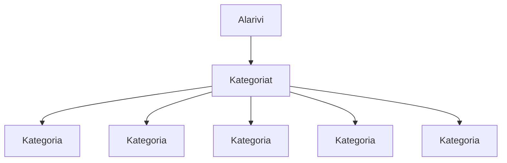

**palautettavien tiedostojen ja kansioiden nimet:** 

* tiedosto: `teht07/alarivi.svelte` (kansiossa: `harjoitukset/02-javascript/01-svelte/teht07/alarivi.svelte`)
* tiedosto: `teht07/kategoria.svelte` (kansiossa: `harjoitukset/02-javascript/01-svelte/teht07/kategoria.svelte`)
* tiedosto: `teht07/kategoriat.svelte` (kansiossa: `harjoitukset/02-javascript/01-svelte/teht07/kategoriat.svelte`)

Aiemmassa tehtävässä tehtiin verkkokaupan ylä- ja alapalkkia perinteisellä html:llä ja css:llä.

Nyt voitaisiinkin lähteä siirtämään osaa tästä aiemmin tehdystä sivusta komponenttien muotoon.

Aloitetaan tämä yläpalkin alarivistä, joka sisältää kategoriat.

Luomme aluksi kategorialle oman komponentin:

`teht07/kategoria.svelte`:

```svelte
<script>
  let { nimi, url } = $props(); 
</script>

<style>
  /* 
  Lisää tähän tyylit kategorialle. 
  */
</style>

<div>
  <a href={url}>{nimi}</a>
</div>
```

Nyt kun meillä on olemassa kategoria-komponentti, 
voimme käyttää sitä kategoriat-komponentin sisällä, useampaan kertaan.

`teht07/kategoriat.svelte`:

```svelte
<script>
  import Kategoria from './kategoria.svelte';
</script>

<style>
  /* 
  Lisää tähän tyylit kategoriat-komponentille. 
  */
</style>

<ul>
  <li>
    <Kategoria nimi="tietokone" url="#" />
  </li>
  <li>
    <Kategoria nimi="komponentit" url="#" />
  </li>
  <li>
    <Kategoria nimi="oheislaitteet" url="#" />
  </li>
  <li>
    <Kategoria nimi="pelaaminen" url="#" />
  </li>
  <li>
    <Kategoria nimi="sim racing" url="#" />
  </li>
  <li>
    <Kategoria nimi="verkkotuotteet" url="#" />
  </li>
  <li>
    <Kategoria nimi="tarvikkeet" url="#" />
  </li>
  <li>
    <Kategoria nimi="erikoistuotteet" url="#" />
  </li>
  <li>
    <Kategoria nimi="ohjelmistot" url="#" />
  </li>
  <li>
    <Kategoria nimi="palvelut" url="#" />
  </li>
  <li>
    <Kategoria nimi="kampanjat" url="#" />
  </li>
</ul>
```

Lopuksi voimme käyttää kategoriat osaa alarivillämme.

`teht07/alarivi.svelte`:

```svelte
<script>
  import Kategoriat from './kategoriat.svelte';
</script>

<style>
  /* 
  Lisää tähän tyylit kategoriat-komponentille. 
  */
</style>

<Kategoriat />
```

#### Lisätehtävä

Huomaa, että tässä vaiheessa olemme vielä, `kategoriat.svelte`-komponentissa, kovakoodanneet `ul`-elementin sisällön svelten html-elementeiksi.

Yleensä `ul`-elementin sisältö kuitenkin määritellään datasta, jonka komponentti saa propsinaan.

Voit myöhemmin, kun olemme oppineet käyttämään svelten `each`-rakennetta, palata `kategoriat.svelte`-komponenttiin, 
ja muuttaa sen määrittämään kategoriat taulukossa, josta `li`-elementit rakennetaan käyttäen svelten `each`-rakennetta.

Voit kuitenkin toistaiseksi jättää `kategoriat.svelte`-komponentin aiemmin määritettyyn muotoonsa.

### Tehtävä 8 - verkkokaupan yläpalkin ylärivi

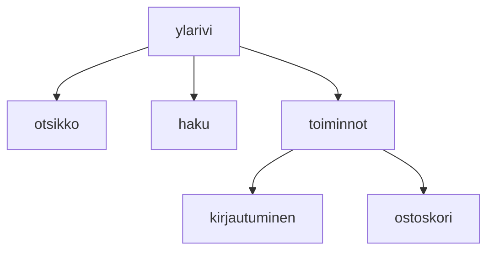

**palautettavien tiedostojen ja kansioiden nimet:** 

* tiedosto: `teht08/ylarivi.svelte` (kansiossa: `harjoitukset/02-javascript/01-svelte/teht08/ylarivi.svelte`)
* tiedosto: `teht08/otsikko.svelte` (kansiossa: `harjoitukset/02-javascript/01-svelte/teht08/otsikko.svelte`)
* tiedosto: `teht08/haku.svelte` (kansiossa: `harjoitukset/02-javascript/01-svelte/teht08/haku.svelte`)
* tiedosto: `teht08/toiminnot.svelte` (kansiossa: `harjoitukset/02-javascript/01-svelte/teht08/toiminnot.svelte`)
* tiedosto: `teht08/kirjautuminen.svelte` (kansiossa: `harjoitukset/02-javascript/01-svelte/teht08/kirjautuminen.svelte`)
* tiedosto: `teht08/ostoskori.svelte` (kansiossa: `harjoitukset/02-javascript/01-svelte/teht08/ostoskori.svelte`)

Tee seuraavaksi yläpalkin ylärivin komponentit.

Määritä komponentit sen perusteella, mitä sisältöä niistä referenssisivulta löytyy.

Komponentit järjestyvät siten, että `ylärivi.svelte` sisältää seuraavat komponentit:

* `otsikko.svelte`
* `haku.svelte`
* `toiminnot.svelte`

Vastaavasti `toiminnot.svelte` sisältää komponentit:

* `kirjautuminen.svelte`
* `ostoskori.svelte`

#### Huomautus kuvista

Kuvien osalta palvelin on tällä hetkellä konfigoroitu virheellisesti. 
Tämän takia kuvat eivät näy, jos ne laitetaan svelte-tiedostojen välittömään yhteyteen.

Tässä tehtävässä kuvia olisi tarvetta käyttää ylärivin toiminnot-komponentin alikomponenteissa, 
sekä hakupalkissa.

Jos haluat käyttää kuvia komponenteissa, 
pitää kuvat sijoittaa hakemistoon [`harjoitukset-apu/static/harjoitukset`](harjoitukset-apu/static/harjoitukset).

Tällöin polku kuvalle `joku-kuva.png` olisi `harjoitukset-apu/static/harjoitukset/joku-kuva.png`.
Kuviin viitataan svelte-komponentin sisältä polulla `/harjoitukset/<kuvan nimi>`.

Esimerkiksi edellä mainittua `joku-kuva.png` kuvaa käytettäisiin img-elementin sisällä seuraavasti:

```svelte

```

Normaalisti voisit sijoittaa kuvat suoraan `static`-kansioon,
mutta tässä tapauksessa pyrimme estämään vahingossa tapahtuvia versionhallinnan konflikteja,
luomalla `static`-kansion alle `harjoitukset`-kansion,
joka on vain opiskelijoiden käytössä.

Github classroomin ongelmana on, 
että kun classroomin päärepo on piilotettu,
niin kuin tässä tapauksessa on,
versionhallinnan konfliktien korjaaminen on mahdollista helposti vain opettajille, jotka näkevät päärepon.
Tämän takia joudumme tässä yhteydessä tekemään asiat hieman vaikeammin.

### Tehtävä 9 - verkkokaupan yläpalkki

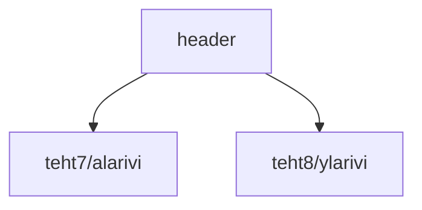

**palautettavien tiedostojen ja kansioiden nimet:** 

* tiedosto: `teht09/header.svelte` (kansiossa: `harjoitukset/02-javascript/01-svelte/teht09/header.svelte`)

Kootaan edelliset tehtävät yhdeksi kokonaisuudeksi, sivun yläpalkiksi.

`header.svelte` pitää sisällään seuraavat alikomponentit:

* ylärivi
* alarivi

Älä kirjoita ylä- ja alapalkkia uudelleen uusiin tiedostoihin, 
vaan linkitä tehtävien 7 ja 8 toteutukset käyttöön tähän komponenttiin.

### Tehtävä 10 - verkkokaupan alapalkin virallinen-osio

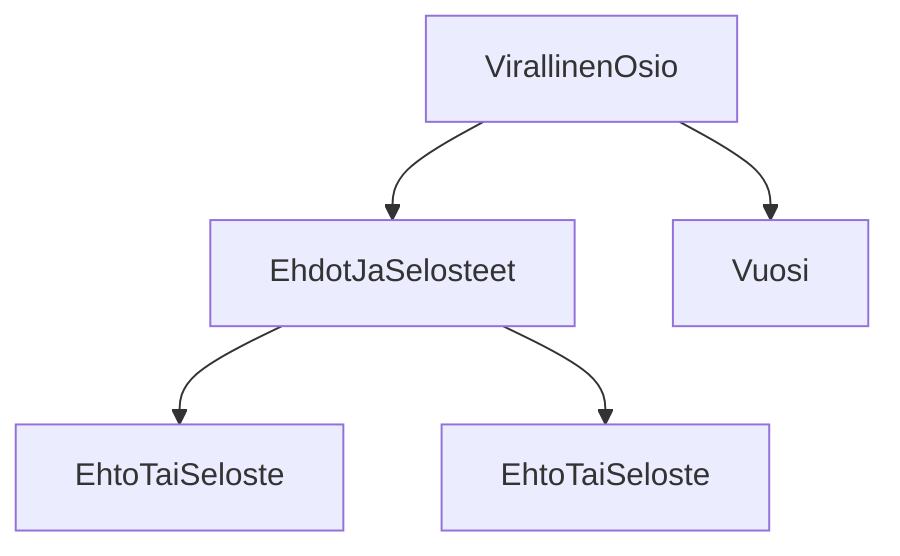

**palautettavien tiedostojen ja kansioiden nimet:**

* tiedosto: `teht10/virallinen-osio.svelte` (kansiossa: `harjoitukset/02-javascript/01-svelte/teht10/virallinen-osio.svelte`)
* tiedosto: `teht10/ehdot-ja-selosteet.svelte` (kansiossa: `harjoitukset/02-javascript/01-svelte/teht10/ehdot-ja-selosteet.svelte`)
* tiedosto: `teht10/ehto-tai-seloste.svelte` (kansiossa: `harjoitukset/02-javascript/01-svelte/teht10/ehto-tai-seloste.svelte`)
* tiedosto: `teht10/vuosi.svelte` (kansiossa: `harjoitukset/02-javascript/01-svelte/teht10/vuosi.svelte`)

Tässä tehtävässä toteutetaan sivun alapalkin virallinen osio, 
jossa listataan ehtoja ja selosteita, 
sekä kerrotaan minä vuonna sivustoa on viimeksi päivitetty.

#### Vuosi-komponentti

Aloitetaan `vuosi.svelte`-komponentista.

Sen tulee näyttää vain vuosi, jona sivua on päivitetty. 
Sivuston nimeä, tai muuta ei versiossamme tarvitse näyttää tämän komponentin sisällä.

Laiskana ihmisenä voit halutessasi kirjoittaa lyhyen javascript-skriptin, 
joka näyttää komponentin sisällä tekstinä kuluvan vuoden.
Tällöin vältytään päivittämästä vuositekstiä vuosittain.

#### Ehdot ja selosteet -lista ja sen toteuttamiseen käytetyt komponentit

Siinä missä yläpalkissa kovakoodasimme (engl. hard code) datan osaksi komponentteja,
tässä komponentissa lähdemmekin käyttämään svelten `each`-rakennetta.
Svelten `each`-rakenne muistuttaa perinteistä ohjelmointikielten "for each"-rakennetta.

Tässä osassa luodaan ensin komponentti listan alkiolle, 
ja sen jälkeen kootaan nämä yhteen listaksi, 
syöttäen niihin dataa.

##### Svelten `each`-rakenne

Svelten `each`-rakenne toimii käyttäen `{#each}`- ja `{/each}`-syntaksia.
Ensimmäisellä ilmaistaan aloitus, ja jälkimmäisellä lopetus.

`{#each}`-osassa määritetään:

* taulukko, jota käydään läpi
* alkion nimi, joka taulukosta otetaan vuorollaan käsittelyyn

Se näyttää siis seuraavalta:

```svelte
{#each alkiot as alkio}
  {alkio}
{/each}
```

Ideana on siis, että `alkiot`-taulukko käydään läpi alkio kerrallaan, 
ja kukin alkion arvoista asetetaan vuorollaan `alkio`-muuttujan sisälle.
Tämän jälkeen `alkio`-muuttuja on svelten käytettävissä komponentin sisällä.

Kokonaisuudessaan käyttö näyttää seuraavalta:

```svelte
<script>
let alkiot = ["eka", "toka", "kolmas"];
</script>

{#each alkiot as alkio}
<div>{alkio}</div>
{/each}
```

##### Ehto tai seloste -listan alkio -komponentti

Listan alkion tulee ottaa vastaan parametrina (prop): 

* `url` - josta ehto tai seloste löytyy
* `nimi` - ehdon tai selosteen nimi, joka näytetään listassa

Komponentti siis näyttää ehdon tai selosteen nimen, 
ja sille linkkinä url:n, 
josta kyseisen virallisen tekstin voi lukea kokonaisuudessaan.

Emme siis kovakoodaa alkiokomponenttiin itseensä tietoja ehdoista tai selosteista.

Näin ollen, voimme myöhemmin helposti datana lisätä ehtoja ja selosteita lisää.

Tämän komponentin ei pitäisi tietää mitään sen tulevasta käyttöpaikasta osana listaa.
Älä siis lisää tälle komponentille `li`-elementtiä, sillä siitä vastaa tällä kertaa listakomponentti.

Lyhykäisyydessään komponentin html-rakenne voi siis näyttää esim. seuraavalta:

```html
<div>
  <a href="url">nimi</a>
</div>
```

Komponentti on oikeastaan aika yksinkertainen.

Miksi määrittelemme sen erillisessä komponentissa, 
emmekä vain suoraan listakomponentin sisällä?
Tällä tavoin voimme piilottaa komponenttiin liittyvät yksityiskohdat listakomponentilta.
Listakomponentin tehtäväksi jää tällöin vain listan jakaminen alkiokomponenteiksi.

Halutessamme myöhemmin, voisimme muuttaa alkiokomponentin hyvinkin monimutkaiseksi esitys- tai toimintatavaltaan, 
ilman, että listakomponentin tarvitsisi tietää tästä muutoksesta mitään.

Tästä tekniikasta käytetään akateemista termiä ["separation of concerns"](https://en.wikipedia.org/wiki/Separation_of_concerns) 
(suomeksi vaikka: vastuualueiden erittely). 
Se tarkoittaa, että jos yhdellä koodinpätkällä on monta toisistaan erillistä tehtävää, 
yksittäisen tehtävän ymmärtämisestä tulee helpompaa, 
jos sitä käsitellään muista erillään.
Siis esimerkiksi, jos koiran pitää haukkua ja syödä, eivätkä nämä liity toisiinsa, 
kannattaa ne myös koodissa irrottaa toisistaan, ja toteuttaa itsenäisinä toiminnallisuuksina.
Tämä on kuitenkin vähän akateemisempi käsite, eikä sitä terminä tarvitse itse osata käyttää.
Se on kuitenkin ihan hyvä tuntea, 
koska se on oikeastaan aika lailla maalaisjärkeen perustuva ajatus: 
ei tehdä asioista vaikeita, vaan pilkotaan asioita pienemmiksi.

Eli listan vastuualueisiin kuuluu siis vain listauksen tuottaminen, ei alkion näyttäminen - se on alkiokomponentin vastuulla.

##### Ehdot ja selosteet -listakomponentti

Tämä komponentti vastaa alkiokomponenttien käytöstä listan näyttämiseen, sekä listan datan määrittämisestä.

Myöhemmin saatamme muuttaa komponentin hakemaan datan jostain muualta, 
mutta ainakin näin alkuun,
kovakoodaamme listan sisältämän datan itse komponenttiin.

Tämä komponentti vastaa sekä `<ul>` että `<li>` -elementtien käytöstä.

Eli sen pitäisi näyttää suurin piirtein seuraavalta:

```svelte
<!-- lataa Alkio-alikomponentti svelten käytettäväksi -->

<script>
  let alkiot = [
    {nimi: "a", url: "#"},
	{nimi: "b", url: "#"}
  ]
</script>

<ul>
  {#each alkiot as alkio}
  <li>
    <Alkio {...alkio} />
  </li>
  {/each}
</ul>
```

Lisää siis komponentin sisälle `ehdot_ja_selosteet`-taulukko, 
joka sisältää referenssikuvan mukaiset ehdot ja selosteet datana.
Tämän jälkeen komponentti luo jokaista taulukon alkiota kohden yhden `ehto-tai-seloste.svelte`-komponentin.

Muista lisätä komponentille sopivat tyylit.

#### Virallinen-osio -komponentti kokoaa osat yhteen

Kokoa kaikki edellä toteutettu yhteen `virallinen-osio.svelte`-komponentissa.

Sen pitäisi siis näyttää komponentit:

* Ehdot ja selosteet -listakomponentti
* vuosi-komponentti

#### Muuta huomioitavaa

Määritä komponenteille itsenäisesti tyylit. Mieti, mitkä tyylit tulee määritellä minkäkin komponentin sisällä.

### Tehtävä 11 - verkkokaupan alapalkin otsikot

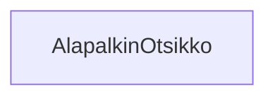

**palautettavien tiedostojen ja kansioiden nimet:** 

* tiedosto: `teht11/alapalkin-otsikko.svelte` (kansiossa: `harjoitukset/02-javascript/01-svelte/teht11/alapalkin-otsikko.svelte`)

Muokkaa `alapalkin-otsikko`-komponenttia.

Komponentti saa seuraavat parametrit (props):

* `teksti` - otsikon teksti

Yksinkertaisuudessaan komponentti näyttää siis sille annetun tekstin `h2`-elementin sisällä.

### Tehtävä 12 - verkkokaupan alapalkin aukioloajat

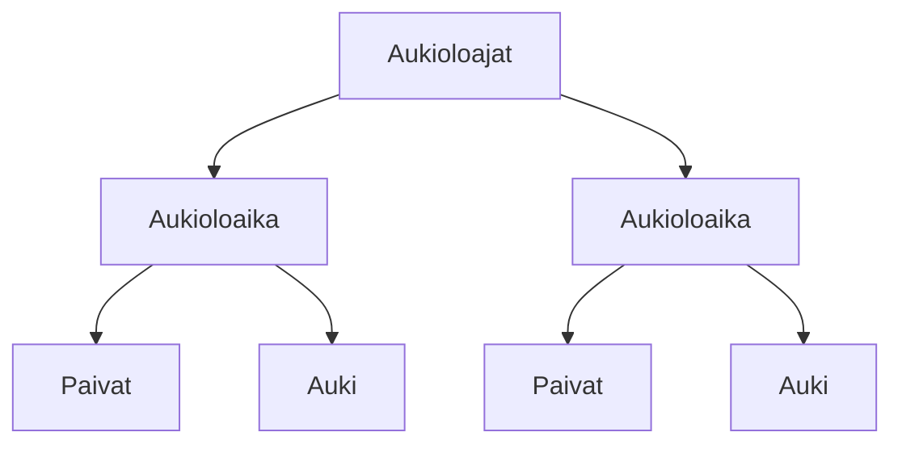

**palautettavien tiedostojen ja kansioiden nimet:** 

* tiedosto: `teht12/aukioloajat.svelte` (kansiossa: `harjoitukset/02-javascript/01-svelte/teht12/aukioloajat.svelte`)
* tiedosto: `teht12/aukioloaika.svelte` (kansiossa: `harjoitukset/02-javascript/01-svelte/teht12/aukioloaika.svelte`)
* tiedosto: `teht12/paivat.svelte` (kansiossa: `harjoitukset/02-javascript/01-svelte/teht12/paivat.svelte`)
* tiedosto: `teht12/auki.svelte` (kansiossa: `harjoitukset/02-javascript/01-svelte/teht12/auki.svelte`)

#### Paivat-komponentti

`paivat.svelte`-komponentti saa parametrit (props):

* `paivat` - merkkijonotaulukko, joka pitää sisällään päivät, joita aukioloajat koskevat.

Komponentti saa `paivat`-parametrissa 0-n päivää merkkijonomuotoista päivää, merkittynä kahdella kirjaimella.
Se voi siis saada listassa esimerkiksi 100 päivää.

Se listaa asioita eri tavoin, riippuen saamastaan arvosta:

* jos `paivat`-parametria ei ole annettu, tai lista on tyhjä, komponentti näyttää tekstin "Ma-Su".
* se listaa paivat siinä järjestyksessä, jossa ne on listaan merkitty. Päivät voivat olla maanantaista keskiviikkoon, mutta myös kalenteriviikon ulkopuolisesti lauantaista tiistaihin.
* jos kaksi tai useampi päivistä on peräkkäisiä päiviä, merkitään vain ensimmäinen ja viimeinen peräkkäinen päivä, eroteltuna `-`-viivalla.
* jos kaksi listattua päivää eivät ole peräkkäisiä, ne merkitään pilkulla ja välilyönnillä eroteltuna.

Huomaa, että haluat tyylitellä jokaisen päivän alkamaan isolla kirjaimella.

#### Auki-komponentti

`auki.svelte`-komponentti saa parametrit (props):

* `aukeaa` - merkkijonona aika. Esim. "10:00", "10", "aamu".
* `sulkeutuu` - merkkijonona aika. Esim. "15:00", "15", "ilta".

Saamiensa parametrien pohjalta komponentti näyttää eri asioita:

* jos molemmat arvot puuttuvat, näytetään teksti "24 / 7". Huomioi tässä, että merkkien ja numeroiden väliset tyhjät tilat vastaavat muuta muotoilua. 
* jos jompi kumpi parametreistä on annettu, näytetään arvojen välissä viiva.
* jos `aukeaa`-parametri on annettu, näytetään se ennen viivaa.
* jos `sulkeutuu`-parametri on annettu, näytetään se viivan jälkeen.

#### Aukioloaika-komponentti

`aukioloaika.svelte`-komponentti on yksinkertaisempi komponentti.

Se saa parametrina:

* `paivat` - merkkijonolista
* `auki` - avainarvotietuetaulukko (engl. array of maps)
  * jokainen avainarvotietue pitää sisällään kaksi mahdollista avainta: `aukeaa`, `sulkeutuu`.

Se renderöi seuraavat komponentit:

* `paivat.svelte`
  * antaa komponentille parametrina itse saamansa `paivat`-parametrin
* `auki.svelte`
  * renderöi pilkulla eroteltuna yhden komponentin jokaista taulukon alkiota kohden.
  * antaa komponentille avainarvotietueen avaimet ja niitä vastaavat arvot.
  * aukioloaikoja voi siis olla yksi tai useampi: esim. "10-14, 20-21.30"

#### Aukioloajat-komponentti

`aukioloajat.svelte`-komponentti saa parametrit:

* `ajat` - avainarvotietuetaulukko

Toiminnallisuus:

* Se näyttää sivulla yhden `aukioloaika.svelte`-komponentin jokaista taulukon alkiota kohden.
	* Se antaa komponentille eteenpäin kaikki taulukonalkiossa olevat avainarvotietueen avaimet ja niitä vastaavat arvot. 
	  Se ei siis itse ole kiinnostunut siitä, mitä alkio pitää sisällään, muutoin kuin, että se on avainarvotietue.

### Tehtävä 13 - ikoni-ja-teksti -komponentti

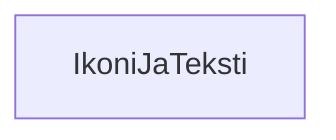

**palautettavien tiedostojen ja kansioiden nimet:** 

* tiedosto: `teht13/ikoni-ja-teksti.svelte` (kansiossa: `harjoitukset/02-javascript/01-svelte/teht13/ikoni-ja-teksti.svelte`)

Komponentti saa parametrit:

* `kuva` - kuva
* `teksti` - merkkijono tai merkkijonotaulukko

Tätä komponenttia käytetään sivulla useammassa paikassa apuna. 
Sitä käytetään osoitetietoihin sekä info-sivujen näyttämiseen.

Komponentti näyttää sille annetun kuvan tekstin vasemmalla puolella.

Jos `teksti`-parametri on tavallinen merkkijono, näytetään se yhdellä rivillä.
Jos se kuitenkin onkin taulukko, pitäen sisällään useamman merkkijonon, 
näytetään jokainen näistä omalla rivillään. 
Jälkimmäinen näkyy referenssikuvassa katuosoitteen muodossa.

#### Svelten if-blokki sekä javascriptin `Array.isArray()` ja arrayn tyypin tarkistus

Tätä tehtävää varten joudut tarkastamaan, onko `teksti`-propin arvona merkkijono vai taulukko. 

Tämä onnistuu käyttäen kahta tekniikkaa:

* svelten `if`-block
* javascriptin `Array.isArray()`-funktio

##### Svelten if-blokki

Svelte tarjoaa mahdollisuuden käyttää kahta erilaista if-operaatiota:

* javascriptin perinteinen if-lause
* svelten oma html:n sekaan lisätttä if-blokki

Tässä käytämme jälkimmäistä tekniikkaa.

Svelten `if`-blokki asetetaan html:n sekaan, ja se näyttää seuraavalta:

```svelte
<div>
{#if käytetäänköVirallistaTervehdystä}
	Tervehdys!
{:else}
	Moippa!
{/if}
</div>
```

Tässä määritimme `<div>`-elementin, jonka sisällä näytämme joko tekstin "Tervehdys!" tai "Moippa!", 
sen mukaan onko `käytetäänköVirallistaTervehdystä`-muuttujan boolean arvo true vai false.

##### javascriptin `Array.isArray()` ja arrayn tyypin tarkistus

Seuraavaksi joudumme tarkistamaan, onko `teksti`-propin arvo taulukko (engl. array).

Tämän voimme tehdä käyttäen javascriptin `Array.isArray`-funktiota.

`Array.isArray()`-funktio saa parametrikseen testattavan arvon, ja palauttaa boolean-arvon (`true` tai `false`),
sen mukaan, onko parametrina annettu arvo taulukko.

```javascript
// seuraavat ovat taulukoita
Array.isArray([]) // true
Array.isArray([1]) // true
Array.isArray([""]) // true
Array.isArray(["hei"]) // true

// parametri voi tulla myös muuttujan sisällä
const taulu = [];
Array.isArray(taulu) // true

// seuraavat eivät ole taulukoita
Array.isArray() // false
Array.isArray(undefined) // false
Array.isArray(1) // false
Array.isArray("") // false
Array.isArray("hei") // false
Array.isArray({}) // false
```

##### Yhteenvetona

```svelte
<div>
{#if Array.isArray(teksti)}
	<!-- tähän svelten each-blokki, jossa käyt läpi taulukon arvot -->
{:else}
	{teksti}
{/if}
</div>
```

### Tehtävä 14 - sosiaalisen median yhteisöt

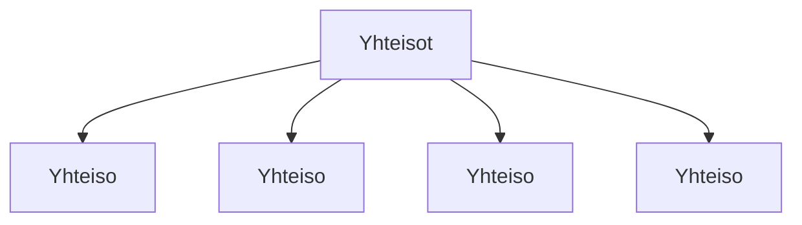

**palautettavien tiedostojen ja kansioiden nimet:** 

* tiedosto: `teht14/yhteiso.svelte` (kansiossa: `harjoitukset/02-javascript/01-svelte/teht14/yhteiso.svelte`)
* tiedosto: `teht14/yhteisot.svelte` (kansiossa: `harjoitukset/02-javascript/01-svelte/teht14/yhteisot.svelte`)

#### yhteisö-komponentti

`yhteiso.svelte`-komponentti saa parametrit:

* `nimi` - merkkijono, pitää sisällään sosiaalisen median yhteisön nimen
* `url` - url merkkijonona, joka johtaa yhteisössä olevalle tilille

Komponenttia käytetään:

```svelte
<Yhteiso nimi="" url="" />
```

Komponentti käyttää seuraavaa avainarvotietuetta ikonien tilanvaraajien valintaan:

```json
{
  "facebook": "fb",
  "twitter": "x",
  "x": "x",
  "instagram": "ng",
  "linkedin": "in"
}
```

Komponentti näyttää annetun `nimi`-parametrin arvon perusteella kyseisen somen lyhenteen, seuraavin huomioin:
* jos `nimi`-parametrin arvo löytyy tietueesta, näytetään sitä vastaava arvo.
* Jos `nimi`-parametrin arvo ei löydy tietueesta, näytetään sen tilalla `?`-merkkiä.
* jos komponentille annetaan merkkijono "facebook", se näyttää tekstin "fb".
* Komponentin ei pitäisi välittää siitä, onko sille annettu merkkijono kirjoitettu isoilla tai pienillä kirjaimilla.

Komponentti tekee myös nimestä linkin, käyttäen `url`-parametrina annettua arvoa.

#### yhteisöt-listakomponentti

`yhteisot.svelte`-komponentti saa parametrit:

* `yhteisot` - avainarvotietuetaulukko, sisältäen avaimet: `nimi`, `url`

Komponenttia käytetään:

```svelte
<Yhteisot yhteisot={yhteisot} />
```

Komponentti näyttää yhden `yhteiso.svelte`-komponentin jokaista taulukon alkiota kohden. 
Antaa alkion arvot komponentille.

### Tehtävä 15 - yhteystiedot

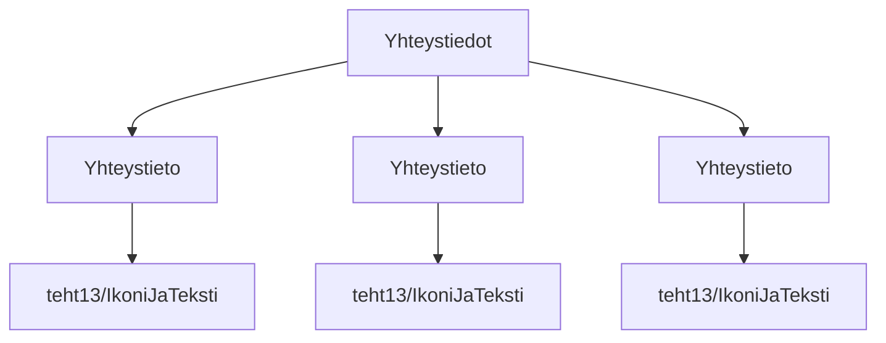

**palautettavien tiedostojen ja kansioiden nimet:** 

* tiedosto: `teht15/yhteystieto.svelte` (kansiossa: `harjoitukset/02-javascript/01-svelte/teht15/yhteystieto.svelte`)
* tiedosto: `teht15/yhteystiedot.svelte` (kansiossa: `harjoitukset/02-javascript/01-svelte/teht15/yhteystiedot.svelte`)

#### yhteystieto-komponentti

`yhteystieto.svelte`-komponentti saa parametrit:

* `tyyppi` - merkkijono
* `teksti` - merkkijono tai merkkijonotaulukko

Komponenttia käytetään `teksti`-parametrin ollessa merkkijono:

```svelte
<Yhteystieto tyyppi="" teksti="" />
```

tai `teksti`-parametrin ollessa merkkijonotaulukko:

```svelte
<Yhteystieto tyyppi="" teksti={["","",""]} />
```

Komponentti näyttää `tyyppi`-parametria vastaavan ikonin.

`tyyppi` voi saada arvon seuraavalta listalta:

```json
[
  "puhelin",
  "sähköposti",
  "osoite",
  "muu"
]
```

Voit itse valita mitä ikoneita haluat näyttää mitäkin tyyppiä kohden.

Näyttää `ikoni-ja-teksti.svelte`-komponentin, jolle antaa `kuva`- ja `teksti`-parametreina jatkojalostamansa tiedot.
`teksti`-parametrin arvon voi antaa eteenpäin sellaisenaan.

#### yhteystiedot-komponentti

yhteystiedot saa parametrit:

* `yhteystiedot` - avainarvotietuetaulukko

Yhteystiedot luo jokaista taulukon alkiota kohden listaan yhden listaelementin, 
joka saa lapsekseen `yhteystieto.svelte`-komponentin, 
ja antaa tälle tietueen avaimet ja niitä vastaavat arvot parametrina.

### Tehtävä 16 - shop-in-shops -listaus

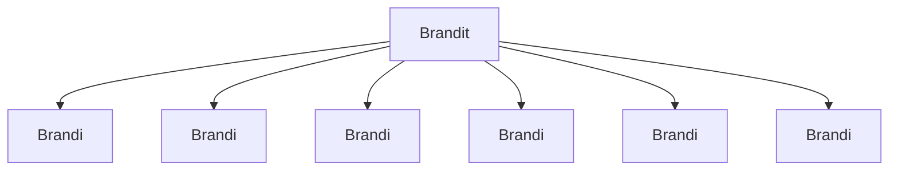

**palautettavien tiedostojen ja kansioiden nimet:** 

* tiedosto: `teht16/brandi.svelte` (kansiossa: `harjoitukset/02-javascript/01-svelte/teht16/brandi.svelte`)
* tiedosto: `teht16/brandit.svelte` (kansiossa: `harjoitukset/02-javascript/01-svelte/teht16/brandit.svelte`)

Brandi-komponentti saa parametrina:

* `url` - url brandin sivulle
* `nimi` - nimi

Määritä itse brandit-komponentin sisällä taulu, josta luot brandi-komponentteja.


### Tehtävä 17 - artikkelit ja blogit -listaus

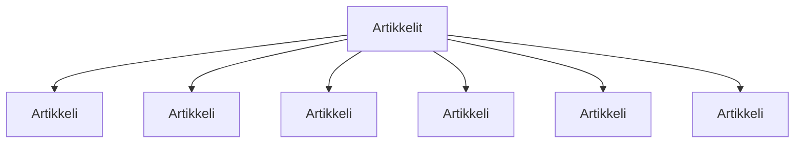

**palautettavien tiedostojen ja kansioiden nimet:** 

* tiedosto: `teht17/artikkeli.svelte` (kansiossa: `harjoitukset/02-javascript/01-svelte/teht17/artikkeli.svelte`)
* tiedosto: `teht17/artikkelit.svelte` (kansiossa: `harjoitukset/02-javascript/01-svelte/teht17/artikkelit.svelte`)

Twist: lisätään artikkelin nimen merkkijonon alkuun muualta saatu etuliite.

Käytä tähän svelten kontekstia avaimella `"sivuston-nimi"`.
Jos kontekstia ei ole tarjolla, jätä etuliite pois.

* context: https://svelte.dev/docs/svelte/context

Artikkeli-komponentti saa parametrina:

* `url` - url artikkeliin
* `nimi` - nimi

Määritä itse artikkelit-komponentin sisällä taulu, josta luot artikkeli-komponentteja.

### Tehtävä 18 - infot-listaus

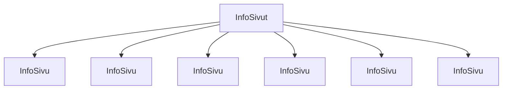

**palautettavien tiedostojen ja kansioiden nimet:** 

* tiedosto: `teht18/info-sivu.svelte` (kansiossa: `harjoitukset/02-javascript/01-svelte/teht18/info-sivu.svelte`)
* tiedosto: `teht18/info-sivut.svelte` (kansiossa: `harjoitukset/02-javascript/01-svelte/teht18/info-sivut.svelte`)

info-sivu -komponentti saa parametrina:

* `url` - url sivulle
* `nimi` - nimi

Määritä itse info-sivut -komponentin sisällä taulu, josta luot info-sivu -komponentteja.

### Tehtävä 19 - palkinnot-listaus

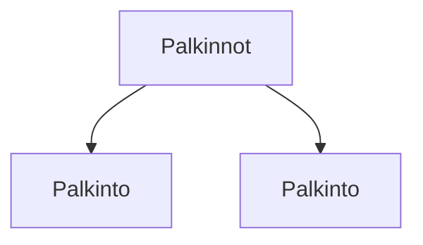

**palautettavien tiedostojen ja kansioiden nimet:** 

* tiedosto: `teht19/palkinto.svelte` (kansiossa: `harjoitukset/02-javascript/01-svelte/teht19/palkinto.svelte`)
* tiedosto: `teht19/palkinnot.svelte` (kansiossa: `harjoitukset/02-javascript/01-svelte/teht19/palkinnot.svelte`)

info-sivu -komponentti saa parametrina:

* `url` - url sivulle
* `kuva` - url kuvaan

Määritä itse palkinnot-komponentin sisällä taulu, josta luot palkinto-komponentteja.

### Tehtävä 20 - alapalkin vertikaalinen osio

Tehtävää 20 on poistettu, eikä sitä tarvitse tehdä. 

Se ei lopulta ollut niin mielekäs, kuin alunperin oli suunniteltu.

~Tässä tehtävässä määritettyjä komponentteja käytetään vertikaalisten sisältöjen erotteluun horisontaalisilla viivoilla.
Tätä käytetään siis asiakaspalvelu- ja yritysmyynti-osioiden erotteluun, 
mutta myös footerin harmaan osan jakamiseen viivalla vertikaalisesti kahtia.~


### Tehtävä 21 - alapalkin osio

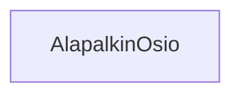

**palautettavien tiedostojen ja kansioiden nimet:** 

* tiedosto: `teht21/alapalkin-osio.svelte` (kansiossa: `harjoitukset/02-javascript/01-svelte/teht21/alapalkin-osio.svelte`)

Komponentti, joka vastaa otsikon ja otsikkoa vastaavan sisällön näyttämisestä.

Saa parametrina:

* `otsikko` - sarakkeen otsikko.
* `otsikkotaso` - merkkijono - oletusarvona "h2"
* saa komponentin sisältönä (eli lapsena) osion sisällön.

Näyttää otsikon, jonka tekstiksi asettaa `otsikko`-parametrin arvon.
Otsikon elementti määräytyy `otsikkotaso`-parametrin perusteella.

Palauttaa seuraavan html:n (kun `otsikkotaso` on "h2"):

```svelte
<div class="alapalkin-osio">
  <h2 class="alapalkin-osio__otsikko">{otsikko}</h2>
  <div class="alapalkin-osio__sisältö">{sisältö}</div>
</div>
```

Tätä varten joudut kuitenkin määrittämään edelliseen esimerkkiin 
`h2`-elementin tilalle oikean elementin käyttäen `<svelte:element>`-syntaksia.

#### `svelte:element` ja elementin valinta muuttujan perusteella

Kun halutaan valita dynaamisesti html-elementti, kuten tässä tehtävässä tehdään `otsikkotaso`-muuttujan avulla,
voidaan tämä tehdä käyttäen `svelte:element`-elementtiä, joka on svelten oma työkalu tällaista tilannetta varten.

`svelte:element`-elementille annetaan `this`-attribuutti, joka saa merkkijonona sen elementin nimen, 
jonka elementin halutaan luovan.

Esimerkiksi seuraavassa svelte-koodissa määritämme dynaamisesti `div`-elementin:

```svelte
<svelte:element this={"div"}>tässä on div-elementti</svelte:element>
```

joka siis luo seuraavan html:n:

```html
<div>tässä on div-elementti</div>
```

Käytännössä tilanteet, joissa `svelte:element`-elementtiä tarvitaan ovat verrattain harvinaisia.
Yleensä voimme staattisesti määrittää suoraan haluamamme elementin nimeltä, kuten normaalisti html:ssä.

Välillä kuitenkin haluamme dynaamisesti valita myös elementin, 
kuten tässä tehtävässä, ja silloin `svelte:element` on hyödyllinen.

### Tehtävä 22 - alapalkin sarake

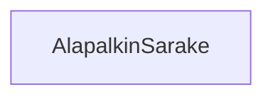

**palautettavien tiedostojen ja kansioiden nimet:** 

* tiedosto: `teht22/alapalkin-sarake.svelte` (kansiossa: `harjoitukset/02-javascript/01-svelte/teht22/alapalkin-sarake.svelte`)

Vastaa alapalkin sarakkeiden piirtämisestä. Keskeinen vastuualue on varmistaa, 
että viereisten sarakkeiden kanssa vie saman verran horisontaalista tilaa.

Saa parametrina:

* leveys - kokonaisluku - kertoo kuinka monta flex-yksikköä sarake vie tilaa. Oletusarvo: `1`.
* saa komponentin sisältönä (eli lapsena) sarakkeen sisällön.

Sarake saa tyylinä säännön `flex: {leveys};`.

Tehtävässä tarvitaan `@render`-riimua ja `children`-propia. Näistä lisää seuraavaksi.

#### elementille annetun sisällön hahmontaminen käyttäen `@render`-riimua ja `children`-proppia

Tähän mennessä on käytetty komponenteille annettavia propseja muodossa joka muistuttaa html-elementille annettavia attribuutteja.

html:

```html
<html-elementti attribuutti="attribuutin arvo" />
```

komponentti:

```svelte
<komponentti attribuutti="attribuutin arvo" />
```

### Tehtävä 23 - alapalkin sisältö

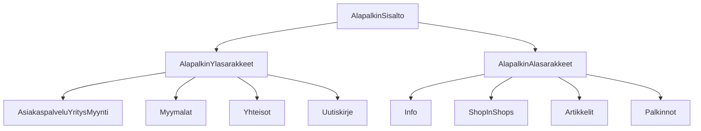

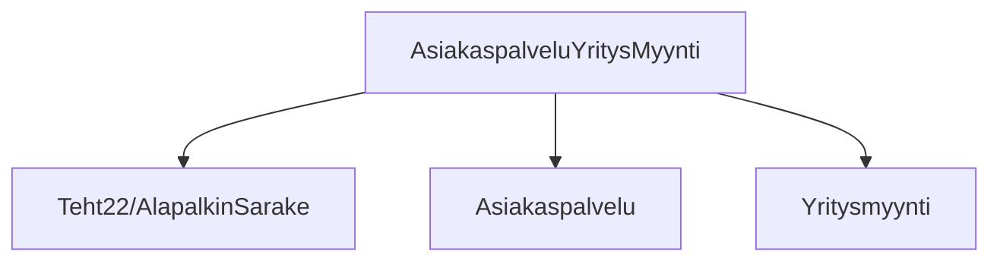

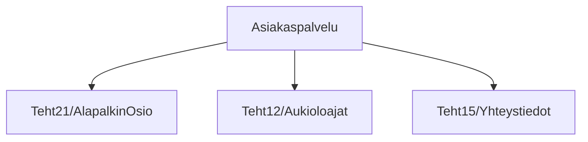

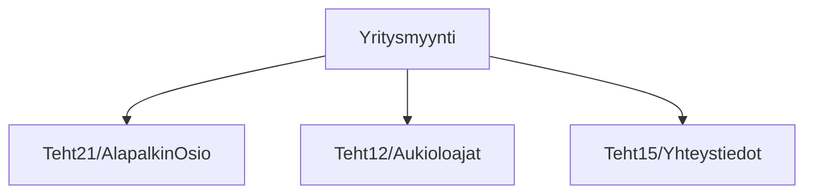

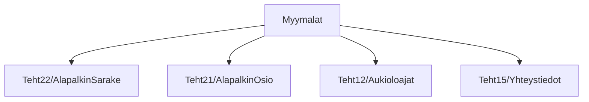

```mermaid
graph TD;
  Yhteisot-->alapalkinsarake[Teht22/AlapalkinSarake];
  Yhteisot-->alapalkinosio[Teht21/AlapalkinOsio];
  Yhteisot-->yhteisotlista[Teht14/Yhteisot];
```

```mermaid
graph TD;
  Info-->alapalkinsarake[Teht22/AlapalkinSarake];
  Info-->alapalkinosio[Teht21/AlapalkinOsio];
  Info-->infosivut[Teht18/InfoSivut];
```

```mermaid
graph TD;
  ShopInShops-->alapalkinsarake[Teht22/AlapalkinSarake];
  ShopInShops-->alapalkinosio[Teht21/AlapalkinOsio];
  ShopInShops-->Teht16/Brandit;
```

```mermaid
graph TD;
  Artikkelit-->alapalkinsarake[Teht22/AlapalkinSarake];
  Artikkelit-->alapalkinosio[Teht21/AlapalkinOsio];
  Artikkelit-->Teht17/Artikkelit;
```

```mermaid
graph TD;
  Palkinnot-->alapalkinsarake[Teht22/AlapalkinSarake];
  Palkinnot-->alapalkinosio[Teht21/AlapalkinOsio];
  Palkinnot-->palkinnotlistaus[Teht19/Palkinnot];
```

```mermaid
graph TD;
  Uutiskirje-->alapalkinsarake[Teht22/AlapalkinSarake];
  Uutiskirje-->alapalkinosio[Teht21/AlapalkinOsio];
```


**palautettavien tiedostojen ja kansioiden nimet:** 

* tiedosto: `teht23/alapalkin-sisalto.svelte` (kansiossa: `harjoitukset/02-javascript/01-svelte/teht23/alapalkin-sisalto.svelte`)
* tiedosto: `teht23/alapalkin-ylasarakkeet.svelte` (kansiossa: `harjoitukset/02-javascript/01-svelte/teht23/alapalkin-ylasarakkeet.svelte`)
* tiedosto: `teht23/alapalkin-alasarakkeet.svelte` (kansiossa: `harjoitukset/02-javascript/01-svelte/teht23/alapalkin-alasarakkeet.svelte`)
* tiedosto: `teht23/asiakaspalvelu-yritysmyynti.svelte` (kansiossa: `harjoitukset/02-javascript/01-svelte/teht23/asiakaspalvelu-yritysmyynti.svelte`)
* tiedosto: `teht23/asiakaspalvelu.svelte` (kansiossa: `harjoitukset/02-javascript/01-svelte/teht23/asiakaspalvelu.svelte`)
* tiedosto: `teht23/yritysmyynti.svelte` (kansiossa: `harjoitukset/02-javascript/01-svelte/teht23/yritysmyynti.svelte`)
* tiedosto: `teht23/myymalat.svelte` (kansiossa: `harjoitukset/02-javascript/01-svelte/teht23/myymalat.svelte`)
* tiedosto: `teht23/yhteisot.svelte` (kansiossa: `harjoitukset/02-javascript/01-svelte/teht23/yhteisot.svelte`)
* tiedosto: `teht23/uutiskirje.svelte` (kansiossa: `harjoitukset/02-javascript/01-svelte/teht23/uutiskirje.svelte`)
* tiedosto: `teht23/info.svelte` (kansiossa: `harjoitukset/02-javascript/01-svelte/teht23/info.svelte`)
* tiedosto: `teht23/shop-in-shops.svelte` (kansiossa: `harjoitukset/02-javascript/01-svelte/teht23/shop-in-shops.svelte`)
* tiedosto: `teht23/artikkelit.svelte` (kansiossa: `harjoitukset/02-javascript/01-svelte/teht23/artikkelit.svelte`)
* tiedosto: `teht23/palkinnot.svelte` (kansiossa: `harjoitukset/02-javascript/01-svelte/teht23/palkinnot.svelte`)

`alapalkin-sisalto.svelte`-komponentti näyttää kaiken alapalkin sisällön, joka näkyy alapalkin harmaalla alueella.

`alapalkin-ylasarakkeet.svelte`-komponentti näyttää kaikki alapalkin yläosan sarakkeet: 

* asiakaspalvelu ja yritysmyynti,
* myymälät,
* yhteisöt,
* uutiskirje

`alapalkin-ylasarakkeet.svelte`-komponentti näyttää kaikki alapalkin alaosan sarakkeet:

* info
* shop-in-shops
* artikkelit
* palkinnot 

Muut sarakekomponentit näyttävät saman nimisen sarakkeen tai sarakkeen osan (asiakaspavelu, yritysmyynti) alapalkista.

Käytä tähän aiemmin luotuja komponentteja, ja syötä niille parametrit, 
joilla saat tehtyä alapalkista referenssiä vastaavan näköisen.
Voit käyttää linkkien osoitteiden arvona `"#"`- relatiivista urlia.

`alapalkin-sisalto`-komponentti ei itse saa suoraan käyttää yhtään html-elementtiä, 
vaan kaikkien elementtien tulee olla määritetty muiden komponenttien sisällä.

### Tehtävä 24 - alapalkki

```mermaid
graph TD;
  Alapalkki-->AlapalkinSisalto[teht23/AlapalkinSisalto];
  Alapalkki-->VirallinenOsio[teht10/VirallinenOsio];
```

**palautettavien tiedostojen ja kansioiden nimet:** 

* tiedosto: `teht24/alapalkki.svelte` (kansiossa: `harjoitukset/02-javascript/01-svelte/teht24/alapalkki.svelte`)

Näyttää `alapalkin-sisalto.svelte`- ja `virallinen-osio.svelte`-komponentit.

### Tehtävä 25 - pudotusvalikko kategorioille

```mermaid
graph TD;
  KategoriaPudotusValikko-->KategoriaPudotusvalikkoSisalto;
```

**palautettavien tiedostojen ja kansioiden nimet:** 

* tiedosto: `teht25/kategoria-pudotusvalikko.svelte` (kansiossa: `harjoitukset/02-javascript/01-svelte/teht25/kategoria-pudotusvalikko.svelte`)
* tiedosto: `teht25/kategoria-pudotusvalikko-sisalto.svelte` (kansiossa: `harjoitukset/02-javascript/01-svelte/teht25/kategoria-pudotusvalikko-sisalto.svelte`)

Tässä tehtävässä luomme yläpalkin/headerin alarivin kategoria-napeille pudotusvalikon. Siis sen valkoisen osion, joka tulee näkyviin, kun yksittäistä kategoriaa hoveroidaan.

Pudotusvalikon luonnista vastaa `kategoria-pudotusvalikko.svelte`, kun taas sen sisällöstä vastaa `kategoria-pudotusvalikko-sisalto.svelte`-komponentti.
Myöhemmin muutamme sisällöstä vastaavan komponentin monimutkaisemmaksi.

`kategoria-pudotusvalikko.svelte`:

* ottaa vastaan kategoria `propin` ja antaa sen edelleen lapsenaan näyttämälleen `kategoria-pudotusvalikko-sisalto.svelte`-komponentille.

`kategoria-pudotusvalikko-sisalto.svelte`:

* ottaa `kategoria`-propin
* näyttää tilanvaraajatekstin "kategorian pudotusvalikon teksti"

Lisää lopuksi tämä pudotusvalikko jokaiselle kategoria-napille.

Kategoria-nappiin lisäyksen kriteerit:

* luo kategoria-napille uusi ylätason div, jonka lapsena on aiempi kategoria-napin sisältö, sekä uusi pudotusvalikko, sisältöineen,
* pudotusvalikko sisältöineen on normaalisti näkymätön,
* kun pudotusvalikon päällä pidetään hiirtä, tulee valikko näkyväksi,
* kun hiiri siirretään pudotusvalikon sisälle, pudotusvalikko säilyy edelleen näkyvänä,
* pudotusvalikon näytöstä vastaava logiikka perustuu pelkkään css:ään.

#### elementin valinta suhteessa toiseen elementtiin: lapseen tai sisarukseen

Tässä tehtävässä joudut valitsemaan elementin suhteessa toiseen elementtiin, jota hoveroidaan.

Tämä onnistuu kahdella eri css-valitsimella, jotka molemmat ovat yhdistelmävalitsimia:

* vanhempi-lapsi -valitsin: `.vanhempi .lapsi`
* sisarus-valitsin: `.vanhempi-sisar ~ .nuorempi-sisarus`

Se kumpaa näistä valitsimista käytät, riippuu siitä, miten asetat komponentit (kategoria ja pudotusvalikko) suhteessa toisiinsa.

Molemmissa tapauksissa css-säännöt, jotka valitsimelle annetaan, kohdistuvat oikean puoleiseen osavalitsimeen (nuorempi sisarus, lapsi).

Sisarus-valitsimesta voit lukea lisää mdn:n dokumentaatiosta: [subsequent-sibling-combinator](https://developer.mozilla.org/en-US/docs/Web/CSS/Subsequent-sibling_combinator).

Molemmissa tapauksissa haluat valita ensimmäisen elementin silloin kun sitä hoveroidaan, ja kohdistaa säännöt oikeanpuoleiseen osavalitsimeen:

* `.vanhempi-sisarus:hover ~ .nuorempi-sisarus` - kun vanhempaa sisarusta hoveroidaan, säännöt kohdistuvat nuorempaan sisarukseen.
* `.vanhempi:hover .lapsi` - kun vanhempaa hoveroidaan, säännöt kohdistuvat lapseen.

#### Elementin piilottaminen css-säännöllä

Voit asettaa pudotusvalikon näkymättömäksi css-säännöllä:

```css
display: none;
```

ja vastaavasti asettaa näkyväksi css-säännöllä:

```css
display: flex;
```

Haluat siis asettaa pudotusvalikon:

* normaalitilassa näkymättömäksi,
* hoveroitaessa näkyväksi.


### Tehtävä 26 - sivun sisältö


```mermaid
graph TD;
  SivunSisalto;
```

**palautettavien tiedostojen ja kansioiden nimet:** 

* tiedosto: `teht26/sivun-sisalto.svelte` (kansiossa: `harjoitukset/02-javascript/01-svelte/teht26/sivun-sisalto.svelte`)

Näyttää sivun varsinaisen sisällön, siis valkoisella taustalla olevan osuuden ylä- ja alapalkin välissä.

Tällä kertaa riittää, että sivu näyttää ruudulla tekstin "Tästä löytyy sivun varsinainen sisältö."

### Tehtävä 27 - sivun sisältö

```mermaid
graph TD;
  Sivu-->Ylapalkki[teht9/Header];
  Sivu-->SivunSisalto[teht26/SivunSisalto];
  Sivu-->Alapalkki[teht24/Alapalkki];
```

**palautettavien tiedostojen ja kansioiden nimet:** 

* tiedosto: `teht27/sivu.svelte` (kansiossa: `harjoitukset/02-javascript/01-svelte/teht27/sivu.svelte`)

Näyttää komponentit:

* `ylapalkki.svelte`
* `sivun-sisalto.svelte`
* `alapalkki.svelte`

### Tehtävä 28 - sivun tyylit: globaalit tyylit

```mermaid
graph TD;
  Sivu[teht27/Sivu]-->GlobaalitTyylit[teht28/GlobaalitTyylit];
```

**palautettavien tiedostojen ja kansioiden nimet:** 

* tiedosto: `teht28/globaalit-tyylit.svelte` (kansiossa: `harjoitukset/02-javascript/01-svelte/teht28/globaalit-tyylit.svelte`)

Huomaa, että tälle tehtävälle ei ole olemassa erillisiä tarinoita storybookin puolella,
vaan muutokset näkyvät muiden tehtävien osana tehdyissä komponenteissa.

Tässä tehtävässä määritämme komponentin, joka vastaa globaalien tyylien määrittämisestä.
Globaaleja tyylejä voi määrittää mistä tahansa komponentista käsin, 
mutta tässä teemme niitä varten yhden erillisen tiedoston,
jotta ne tulisi määritettyä yhdestä ja samasta paikasta.

#### Teoria: globaalit tyylit sveltessä

##### Taustaa ja filosofisempaa pohdintaa komponenttien rajat rikkovista muokkausoperaatioista

Svelte mahdollistaa globaalien tyylien asettamisen mistä komponentista tahansa käsin.
Lähtökohtaisesti tämä on kuitenkin huono idea, 
ja elementtien pitäisi pääasiallisesti itse vastata omista tyyleistään.

Komponenttien keskeinen idea on, että ne ovat tavallaan mustia laatikoita,
joiden toiminnan ei pitäisi välittyä toisille komponenteille.
Tästä johtuen, muiden komponenttien ei pitäisi pystyä suoraan vaikuttamaan toisten komponenttien tyyleihin.

Tässä yhteydessä käytämme kuitenkin svelten työkaluja globaalien tyylien asettamiseen hienotunteisesti.

Seuraavissa tehtävissä tulemme pääasiallisesti lisäämään tässä tehtävässä määritetyn `globaalit-tyylit.svelte`-komponentin avulla juurielementille erilaisia avustavia tyylejä.

Tulemme mm. määrittämään css-muuttujia, joita komponentit voivat itse halutessaan käyttää.

Emme siis tule muokkaamaan muiden komponenttien tyylejä suoraan, 
vaan vain tarjoamaan niille mahdollisuuden tulla muokatuksi.

##### `:global`-määre sveltessä

Svelte tarjoaa globaalien tyylien muokkaukseen `:global`-määreen, 
jonka avulla voidaan määrittää komponentin sisällä määritetty css-valitsin kohdistumaan komponentin ulkopuolisiin elementteihin - siis toisten komponenttien omistamiin elementteihin.

Sen käyttö on yksinkertaisehkoa:

```svelte
<style>
  :global(:root) {
    color: black;
  }
</style>
```

Edellä asetamme juurielementille, ja kaikille sen lapsille tekstinväriksi mustan.

#### Tehtävänanto

Tämä komponentti lisätään testeissä kaikkiin muihin tarinoihin, 
paitsi `sivu.svelte`-komponentin tarinoihin.

Muuta `sivu.svelte` komponenttia siten, että se renderöi `globaalit-tyylit.svelte`-komponentin.

### Tehtävä 29 - sivun tyylit: css-muuttujat

Tässä tehtävässä tyylitellään aiemmissa tehtävissä tehtyjä komponentteja, käyttäen apuna [css-muuttujia](https://developer.mozilla.org/en-US/docs/Web/CSS/Using_CSS_custom_properties) (englanniksi "css custom properties").

Css-muuttujien käyttö sveltessä onnistuu samalla tavalla, jolla niitä käytetään normaalissa html:ssä.

Katsomme ensin miten css-muuttujat toimivat, ja sen jälkeen katsomme, 
miten niitä on mahdollista antaa sveltessä komponenteille parametrina.

#### teoriaa: css-muuttujat yleisesti

Css-sääntöjen käyttämiä arvoja, siis säännön oikeaa puolta, on mahdollista tallettaa muuttujiin,
ja näitä muuttujia on mahdollista käyttää elementtien tyylittämiseen.

Syntaktiltaan muuttujan määrittäminen tapahtuu seuraavasti:

```css
valitsin {
  <muuttujan nimi>: <muuttujan arvo>
}
```

Muuttujan nimi alkaa aina kahdella viivalla `--`, ja on muotoa `--muuttujan-nimi`.

Käytännössä se voisi siis tapahtua vaikka seuraavasti:

```css
body {
  --väri-teksti: #fff; 
}
```

Tämän jälkeen sitä käytetään normaalisti css-säännön sisällä. 
Tällöin viittaus muuttujaan tapahtuu funktion kutsua viittaavalla syntaksilla `var(--muuttujan-nimi)`.

Edellisen `--väri-teksti`-muuttujan käyttö tapahtuisi siis seuraavasti, 
kun halutaan määrittää luokalle ".joku-luokka" tekstin väri:

```css
.joku-luokka {
  color: var(--väri-teksti);
}
```

Huomattavaa: css-muuttuja näkyy aina siinä elementissä, 
jossa se on määritelty, sekä sen lapsi-elementeissä.
Edellisissä esimerkeissä määritimme css-muuttujan `body`-elementissä,
jolloin se on näkyvissä kaikkialla sivulla.

Toinen yleinen tapa määrittää globaaleja css-muuttujia 
on käyttää [`:root`](https://developer.mozilla.org/en-US/docs/Web/CSS/:root)-pseudoluokkavalitsinta määrittelyssä:

```css
:root {
  --väri-teksti: #0f0;
}
```

#### teoriaa: css-muuttujat sveltessä

Svelte mahdollistaa css-muuttujien antamisen lapsikomponentille parametrina,
tavalla joka muistuttaa normaalien props-parametrien antamista lapsikomponentille:

```svelte
<!-- Vanhempi.svelte -->
<Lapsi --väri-teksti="#f00" />
```

Tällöin lapsi voi käyttää css-valitsinta tyyleissään normaalisti:

```svelte
<!-- Lapsi.svelte -->
<style>
  p {
    color: var(--väri-teksti);
  }
</style>

<p>punainen teksti</p>
```

#### Tehtävänanto

Käytä css-muuttujia komponenttien tyylien määrittämisessä.

Yleinen tapa on määrittää seuraavia arvoja ylätasolla (`:root`):

* värit (teksti, tausta, korostus, apu, yms)
* fontit (leipäteksti, otsikko) ja niiden eri arvot (koko, paksuus, yms)
* tyhjä tila (1x, 2x, 3x, 4x)
* reunus (koko, väri)

Tyypillisesti näiden nimeämisessä käytetään muotoa `--<kategoria>-<sääntö>`, 
esimerkiksi `--fontti-leipäteksti`.

Määritä seuraavat css-muuttujat ylätasolla:

* `--fontti-perhe-leipäteksti`
* `--fontti-perhe-otsikko`
* `--fontti-koko-leipäteksti`
* `--fontti-koko-otsikko`
* `--väri-musta`
* `--väri-valkoinen`
* `--väri-ensisijainen`
* `--väri-toissijainen`
* `--väri-tausta`
* `--väri-teksti-yläpalkki`
* `--väri-teksti-alapalkki`
* `--väri-teksti-sisältö`
* `--väri-reunus
* `--väli-x1`
* `--väli-x2`
* `--väli-x3`
* `--väli-x4`

Määritä värit komponentissa `globaalit-tyylit.svelte`.

Huomaa, että voit käyttää css-muuttujien määrittelyssä arvona toisen css-muuttujan arvoa.
Näin tehdään yleensä värien osalta. 
Ensin nimetään väri, 
jonka jälkeen tietylle käytettävälle värille (esim. `---väri-teksti-yläpalkki`) annetaan aiempi väri arvoksi.

Esimerkiksi:

```css
:root {
  --väri-ensisijainen: #00f;
  --väri-teksti-yläpalkki: var(--väri-ensisijainen);
}
```

Tämän jälkeen, käytä näitä css-muuttujia eri komponenttien sisällä.

### Tehtävä 30 - sivun tyylit: `margin: 0 auto;`

Tässä tehtävässä muokataan sivun komponentteja siten, 
että sivun reunoilla olevat tyhjät tilat määräytyvät automaattisesti sivun leveyden mukaan.

Tämä onnistuu käyttäen `margin`-säännön `auto`-arvoa, sekä määrittämällä sivun sisällölle kiinteä leveys.

#### Teoriaa: `auto`-arvo

`margin`-säännölle on mahdollista asettaa arvoksi `auto`.
Tällöin selain valitsee margin:in arvoksi sopivan todellisen arvon.
Apuna se käyttää muita tietoja siitä, kuinka paljon muut elementit vievät tilaa.

Tyypillinen käyttötapaus on keskittää elementti tämän säännön avulla.

Se onnistuu kahden vaiheen avulla:

* määritetään elementille itselleen kiinteä leveys
* asetetaan elementin molemmille horisontaalisille reunoille marginin arvoksi `auto`.

Tällöin, jos tässä tilassa on kaikkien muiden elementtien leveys selvillä, 
jakaa selain molemmille sivuille yhtä paljon tyhjää tilaa.

Yleensä tätä sääntöä käytetään uloimmalla mahdollisella elementillä, 
joka ei varaa käyttöönsä koko elementin leveyttä.

Esimerkiksi, jos meillä on sininen keskitetty neliö:

```html
<html>
<body>
  <div class="sininen-keskitetty-elementti"></div>
</body>
</html>
```

Tällöin määritämme tyylit:

```css
.sininen-keskitetty-elementti {
  margin: 0 auto;
  width: 200px;

  /* tehdään lisäksi elementistä neliö, ja sininen */
  height: 200px;
  background-color: blue;
}
```

Vähän vaikeammaksi tilanne menee, jos, kuten referenssisivun tilanteessa, 
haluammekin määrittää taustavärillä määritetylle elementille keskityksen taustavärin sisällä.

Ongelmana on, että `auto`-arvo ei ole käytössä `padding`-säännölle. 
Emme siis voikaan käyttää sääntöä sille elementille, jolle asetamme taustavärin,
vaan joudummekin mahdollisesti luomaan elementin sisällölle uuden keskitetyn elementin.

Tällöin html voisi olla seuraava:

```html
<html>
<body>
  <header class="taustavärillinen-yläpalkki">
    <div class="uusi-yläpalkin-keskitetty-sisältö-elementti">
	  sisältö
	</div>
  </header>
</body>
</html>
```

Tällöin määritämme tyylit:

```css
.taustavärillinen-yläpalkki {
  background-color: black;
  color: white;
}

.uusi-yläpalkin-keskitetty-sisältö-elementti {
  margin: 0 auto;
  width: 1024px; /* kiinteä leveys, joka keskitetään */
}
```

Periaatteessa saman keskityksen saa aikaiseksi myös käyttäen flexboxin `justify-content: center`-sääntöä
ja kiinteätä leveyttä.
Voit käytännössä valita näistä tekniikoista kumman tahansa. 
Myöhemmin katsomme, miten voimme vaihtaa tätä kiinteää leveyttä tarjoiltaessa sivua eri kokoisille näytöille.

Lopuksi mainittakoon vielä mielenkiintoisena [teknisenä yksityiskohtana](https://stackoverflow.com/questions/44244549/whats-the-difference-between-marginauto-and-justify-content-align-items-cent/44244743#44244743), 
että `margin: auto` varaa tilan ennen flexboxin laskemaa tilan varausta.

### Tehtävä 31 - sivun tyylit: `@media`-sääntö

Responsiivisten sivujen teossa tärkeimpiä css:n tarjoamia työkaluja on [`@media`](https://developer.mozilla.org/en-US/docs/Web/CSS/@media)-sääntö.

Tässä tehtävässä lähdemme tekemään sivusta responsiivista.
Muokkaamme aiemmin luotuja komponentteja, 
ja asetamme `@media`-säännön avulla erilaisia kohtia,
joissa sivun tyylit vaihtuvat toisenlaisiksi.

Tätä varten käytämme apuna selaimien kehittäjätyökaluista löytyvää responsiivista tilaa,
joka antaa kehittäjän kokeilla työpöydän koosta riippumattomasti erilaisia sivun resoluutioita.

#### Selaimen responsiivinen kehitystila

Responsiivisesta kehitystilasta voit lukea esimerkiksi firefoxin [responsiivisen tilan dokumentaatiosta](https://firefox-source-docs.mozilla.org/devtools-user/responsive_design_mode/).
Ominaisuus toimii suurin piirtein samoin kaikissa selaimissa,
ja löytyy enemmän tai vähemmän samasta paikasta.

Responsiivinen tila käynnistyy yleensä kehittäjätyökalujen vasemmasta yläreunasta löytyvästä pienestä napista jossa on yhden tai useamman laitteen kuva.

#### Teoriaa: `@media`-sääntö

`@media`-sääntö lisätään css-tiedostoon normaalin css:n ympärille.

Yleensä haluamme määrittää tietylle elementille normaalit tyylit, 
sekä yhtä tai useampaa resoluutiota varten erityiset tyylit.

Oletetaan, että haluamme näyttää linkin sosiaalisen median sivustolle.
Työpöydällä, kun tilaa on paljon, haluamme käyttää sivustosta sen kuvaketta, ja kuvakkeen vieressä koko nimeä,
mutta mobiilissa haluamme näyttää vain sivuston kuvakkeen.

Emme tätä varten tarvitse javascriptiä, vaikka dynaamisesti sivulla näkyvää sisältöä muokkaammekin.
Riittää, että vain piilotamme `@media`-sääntöjen avulla kapeammilla resoluutioilla sivuston nimen.

Tässä tilanteessa haluamme ensin määrittää sivun tyylit työpöytäkoossa, 
ja sen jälkeen mobiililaitteille. 
Monesti tänä päivänä tyylit kuitenkin määritetään päinvastaisesti ensin mobiililaitteille,
ja vasta sen jälkeen mobiililaitteista poikkeaville resoluutioille.

Html voisi tällöin olla seuraava:

```html
<div class="some">
  
  <div class="some__nimi">Twitter</div>
</div>
```

Css olisi vastaavasti:

```css
/* elementin normaalit tyylit: perustyylit ja tyylit isolla näytöllä */
.some {
  display: flex;
  flex-direction: row;
}

.some__kuvake {
  width: 20px;
  height: 20px;
}

.some__nimi {
  font-size: 20px;
}

/* elementin responsiiviset tyylit keskikokoisille näytöille */
@media (max-width: 800px) {
  .some__nimi {
    font-size: 18px; /* vähän pienempi fontti */
  }
}

/* elementin responsiiviset tyylit pienille ruuduille */
@media (max-width: 600px) {
  .some__nimi {
    display: none; /* poistetaan teksti kokonaan näkyvistä */
  }
}
```

Tyypillisesti säännöstä käytetään muotoja:

* `@media (max-width: <leveys>) {}` - voimassa kun ruudun leveys on enintään `<leveys>`-mitan verran.
* `@media (min-width: <leveys>) {}` - voimassa kun ruudun leveys on vähintään `<leveys>`-mitan verran.

Kuten edellisessä elementissä, jos useampi `@media`-sääntö pätee elementtiin,
silloin kaikkia niitä sovellettaan elementtiin.

Voit lukea tarkemmin `@media`-säännölle annettavista arvoista mdn:n sivuilta.

#### Tehtävänanto

Lisää eri komponenteille responsiiviset tyylit käyttäen `@media`-sääntöä. 
Käytä apuna referenssisivua, ja tarkkaile miten sen eri osat käyttäytyvät,
kun sivun leveys kasvaa tai pienenee.

Todennäköistä on, että joudut lisäämään sääntöjä useisiin eri komponentteihin.

### Tehtävä 32 - sivun tyylit: `rem`-yksikkö

Tässä tehtävässä siirrymme käyttämään pikselien sijaan `rem`-leveysyksikköä.

`rem`-yksiköstä voit lukea lisää mdn:n [leveysyksikköjen](https://developer.mozilla.org/en-US/docs/Web/CSS/length) dokumentaatiosta.

#### Teoriaa: `rem`-yksikkö

`rem`-yksikkönä on responsiivisen tyylittelyn kannalta oivallisempi yksikkö.

Siinä missä yksi pikseli vastaa yhtä ruudulla näkyvää pikseliä,
yksi `rem`-yksikkö vastaa juurielementissä määritetyn `font-size`-säännön arvoa.

Jos esimerkiksi haluamme asettaa rem-yksikön kooksi 20 pikseliä, asetamme juurielementin fontin kooksi 20 pikseliä:

```css
:root {
  font-size: 20px;
}
```

Responsiivisessa tyylittelyssä tästä tulee hyödyllistä, 
jos haluammekin pienentää kaikkea kokoa pienemmille laitteille.

Tällöin voimme vain asettaa `@media`-säännön avulla toisen arvon juurielementille:

```css
@media (max-width: 500px) {
  :root {
    font-size: 10px;
  }
}
```

Tällöin kaikki `rem`-yksiköitä käyttävät tyylit vaihtuvat automaattisesti pienemmiksi,
suhteessa leipätekstin fontin kokoon. 
Mahdollisesti olemme tällöin voineet johtaa myös muiden fonttien koot käyttäen `rem`-yksiköitä,
ja nekin vaihtuvat samalla.

#### Tehtävänanto

Määritä sivun body-elementille tietty fontinkoko. 

Voit tehdä sen aiemmin luodun `globaalit-tyylit.svelte`-komponentin sisällä.

Tämän jälkeen, vaihda kaikki aiemmin käyttämäsi pikseliä yksikkönään käyttävät arvot käyttämään rem-arvoja.

Huomioi, että et luultavasti suoraan voi vaihtaa `px`-yksikköä `rem`-yksikköön, 
vaan joudut myös vaihtamaan itse arvoa, jotta ruudulla näkyvät koot eivät muutu.

Tämä on helpompaa, jos olet vaihtanut suurimman osan numeroarvoista käyttämään css-muuttujia.
Tällöin pystyt helposti vaihtamaan yksiköt vain muuttujissa, 
ja laskemaan niille helposti tarvittavat muutetut arvot.

### Tehtävä 33 - sivun tyylit: `calc`-css-funktio

Tässä tehtävässä käytetään [calc](https://developer.mozilla.org/en-US/docs/Web/CSS/calc) -css-funktiota.

Tämä tehtävä on jatkoa css-muuttuja -tehtävälle (teht 29).

Toisinaan, pelkkä yhden muuttujan käyttö ei riitäkään, 
vaan muuttujien arvoja pitää laskea yhteen toisten muuttujien arvojen kanssa, tai muiden arvojen kanssa.

Yksinkertaisiin matemaattisiin laskuihin voi css:n puolella käyttää `calc`-css-funktiota.

Yksinkertaisuudessaan sen sulkujen sisään laitetaan matemaattinen operaatio arvoineen. 

Esimerkiksi yhteenlasku tapahtuu seuraavasti:

```css
.elementti {
  margin-left: calc(1px + 1px); /* vastaa sääntöä: `margin-left: 2px;` */
}
```

Tyypillinen tapaus `calc`-funktion käytölle on kun muuttujan pituudesta pitääkin lisätä tai poistaa toisen elementin padding:in leveys.

Tällainen saattaisi näyttää seuraavalta:

```css
:root {
  --leveys-sivu: 100%;
  --väli-1x: 7px;
}
.elementti {
  width: calc(var(--leveys-sivu) - var(--väli-1x));
}
```

Huomaa, että edellistä sääntöä ei voi luoda ilman `calc`-css-funktiota, 
koska siinä vähennetään kahden eri yksikön (prosentit ja pikselit) arvoja toisistaan.

#### Tehtävänanto

Kokeile käyttää `calc`-css-funktiota jossain sivulla.

### Tehtävä 34 - Svelte-applikaation jakelu

Siinä missä html- ja css-tiedostoista koostuva sivu pystytään tarjoilemaan ilman dynaamista palvelinta,
vaikka tiedostojärjestelmästä käsin paikallisesti selaimeen,
pitää svelte-sovellus aina ensin kääntää palvelimella, 
ennen kuin se voidaan jaella selaimiin luettavaksi.

Nämä svelte harjoitukset käännetään ajamalla repositorion juuritasolla komento:

```sh
yarn run build-svelte-harjoitukset
```

Tämä ajaa `harjoitukset-apu`-kansiossa komennon `yarn run build`, 
joka kääntää svelte-tiedostot html-, css- ja javascript-tiedostoiksi.

Käännetyt html-, css- ja javascript-tiedostot löytyvät kansiosta `/harjoitukset-apu/build`.
Kyseisen kansion voi nyt sellaisenaan siirtää palvelimelle.
Käännettyä sovellusta voi paikallisesti testata avaamalla kansiosta löytyvän `index.html`-tiedoston selaimessa.

### Tehtävä 35 - etusivun sisältö

```mermaid
graph TD;
  Etusivu;
```

**palautettavien tiedostojen ja kansioiden nimet:** 

* tiedosto: `teht35/etusivu.svelte` (kansiossa: `harjoitukset/02-javascript/01-svelte/teht35/etusivu.svelte`)

Luo komponentti, joka näyttää kaupan etusivun sisällön. Siis sen sisällön, joka näytetään header- ja footer-komponenttien välissä.

`etusivu.svelte`-komponentti:

* näyttää yhden koko levyisen kuvan ensimmäisellä rivillä,
* näyttää neljä kuvaa toisella rivillä.

Komponentin ei tarvitse näyttää tekstiä, riittää, että se näyttää yllä mainitut viisi kuvaa.

Voit ottaa mallia referenssisivulta.

Tässä tapauksessa riittää, että komponentti on näyttää jotain järkevää. 
Tarvitsemme sitä seuraavassa tehtävässä, kun lähdemme rakentamaan sivulle yksinkertaista toimivaa hakua (joka ei vain löydä mitään).

### Tehtävä 36 - hakusivu

```mermaid
graph TD;
  Hakusivu;
```

Lisätään sivulle yksinkertainen hakusivu, joka näyttää käytetyn hakusanan, ja sillä löytyneet asiat.

**palautettavien tiedostojen ja kansioiden nimet:** 

* tiedosto: `teht36/hakusivu.svelte` (kansiossa: `harjoitukset/02-javascript/01-svelte/teht35/hakusivu.svelte`)

Komponentti:

* saa `hakusana`-propsin

Komponentti näyttää:

* tekstin: 'Hakusanalla "<hakusana>" löydettiin 0 tuotetta.', jossa 0 on lihavoitu.
* tekstin: "Näytetään tuotteet: 1 - 0 / 0"

Eli sivun ei tarvitse näyttää hakusanalla löytyviä tuotteita.

Voit myös lisätä sivulle muita referenssitoteutuksessa näkyviä elementtejä.

### Tehtävä 37 - toimiva hakutoiminnallisuus

Nyt kun meillä on etusivu sisällöllä ja hakusivu, voimme lisätä sivulle yksinkertainen haun.

#### Tehtävänanto

Toiminnallisuus:

* Normaalisti sivu näyttää sisältönään (`sivun-sisalto.svelte`-komponentin avulla) etusivu-komponentin.
* Sivu näyttää sisältönään hakusivun, hakusanalla, kun käyttäjä syöttää header-komponentin hakukenttään hakusanan.
* Jos hakusana on tyhjä, näytetään myös etusivu-komponentti.

Muokkaa tätä tehtävää varten seuraavia komponentteja:

* `teht8/haku.svelte`
* `teht26/sivun-sisalto.svelte`
* `teht27/sivu.svelte`

Seuraavat svelten ominaisuudet saattavat olla hyödyllisiä tässä tehtävässä:

* [context](https://svelte.dev/docs/svelte/context)
* [state](https://svelte.dev/docs/svelte/$state)
* [bind](https://svelte.dev/docs/svelte/bind)

Voit määrittää kontekstin `setContext`-funktiolla `sivu.svelte`-komponentissa,
sen jälkeen lukea kontekstista arvon sekä `haku.svelte`- että `sivun-sisalto.svelte`-komponenteissa.

Kontekstilla siirrettävän arvon voi määrittää `$state`-riimulla tilan säilyttäväksi `sivu.svelte`-komponentissa,
jolloin sitä voi muokata `haku.svelte`-komponentissa. Tällöin muutettu tilallinen konteksti on paikkaansa pitävä `sivun-sisalto.svelte`-komponentissa. 

Hakukentän input-kentästä saat muutokset kiinni käyttäen svelten `bind:value`-attribuuttia.

Tällä tavalla hakukentän muutokset näkyvät suoraan hakusivulla.

### Koodi

Alla on esimerkkikoodi, jolla pääsee aika pitkälle, mutta ei aivan loppuun asti.

`sivu.svelte`:

```svelte
import { setContext } from "svelte";

let konteksti = $state({ hakusana: "" });
setContext("hakusana", konteksti);
```

`sivun-sisalto.svelte`:

```svelte
<script>
import { getContext } from "svelte";

let konteksti = getContext("hakusana");
</script>

{konteksti.hakusana}
```

`haku.svelte`:

```svelte
<script>
import { getContext } from "svelte";

let konteksti = getContext("hakusana");
</script>

<input value:bind={konteksti.hakusana} placeholder="hae sivulta"/>
```


#### Lisätehtävä

Yleensä hakukenttään tehdyt muutokset vaihtavat kuitenkin sivua vasta rivinvaihtonäppäintä painamalla.

Voit halutessasi lisätä tämän toiminnallisuuden käyttämällä svelten event binding -ominaisuuksia.

Tässä tapauksessa haluat käyttää onkeypress-eventtiä, 
ja tarkistaaa että metodin parametrina saadun avainarvotietueen `keyCode`-arvo vastaa rivinvaihtonäppäimen avainkoodia (13).

### Tehtävä 38 - projekti-ylärivi

```mermaid
graph TD;
  ProjektiYlarivi;
```

Tämä projekti alkaa tässä vaiheessa olla toiminnallisuudeltaan sen verran näyttävä, 
että se kannattaa jo lisätä githubin puolelle osaksi omaa portfoliotasi.

Teemme tätä varten sivulle portfoliotasi varten sivun ulkopuolisen projekti-ylärivin, joka kertoo mistä tässä projektissa on kyse.

Se myös sisältää linkit github-repoon, referenssisivulle, sekä omaan github-profiiliisi.

**palautettavien tiedostojen ja kansioiden nimet:** 

* tiedosto: `teht38/projekti-ylarivi.svelte` (kansiossa: `harjoitukset/02-javascript/01-svelte/teht38/projekti-ylarivi.svelte`)

Kannattaa tehdä projekti-ylärivistäsi tyylikäs ja itsesi näköinen, mutta silti ennen kaikkea asiallinen.

Voit myös käyttää tätä projekti-yläriviä muissa portfolioosi tulevissa sivuissa.

#### Tehtävänanto

`projekti-ylärivi.svelte`-komponentti sisältää seuraavat tiedot: 

* mistä on kyse: lyhyesti (sanalla tai kahdella) ilmaise, että kyse on harjoitus-projektista - esim. "portfolio: jimms.fi -etusivu kopio" on oikein kuvaava
* linkkejä

Tärkeää on ilmaista:

* että olet toteuttamassa kopioimaasi sivua hyvin aikein,
* sivu on kopio -  et siis ole jimms.fi-sivuston alkuperäinen tekijä

Yläpalkin sisältämät linkit, ainakin:

* referenssi-linkki - osoittaa referenssisivulle 
* mahdollinen linkki muuhun referenssiaineistoon - esim. jos olet tehnyt sivun vaikka frontendpractice.com:in kautta
* repositorio-linkki - osoittaa repositorioon, josta löytyy koodi tälle sivulle.
* profiili-linkki - osoittaa omaan github-profiiliisi

#### Lisätehtävä

Lisää projekti-yläriviin pudotusvalikko, josta käyttäjä voi siirtyä muille portfoliosi vastaaville sivuille.

### Tehtävä 39 - projekti-sivu

```mermaid
graph TD;
  ProjektiKaarija-->Sivu[teht27/Sivu];
```


Lisätään vielä projekti-yläpalkki ja sivu yhteisen komponentin sisälle. 
Kutsutaan tätä komponenttia vaikka nimellä projekti-käärijä (engl. wrapper).

**palautettavien tiedostojen ja kansioiden nimet:** 

* tiedosto: `teht39/projekti-kaarija.svelte` (kansiossa: `harjoitukset/02-javascript/01-svelte/teht38/projekti-kaarija.svelte`)

Pitää sisällään alikomponentit:

* `teht38/projekti-ylarivi.svelte`
* `teht27/sivu.svelte`

### Tehtävä 40 - projekti-pudotusvalikko

```mermaid
graph TD;
  ProjektiYlapalkki[teht38/ProjektiYlapalkki]-->ProjektiPudotusvalikko;
  ProjektiYlapalkki[teht38/ProjektiYlapalkki]-->ProjektiPudotusvalikkoNappi;
```

Lisätään tehtävässä 38 tehtyyn projekti-headeriin pudotusvalikko, josta löytyy napin takaa enemmän tietoa projektista.

**palautettavien tiedostojen ja kansioiden nimet:** 

* tiedosto: `teht40/projekti-pudotusvalikko.svelte` (kansiossa: `harjoitukset/02-javascript/01-svelte/teht40/projekti-pudotusvalikko.svelte`)
* tiedosto: `teht40/projekti-pudotusvalikko-nappi.svelte` (kansiossa: `harjoitukset/02-javascript/01-svelte/teht40/projekti-pudotusvalikko-nappi.svelte`)

Voit suunnitella itse, alla mainittujen vaatimusten puitteissa, minkälaisen haluat pudotusvalikosta tehdä.

#### Komponentti: `projekti-pudotusvalikko.svelte`:

Komponentin tarkoitus on kertoa lisätietoja projektista, niiltä osin, mitä projekti-headerin pääriville ei mahtunut.

Komponentin tulisi pitää sisällään vähintään seuraavat tiedot (voit valita esitys- ja sanamuodot itse):

* käytetty teknologia, eli käytetyt kielet (html,css,js) ja kirjastot ja sovelluskehykset (svelte) - nämä voi esittää esimerkiksi kahtena listana
* ajankohta, jolloin projekti on tehty - esim. muodossa "tehty: kevättalvi 2025"
* saavutettavuus - koska emme ole ehtineet opetuksen puitteissa käsittelemään saavutettavuutta, 
  on hyvä mainita, että sivuilla ei ole huomioitu saavutettavuutta.
  Tämä onnistuu esimerkiksi tekstillä "saavutettavuus: ei totetutettu".
  Myöhemmin portfolioon kannattanee kuitenkin korjata myös saavutettavuus kuntoon.

Voit myös halutessasi tässä yhteydessä mainita seuraavia asioita: 

* sivu on tehty osana tätä gradian tutkinnon osaa,
* sivu toteuttaa tietyt sivun osat, esim. tässä harjoituksessa toteutetaan vain header ja footer, sekä pieni osa sivun sisältöä,
* sivun tarkoituksena oli harjoitella svelteä ja storybookin käyttöä,
* sivulla käytetty fontti on xyz (tässä open sans) - voit lisätä tässä yhteydessä linkin google fontsiin open sans -fontin sivulle,
* sivulla käytetyt ikonit tulevat paikoista a ja b. Esimerkiksi tässä yhteydessä google fontsista tulee material designin ikonit, ja sosiaalisen median ikonit toisesta paikasta,
* sivulla ei ole käytetty jimms:in kuvia tai logoa, vaan kuvat on toteutettu muutoin: esimerkiksi palkintokuvat on toteutettu placeholder-elementteinä html:llä,
* sivun kuvat ovat paikasta xyz (esimerkiksi, jos latasit kuvat unsplashista, voit mainita sen, ja linkittää siihen, mahdollisesti jokaiseen kuvaan erikseen listattuna).

Toisaalta mielekästä voisi olla myös lisätä lyhyt listaus parannuksista, 
joita voisitte ajan salliessa harjoitustyöhön lisätä. 
Kannattaa huomata, että harjoitustöihinkään ei aina ole käytettävissä loputtomasti aikaa,
vaan johonkin on vedettävä raja.
Tätä rajaa valitessa kannattaa kuitenkin valita sellaiset pakolliset osiot harjoitustyöhön,
joiden puitteissa voitte ylpeänä määrittää työn valmistuneen.
Tämä rajanveto jossain määrin kuvastaa omaa osaamistanne ja kypsyyttänne ammattilaisina,
tai ammattiin opiskelevina tulevina ammattilaisina.
Se on siis tietynlainen itsereflektion näyte,
jolla pystytte osoittamaan osaamistanne tai alan muuta ymmärrystä lyhyemmässä muodossa.
Toisaalta tässä kannattaa olla varovainen, ettei anna kuvaa, 
että omat taidot eivät riittäisi lunastamaan puheita.
Muutaman mielenkiintoisen potentiaalisen lisäominaisuuden mainitseminen on kuitenkin ihan hyvä idea.

Pudotusvalikko voisi sisältää tämän jimms-toteutuksen osalta vaikka seuraavat tiedot:

> ### Käytetty teknologia:
> #### Käytetyt ohjelmointikielet:
>
> * html
> * css
> * javascript
> 
> #### Käytetyt teknologiat, kirjastot ja sovelluskehykset:
>
> * [svelte](https://svelte.dev)
> * [storybook](https://storybook.js.org)
> 
> #### Huomioita teknologioista
>
> * responsiviisuus: sivu on responsiivinen mobiili- ja työpöytä-näkymissä, sekä näiden välillä
> * saavutettavuus: ei toteutettu (tosin sivusto pyrkii käyttämään semanttisia elementtejä)
>
> #### Harjoituksen tarkoitus: 
>
> * toteuttaa sveltellä yksinkertainen html-sivu.
> * harjoitella storybook:in käyttöä.
>
> Sivu toteuttaa jimms.fi -sivuston etusivun,
> pääasiallisesti sen header- ja footer-osioiden osalta.
> Sivun toteutuksen ulkopuolelle on rajattu suurin osa jimms.fi -sivuston etusivun varsinaisesta sisällöstä.
> Sivun varsinaisen sisällön korvaa toteutuksessa lyhyt kuvaosio.
>
> Toteutus sisältää pienimuotoisesti sivuston logiikkaa:
>
> * hakupalkki vaihtaa sivun varsinaisen sisällön hakusivuun, ja takaisin, syötteen perusteella,
> * headerin kategoriat avaavat hoveroitaessa alasvetovalikon.
> 
> Muilta osin toteutus keskittyy pääasiallisesti sivuston staattisen ilmeeen replikointiin valittujen sivun osien osalta. 
>
> ### Tietoa projektista
>
> * Toteutusajankohta: kevättalvi 2025
> * Tehty osana gradian tutkinnonosaa: [ohjelmointi](https://eperusteet.opintopolku.fi/#/fi/ammatillinen/6779583/tutkinnonosat/6810819)
>
> ### Käytetyt resurssit
>
> Sivuilla ei ole käytetty referenssisivun kuvamateriaalia, 
> vaan referenssisivulla käytetyt kuvat ja logot on toteutettu muutoin, 
> esimerkiksi html-elementteinä toteutettuina raakaversioina, 
> tai hankittu muista lähteistä sallivilla lisensseillä.
>
> #### Kuvat:
>
> * [unsplash](https://unsplash.com) - [lisenssi](https://unsplash.com/license)
>
> #### Ikonit:
>
> * [google fonts: material design icons](https://fonts.google.com/icons) - lisenssi: [Apache license](https://fonts.google.com/icons)
>
> #### Fontit:
>
> * [open sans](https://fonts.google.com/specimen/Open+Sans) - [lisenssi](https://fonts.google.com/specimen/Open+Sans/license): [SIL Open Font License, Version 1.1](https://openfontlicense.org/open-font-license-official-text/)
>
> ### Reflektio projektista
>
> Jatkokehitys mahdollisuuksia:
> 
> * riittävän saavutettavuuden toteuttaminen
> * hakutoiminnallisuuden jatkokehitys hakemaan dataa tietokannasta
>

Tärkeää tässä yhteydessä on listata toteutukseen liittyviä tärkeitä asioita neutraalissa muodossa.
Tällainen analyyttinen ote on myös työelämässä arvostettua, 
ja antaa teistä hyvää kuvaa ammattilaisina.
Tarkoitus ei kuitenkaan ole listata työssä tehtyjä virheitä.
Sen sijaan sivuston puutteiden listauksen ideana on selventää lukijalle,
minkälainen rajaus harjoitustyölle oli määritetty.

Tällaiselle rajaukselle saattaa olla erilaisia hyviä syitä:

* rajaus kohdistui kiínnostavaan osuuteen referenssisivusta,
* aikarajoite - esim. työlle oli varattu vain tietty aika,
* teknologiarajoite - työssä ei ollut mahdollista (tai ei haluttu, tai vielä osattu) käyttää kaikkia referenssisivun teknologioita,
* muu rajoite

Tärkeintä tällaisella portfolion osalla on osoittaa osaamistanne, 
mutta samalla myös ilmaista, että ymmärrätte oman osaamisenne rajat,
ja toisaalta myös, että olette tietoisia teknologioista,
joita lisäämällä, ajan puitteissa, voisitte mahdollisesti parantaa työtänne.

##### Komponentin toiminnallisuus

Komponentin toiminnallisuutena sen tulee:

* pudotusvalikko avautuu, kun headerissa olevaa nappia painetaan. Voit käyttää tähän esim. `:active`-pseudoelementtiä.

#### Komponentti: `projekti-pudotusvalikko-nappi.svelte`:

Tee nappi, jonka asetat projekti-headeriin. Nappia painamalla pudotusvalikon tulee avautua.

Voit käyttää napissa haluamaasi ikonia. 
Hampurilaismenu ( &#8801; ) on kuitenkin hyvä valinta tähänkin.

Voit halutessasi jättää napin tekemättä, jos keksit muun tavan avata pudotusvalikon.

### Lisää tehtäviä tulossa

Lisää tehtäviä tulossa.
