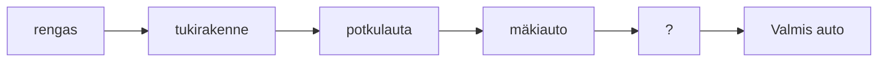

# Harjoitusten tekemisestä

## Tehtävien tekemisen vaiheet

Koska tehtävästä 7 eteenpäin luodaan yksi isompi kokonaisuus,
niiden tekemistä lähestytään useammassa eri vaiheessa, useammassa eri tehtäväsarjassa.

## Tehtävien tekemisen vaiheet teorian tasolla

Ketterän kehityksen mukaisesti tärkeintä on saada komponenteista valmiiksi aina mahdollisimman keveä toimiva versio,
ja sen jälkeen lähteä tekemään siitä ominaisuuksiltaan monimutkaisempaa versiota.

Ajatuksena on, 
että autoa rakentamaan lähtiessämme rakennamme sitä osissa:

1. rengas - testataan, onko pyörivän esineen toimivuus olettamamme kaltaista,
2. tukirakenne - testataan, voimmeko tehdä jotain joka ei ole pyöreää,
3. potkulaudan kaltainen yksinkertainen yhdiste aiemmista - testataan, saadaanko neljästä renkaasta ja tukirakenteesta yksinkertainen kulkuväline,
4. ?
5. mäkiauto, jossa lisättynä rattia, istuinta, suojarakenteita, spoilereita
6. ?
7. valmis auto

Ideana on siis lähteä vaihe vaiheelta rakentamaan jotain toimivaa,
ja lisätä ja yhdistellä näitä toimivia kokonaisuuksia toisiinsa, 
jotta lopulta saisimme aikaiseksi kaipaamamme valmiin tuotteen.

## Tehtävien tekemisen vaiheet käytännössä

Tehtäviä lähdetään tekemään useammassa tehtäväsarjassa,
joissa jokaisessa tehdään jokaiseen komponenttiin tietty muutos.

Muokkaamme siis samoja komponentteja uudelleen ja uudelleen,
tehtäväsarja kerrallaan, 
kunnes saamme valmiiksi lopullisen sivun.

Tehtäväsarjat:

2. tehtäväsarja 2: komponenttien tilapäinen sisältö
3. tehtäväsarja 3: komponenttipuu
4. tehtäväsarja 4: div-elementin kaltaiset komponentit
5. tehtäväsarja 5: globaalit tyylit
6. tehtäväsarja 6: staattinen oikea sisältö
7. tehtäväsarja 7: dynaaminen monimutkaisempi sisältö

Komponentit sijaitsevat vanhoissa `textXX`-kansioissa aiemman tehtävärakenteen mukaisesti.
Ole siis tarkka tehtäviä tehdessäsi,
että kohdistat muutoksesti oikeaan komponenttitiedostoon oikeassa kansiossa.
