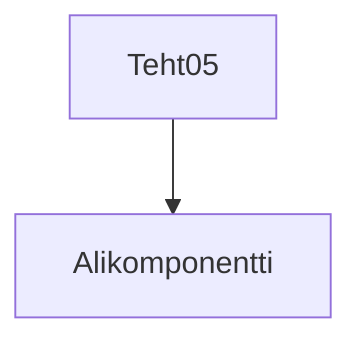
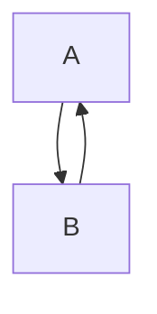

# Tehtävä 5 - heippa-komponentti, alikomponentilla

**palautettavien tiedostojen nimet:** 

* `teht05.svelte` (kansiossa: `harjoitukset/02-javascript/01-svelte/teht05.svelte`)
* `alikomponentti05.svelte` (kansiossa: `harjoitukset/02-javascript/01-svelte/alikomponentti05.svelte`)

Komponenttikirjastojen hyöty tulee siitä, 
että niissä voidaan ulkoistaa itsenäisiin komponentteihin keskeisiä toiminnallisuuksia.
Vähään samaan tapaan, kuin javascriptissä käytetään funktioita.

Tehdään tätä varten siis kaksi svelte-tiedostoa: 

`teht05.svelte`:

```svelte
<script>
  import Alikomponentti from './alikomponentti05.svelte';
</script>

<h1>Tervepä terve, maailma!</h1>
<Alikomponentti />
```

`alikomponentti05.svelte` (tee tiedosto itse, jos se puuttuu repositoriostasi):

```svelte
<h2>Heippa vaan, maailma</h2>
```

Tätä komponenttien muodostamaa hierarkiaa, jossa pääkomponentti kutsuu alikomponenttia, voidaan ajatella puuna:



## Alikomponenteista

Svelte:n, ja muiden komponenttikirjastojen, vahvuus on juuri alikomponenttien käytön muodostamissa komponenttihierarkioissa.
Tämä tulee myöhemmin paremmin tutuksi.

### Mikä on alikomponentti

Mikä sitten on alikomponentti?

Alikomponentti on vain toinen komponentti.

Kuten esimerkissä, se on vain toinen `.svelte`-päätteinen tiedosto.

### Komponentteja voi liittää toisiinsa kuin lego-palikoita

Svelte:n hienous onkin, että voimme käyttää näitä komponentteja kuin lego-palikoita ikään.
Voimme liittää niitä yhteen mitä monimutkaisimpina muodostelmina.

### Ainoa vaatimus

Ainoa komponentteihin liittyvä vaatimus on, että emme voi muodostaa komponenteista kehää.

Emme siis voi esimerkiksi luoda komponentti A:ta, jolla on alikomponenttina B, jolla on alikomponenttina A, ja niin edelleen.



Tällainen kehärakenne loisi päättymättömän kehän, jossa sivu ei koskaan valmistuisi, eikä selain näin ollen voisi näyttää sitä käyttäjälle.

Tällainen kehärakenne voisi ehkä kuitenkin olla mahdollinen, jos pystyisimme jotenkin välittämään komponenteille tiedon siitä, kuinka monta kierrosta niiden pitäisi toisiaan näyttää alikomponentteina.

Päättymisehtoon tarvitsemme kuitenkin jonkinlaista datan siirtoa vanhempikomponentilta lapsikomponentille. 
Tätä komponentilta alikomponentille tapahtuvaa datan siirtoa katselemme seuraavaksi.

Päättymisehtoa voi kokeilla toteuttaa esimerkiksi tästä repositoriosta löytyvillä hiekkalaatikkokomponenteilla.
Se jätetäään kuitenkin itsenäiseksi harjoitukseksi.

## Seuraavaksi

Seuraavaksi: [Tehtävä 6](./01-06.md)
