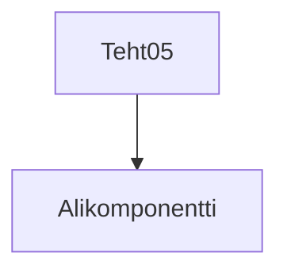

### Tehtävä 5 - heippa-komponentti, alikomponentilla

**palautettavien tiedostojen nimet:** 

* `teht05.svelte` (kansiossa: `harjoitukset/02-javascript/01-svelte/teht05.svelte`)
* `alikomponentti05.svelte` (kansiossa: `harjoitukset/02-javascript/01-svelte/alikomponentti05.svelte`)

Komponenttikirjastojen hyöty tulee siitä, 
että niissä voidaan ulkoistaa itsenäisiin komponentteihin keskeisiä toiminnallisuuksia.
Vähään samaan tapaan, kuin javascriptissä käytetään funktioita.

Tehdään tätä varten siis kaksi svelte-tiedostoa: 

`teht05.svelte`:

```svelte
<script>
  import Alikomponentti from './alikomponentti05.svelte';
</script>

<h1>Tervepä terve, maailma!</h1>
<Alikomponentti />
```

`alikomponentti05.svelte` (tee tiedosto itse, jos se puuttuu repositoriostasi):

```svelte
<h2>Heippa vaan, maailma</h2>
```

Tätä komponenttien muodostamaa hierarkiaa, jossa pääkomponentti kutsuu alikomponenttia, voidaan ajatella puuna:



## Seuraavaksi

Seuraavaksi: [Tehtävä 6](./01-06.md)
