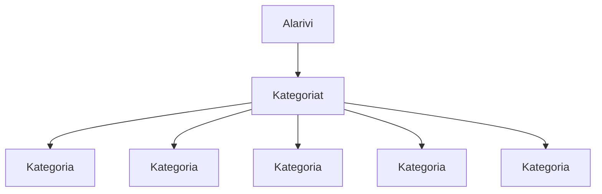

### Tehtävä 7 - verkkokaupan yläpalkin alarivi, eli tuotekategoriat

Tässä tehtävässä tehdään ensimmäinen versio kauppa-sivumme yläpalkin alarivistä. 
Alarivillä näytetään aluksi viisi kategoriaa.
Lopullisessa versiossa niitä tullaan näyttämään enemmän, referenssiä vastaavasti.

#### Komponenttipuu

Alla oleva graafi kuvaa sitä, miten komponenttien pitäisi muodostaa komponenttipuu.



Tässä tapauksessa:

* `Alarivi`-komponentti kutsuu `Kategoriat`-komponenttia yhden kerran.
* `Kategoriat`-komponentti kutsuu `Kategoria`-komponenttia viisi (5) kertaa.

Myöhemmin, tulet lisäämään alariville enemmän kategorioita, mutta nyt riittää, että niitä näytetään viisi kappaletta.

Toteuta tämän ohjeen perusteella muutokset komponentteihin `alarivi.svelte`, `kategoria.svelte` ja `kategoriat.svelte`.

#### Palautettavat tiedostot

**palautettavien tiedostojen ja kansioiden nimet:** 

* tiedosto: `teht07/alarivi.svelte` (kansiossa: `harjoitukset/02-javascript/01-svelte/teht07/alarivi.svelte`)
* tiedosto: `teht07/kategoria.svelte` (kansiossa: `harjoitukset/02-javascript/01-svelte/teht07/kategoria.svelte`)
* tiedosto: `teht07/kategoriat.svelte` (kansiossa: `harjoitukset/02-javascript/01-svelte/teht07/kategoriat.svelte`)

#### Tarkemmat ohjeet

Alarivi komponentin pitäisi näyttää alussa seuraavalta:

`alarivi.svelte`:

```svelte
alarivi
```

Muutamme sen nyt näyttämään `Kategoriat`-komponentin alikomponenttinaan.

`alarivi.svelte`:

```svelte
<script>
  import Kategoriat from './kategoriat.svelte';
</script>

alarivi

<Kategoriat />
```

Jätämme vielä hetkeksi komponentin nimen näkyviin komponentin sisälle. 
Voit myöhemmin poistaa ne, kun saat komponenteille oikeata sisältöä.

Vastaavasti muokkaamme `Kategoriat`-komponentin näyttämään useamman `Kategoria`-komponentin alikomponenttinaan graafin mukaisesti.

`Kategoriat`-komponentti näyttää alussa seuraavalta:

`kategoriat.svelte`:

```svelte
kategoriat
```

Muutamme sen nyt näyttämään viisi `Kategoria`-komponenttia alikomponenttinaan.

`kategoriat.svelte`:

```svelte
<script>
  import Kategoria from './kategoria.svelte';
</script>

kategoriat

<Kategoria />
<Kategoria />
<Kategoria />
<Kategoria />
<Kategoria />
```
