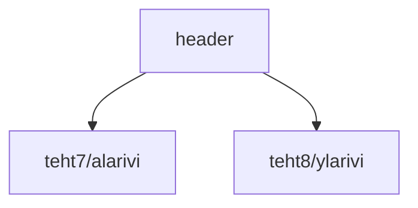

### Tehtävä 9 - verkkokaupan yläpalkki

Tässä tehtävässä luomme verkkokaupan yläpalkin, 
näyttämällä yläpalkissa riveinä edellisissä tehtävissä määriteltyjä `Ylarivi`- ja `Alarivi`-komponentteja.

#### Komponenttipuu




#### Palautettavat tiedostot

**palautettavien tiedostojen ja kansioiden nimet:** 

* tiedosto: `teht09/header.svelte` (kansiossa: `harjoitukset/02-javascript/01-svelte/teht09/header.svelte`)

#### Tehtävä

Tee tehtävän 3.1 mukaisesti yllä määritettyihin tiedostoihin komponenttipuuta vastaava rakenne.

Käytä komponenteissa alikomponentteina niitä komponentteja, joita komponenttipuun mukaan siinä tulisi käyttää.

#### Ohjeet

Huomaa, että tällä kertaa komponentit ovatkin eri kansioissa.

```
01-svelte
  |
   -- teht07
         |
          -- alarivi.svelte
  |
   -- teht08
         |
          -- ylarivi.svelte
  |
   -- teht09
         |
          -- header.svelte
```

Tämän takia emme voikaan käyttää `import`:in polun alussa yhtä pistettä (`.`), vaan meidän pitää käyttää kahta pistettä (`..`)

Aiemmin pystyimme `kategoriat.svelte`-tiedostosta lukemaan `kategoria.svelte`-tiedoston seuraavasti yhdellä pisteellä (`.`):

```svelte
<script>
  import Kategoria from './kategoria.svelte';
</script>
```

Tämä onnistui, koska molemmat tiedostot olivat samassa kansiossa.

Nyt joudumme kuitenkin tarkastelemaan tarkemmin relatiivisia tiedostopolkuja. 

Nämä samat polkujen välillä liikkumiseen vaikuttavat säännöt toimivat koodissa tiedostoja lukiessa, mutta myös terminaalissa, kansioiden välillä liikuttaessa.

##### Poluista

###### Relatiiviset polut

Pisteellä alkavat polut ovat relatiivisia polkuja.
Relatiivinen polku tarkoittaa, että polkua lähdetään kulkemaan nykyisestä tiedostosta, ja sen kansiosta, käsin.

* `.` - yksi piste tarkoittaa, että polussa jäädään nykyiseen kansioon.
* `..` - kaksi pistettä tarkoittaa, että polussa mennään yksi kansio taaksepäin.

Esimerkiksi:

* polku `.` tarkoittaa, että pysytään nykyisessä kansiossa. (esim. `foo/bar/baz` -> pysytään samassa `foo/bar/baz`)
* polku `./././.` tarkoittaa myös, että pysytään nykyisessä kansiossa. (esim. `foo/bar/baz` -> pysytään samassa `foo/bar/baz`)
* polku `..` tarkoittaa, että siirrytään hakemistopuussa tasoa taaksepäin. (esim. `foo/bar/baz` -> siirryttäisiin kansioon `foo/bar`)
* polku `../..` tarkoittaa, että siirrytään hakemistopuussa kaksi tasoa taaksepäin. (esim. `foo/bar/baz` -> siirryttäisiin `foo`)

Näitä voidaan myös yhdistää.  Esimerkiksi:

* polku `./../teht09/../../02-javascript/01-svelte/./teht09` tarkoittaa, että jos olemme alussa polussa `harjoitukset/02-javascript/01-svelte/teht09`, polun suorittamisen jälkeen päädymme takaisin sinne.

###### Harjoituksessa tarvittavista poluista

Meillä on tehtävässä siis kolme eri kansiota, jotka kaikki ovat sisaruskansioita toisilleen.
Ne siis ovat kaikki `harjoitukset/02-javascript/01-svelte/`-kansion lapsikansioita.

Eli kun haluamme kutsua `harjoitukset/02-javascript/01-svelte/teht09/header.svelte`-tiedostosta `harjoitukset/02-javascript/01-svelte/teht07/alarivi.svelte`-tiedostoa, pitää meidän:

* aloittaa polku kahdella pisteellä `..`,
* jatkaa halutulla kansiolla `teht07`,
* päättää tiedoston nimeen `alarivi.svelte`.

Polku `alarivi.svelte`-tiedostoon näyttää siis seuraavalta header.svelte-tiedostosta käsin:

`../teht07/alarivi.svelte`

ja `header.svelte`-tiedostossa käytetty `import`-rivi näyttää silloin seuraavalta:

```svelte
<script>
  import Alarivi from '../teht07/alarivi.svelte';
</script>
```
