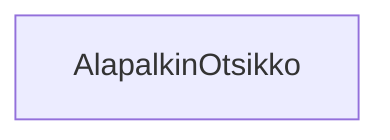

### Tehtävä 11 - verkkokaupan alapalkin otsikot

Tässä tehtävässä tarkastelemme alapalkin otsikoista vastaavia komponentteja, ja niiden muodostamaa hierarkiaa.

Koska komponentit ovat niin sanotusti lehtikomponentteja, eli niillä ei ole alikomponentteja komponenttipuussa,
meidän ei tarvitse lisätä niille alikomponentteja.
Tyydymme siis vain tarkastelemaan näitä komponentteja.

#### Komponenttipuu

#### Palautettavat tiedostot

**palautettavien tiedostojen ja kansioiden nimet:** 

* tiedosto: `teht11/alapalkin-otsikko.svelte` (kansiossa: `harjoitukset/02-javascript/01-svelte/teht11/alapalkin-otsikko.svelte`)

#### Tehtävä

Tee tehtävän 3.1 mukaisesti yllä määritettyihin tiedostoihin komponenttipuuta vastaava rakenne.

Käytä komponenteissa alikomponentteina niitä komponentteja, joita komponenttipuun mukaan siinä tulisi käyttää.

Emme siis tässä tehtävässä teekkään mitään, koska komponenttipuussa ei ole hierarkiassa muita komponentteja.
