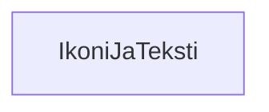

### Tehtävä 13 - ikoni-ja-teksti -komponentti

Tässä tehtävässä tarkastelemme komponenttia, jolla pystymme näyttämään vierekkäin ikonin ja tekstin samalla rivillä.

Emme taas vielä rupea pohtimaan sitä, miten saisimme ikonin tai tekstin näkymään, tai vieretysten.

Toteutamme komponentin yhdellä komponentilla, joten sille ei taas löydy alikomponenttia.

Tyydymme siis vain tarkastamaan komponentin hierarkian.

#### Komponenttipuu

#### Palautettavat tiedostot

**palautettavien tiedostojen ja kansioiden nimet:** 

* tiedosto: `teht13/ikoni-ja-teksti.svelte` (kansiossa: `harjoitukset/02-javascript/01-svelte/teht13/ikoni-ja-teksti.svelte`)

#### Tehtävä

Tee tehtävän 3.1 mukaisesti yllä määritettyihin tiedostoihin komponenttipuuta vastaava rakenne.

Käytä komponenteissa alikomponentteina niitä komponentteja, joita komponenttipuun mukaan siinä tulisi käyttää.

Koska alikomponentteja ei hierarkiassa näy, emme siis tällä kertaa tee mitään.
