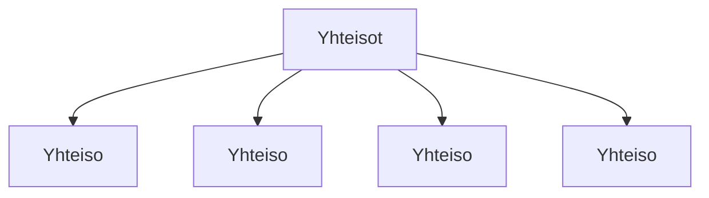

### Tehtävä 14 - sosiaalisen median yhteisöt

Tässä tehtävässä luomme rakenteen, jolla näytämme monta sosiaalisen median yhteisöä listana.

Lopullisessa versiossa some-yhteisöihin vieviä linkkejä on referenssin mukainen määrä.
Tässä vaiheessa meille riittää, että näytämme neljä kappaletta `Yhteiso`-komponenttia `Yhteisot`-komponentin alikomponenttina.

#### Komponenttipuu

#### Palautettavat tiedostot

**palautettavien tiedostojen ja kansioiden nimet:** 

* tiedosto: `teht14/yhteiso.svelte` (kansiossa: `harjoitukset/02-javascript/01-svelte/teht14/yhteiso.svelte`)
* tiedosto: `teht14/yhteisot.svelte` (kansiossa: `harjoitukset/02-javascript/01-svelte/teht14/yhteisot.svelte`)

#### Tehtävä

Tee tehtävän 3.1 mukaisesti yllä määritettyihin tiedostoihin komponenttipuuta vastaava rakenne.

Käytä komponenteissa alikomponentteina niitä komponentteja, joita komponenttipuun mukaan siinä tulisi käyttää.
