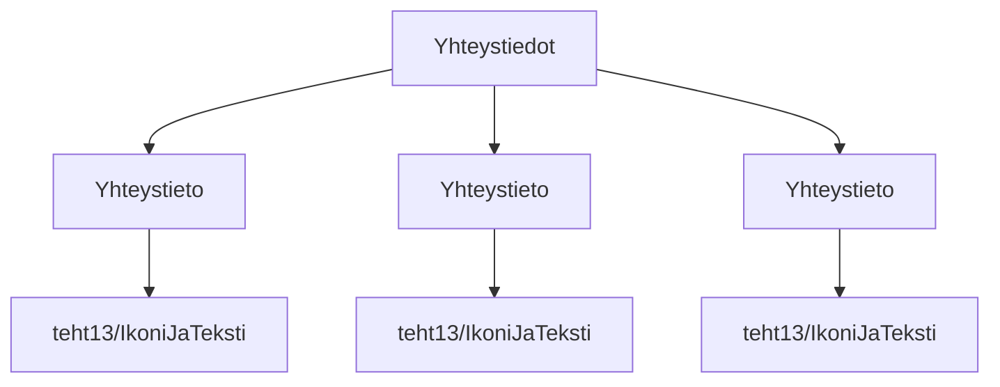

### Tehtävä 15 - yhteystiedot

Tässä tehtävässä luomme `Yhteystiedot`-komponentille rakenteen.

`Yhteystiedot`-komponentti pitää sisällään yhden tai useamman `Yhteystieto`-alikomponentin.

Jokainen `Yhteystieto`-komponentti pitää sisällään tasan yhden `IkoniJaTeksti`-alikomponentin.

Käytämme apuna aiemmassa tehtävässä määriteltyä `IkoniJaTeksti`-komponenttia, 
jotta saamme sivullemme helposti yhtenäisen ilmeen. 
Kun uudelleenkäytämme samoja komponentteja monessa paikassa,
meidän tarvitsee toteuttaa ne vain yhdessä komponentissa.

#### Komponenttipuu

#### Palautettavat tiedostot

**palautettavien tiedostojen ja kansioiden nimet:** 

* tiedosto: `teht15/yhteystieto.svelte` (kansiossa: `harjoitukset/02-javascript/01-svelte/teht15/yhteystieto.svelte`)
* tiedosto: `teht15/yhteystiedot.svelte` (kansiossa: `harjoitukset/02-javascript/01-svelte/teht15/yhteystiedot.svelte`)

#### Tehtävä

Tee tehtävän 3.1 mukaisesti yllä määritettyihin tiedostoihin komponenttipuuta vastaava rakenne.

Käytä komponenteissa alikomponentteina niitä komponentteja, joita komponenttipuun mukaan siinä tulisi käyttää.
