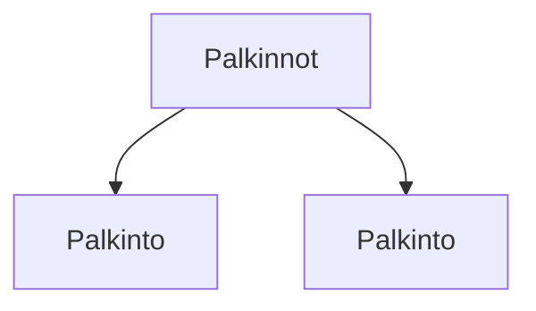

### Tehtävä 19 - palkinnot-listaus

Tässä tehtävässä luomme palkintolistauksen alapalkkia varten.

#### Komponenttipuu

#### Palautettavat tiedostot

**palautettavien tiedostojen ja kansioiden nimet:** 

* tiedosto: `teht19/palkinto.svelte` (kansiossa: `harjoitukset/02-javascript/01-svelte/teht19/palkinto.svelte`)
* tiedosto: `teht19/palkinnot.svelte` (kansiossa: `harjoitukset/02-javascript/01-svelte/teht19/palkinnot.svelte`)

#### Tehtävä

Tee tehtävän 3.1 mukaisesti yllä määritettyihin tiedostoihin komponenttipuuta vastaava rakenne.

Käytä komponenteissa alikomponentteina niitä komponentteja, joita komponenttipuun mukaan siinä tulisi käyttää.
