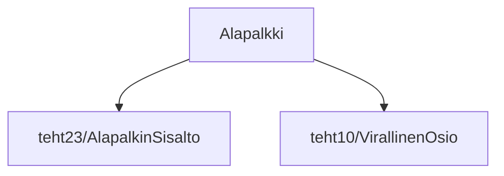

### Tehtävä 24 - alapalkki

Tässä tehtävässä yhdistämme `Alapalkki`-komponentin kokonaisuudeksi, 
joka sisältää aiemmin määritellyt `AlapalkinSisalto`- ja `VirallinenOsio`-alikomponentit.

Sivu alkaa vähitellen muodostua kokonaisuudekseen.

#### Komponenttipuu

#### Palautettavat tiedostot

**palautettavien tiedostojen ja kansioiden nimet:** 

* tiedosto: `teht24/alapalkki.svelte` (kansiossa: `harjoitukset/02-javascript/01-svelte/teht24/alapalkki.svelte`)

#### Tehtävä

Tee tehtävän 3.1 mukaisesti yllä määritettyihin tiedostoihin komponenttipuuta vastaava rakenne.

Käytä komponenteissa alikomponentteina niitä komponentteja, joita komponenttipuun mukaan siinä tulisi käyttää.
