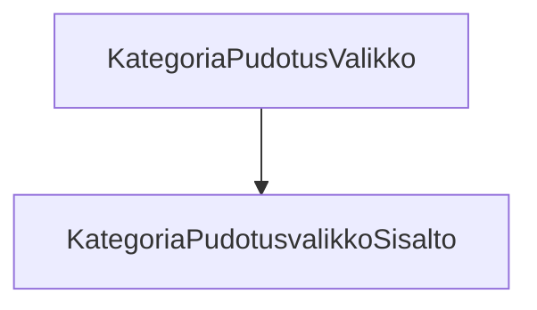

### Tehtävä 25 - pudotusvalikko kategorioille

Tässä tehtävässä ennakoimme tulevaa, ja luomme yläpalkin alarivin kategoriolle pudotusvalikon.

Tämä on jo vähän monimutkaisempaa toiminnallisuutta, mutta teemme sille alustavan rakenteen silti valmiiksi jo nyt.
Ihan vain, koska hierarkian luominen on helppoa.

#### Komponenttipuu

#### Palautettavat tiedostot

**palautettavien tiedostojen ja kansioiden nimet:** 

* tiedosto: `teht25/kategoria-pudotusvalikko.svelte` (kansiossa: `harjoitukset/02-javascript/01-svelte/teht25/kategoria-pudotusvalikko.svelte`)
* tiedosto: `teht25/kategoria-pudotusvalikko-sisalto.svelte` (kansiossa: `harjoitukset/02-javascript/01-svelte/teht25/kategoria-pudotusvalikko-sisalto.svelte`)

#### Tehtävä

Tee tehtävän 3.1 mukaisesti yllä määritettyihin tiedostoihin komponenttipuuta vastaava rakenne.

Käytä komponenteissa alikomponentteina niitä komponentteja, joita komponenttipuun mukaan siinä tulisi käyttää.
