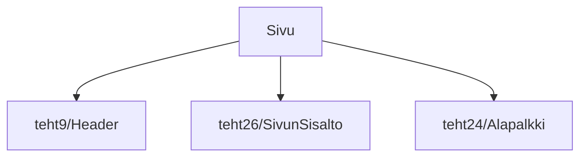

### Tehtävä 27 - sivun sisältö

Tässä tehtävässä sidomme lopulta sivun kaikki komponentit yhteen, 
yhdistämällä sivulle yläpalkin, sivun varsinaisen sisällön ja alapalkin.

#### Komponenttipuu

#### Palautettavat tiedostot

**palautettavien tiedostojen ja kansioiden nimet:** 

* tiedosto: `teht27/sivu.svelte` (kansiossa: `harjoitukset/02-javascript/01-svelte/teht27/sivu.svelte`)

#### Tehtävä

Tee tehtävän 3.1 mukaisesti yllä määritettyihin tiedostoihin komponenttipuuta vastaava rakenne.

Käytä komponenteissa alikomponentteina niitä komponentteja, joita komponenttipuun mukaan siinä tulisi käyttää.
