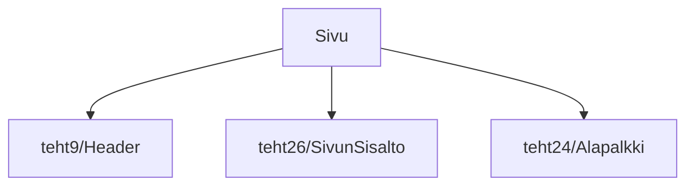

# Tehtävä 27 - sivu

Tässä tehtävässä sidomme lopulta sivun kaikki komponentit yhteen, 
yhdistämällä sivulle yläpalkin, sivun varsinaisen sisällön ja alapalkin.

## Komponenttipuu

## Palautettavat tiedostot

**palautettavien tiedostojen ja kansioiden nimet:** 

* tiedosto: `teht27/sivu.svelte` (kansiossa: `harjoitukset/02-javascript/01-svelte/teht27/sivu.svelte`)

## Tehtävä

Tee tehtävän 3.1 mukaisesti yllä määritettyihin tiedostoihin komponenttipuuta vastaava rakenne.

Käytä komponenteissa alikomponentteina niitä komponentteja, joita komponenttipuun mukaan siinä tulisi käyttää.

## Miltä komponenttien pitäisi näyttää tehtävän lopussa?

Nyt `sivu.svelte`-komponentin pitäisi koota yhteen näkymään kaikki muut komponentit.

`sivu.svelte`, lapsineen, lapsenlapsineen, jne:

Huomaa kuvan oikean reunan vierityspalkin koosta, että `sivu.svelte` on pitkä, ja sisältää paljon rivejä.

`sivu.svelte`-komponentin pitäisi nyt vastata pitkälti edellisen kauppa-sivun toista html-versiota, jossa riveille oli lisätty tekstien ympärille div:it.

## Huomioita ja virhetilanteita

### Teksti ei ole omilla riveillään

Jos monen rivun sijasta näet vain yhden tekstikappaleen, voi olla että lisäsit edellisessä tehtäväsarjassa komponentteihin sisällöksi niiden nimet, muttet lisännyt nimien ympärille `div`-elementtejä.

`div`-elementti, tyylittelemättömänä, lisää jälkeensä ruudulle rivinvaihdon.

Jos taas näet joitain rivejä, mutta osa tekstistä on samalla rivillä, olet unohtanut

### Osa riveistä puuttuu

Jos jokin komponentti ei näytä niitä rivejä, mitä sen pitäisi näyttää, on mahdollista, että joko se itse, tai sen lapsi on rikki.

Tällöin yleinen virhe on, että import ei ole kohdistunut oikeaan tiedostoon.

Voit löytää vihjeitä virheellisestä tiedostosta:

1. vscodessa: terminaalista, jossa storybook pyörii
2. selaimessa: storybook-sivun dev tools -näkymän konsolista

Mahdollisesti jommassa kummassa saatetaan mainita rikkonaisen komponentin tiedostonnimi, sekä jopa virheellinen kohta tiedostossa.

## Seuraavaksi

Seuraavaksi siirrymme [tehtäväsarjaan 4](../04-tehtavasarja-4/README.md).
