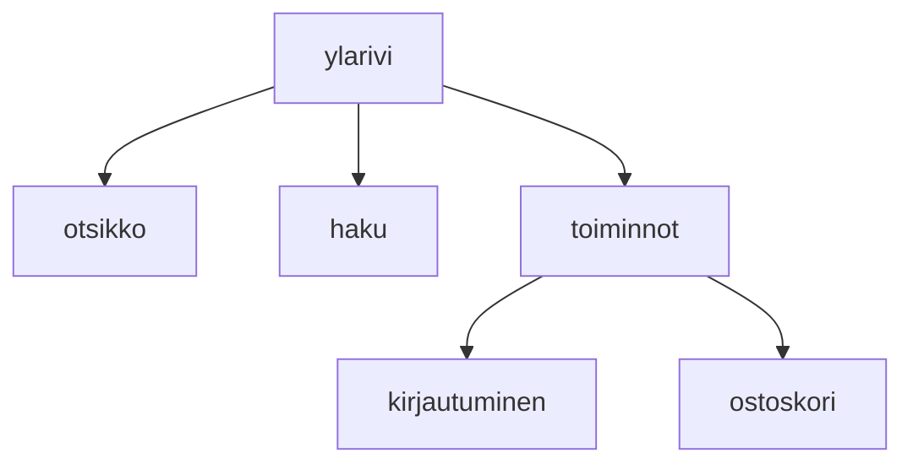

### Tehtävä 8 - verkkokaupan yläpalkin ylärivi

Tässä tehtävässä luomme sivullemme yläpalkin ylärivin.
Ylärivissä on otsikko, haku, ja toiminnot-osio. 
Toiminnot-osio pitää sisällään kirjautumisen ja ostoskorin.

#### Komponenttipuu

#### Palautettavat tiedostot

**palautettavien tiedostojen ja kansioiden nimet:** 

* tiedosto: `teht08/ylarivi.svelte` (kansiossa: `harjoitukset/02-javascript/01-svelte/teht08/ylarivi.svelte`)
* tiedosto: `teht08/otsikko.svelte` (kansiossa: `harjoitukset/02-javascript/01-svelte/teht08/otsikko.svelte`)
* tiedosto: `teht08/haku.svelte` (kansiossa: `harjoitukset/02-javascript/01-svelte/teht08/haku.svelte`)
* tiedosto: `teht08/toiminnot.svelte` (kansiossa: `harjoitukset/02-javascript/01-svelte/teht08/toiminnot.svelte`)
* tiedosto: `teht08/kirjautuminen.svelte` (kansiossa: `harjoitukset/02-javascript/01-svelte/teht08/kirjautuminen.svelte`)
* tiedosto: `teht08/ostoskori.svelte` (kansiossa: `harjoitukset/02-javascript/01-svelte/teht08/ostoskori.svelte`)

#### Tehtävä

Tee tehtävän 3.1 mukaisesti yllä määritettyihin tiedostoihin komponenttipuuta vastaava rakenne.

Käytä komponenteissa alikomponentteina niitä komponentteja, joita komponenttipuun mukaan siinä tulisi käyttää.
