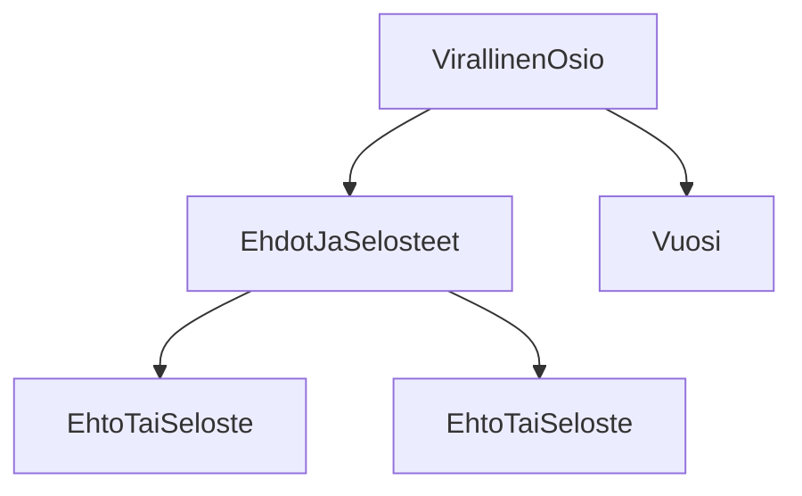

### Tehtävä 10 - verkkokaupan alapalkin virallinen-osio

Tässä tehtävässä luomme verkkokauppasivumme alimman osion, pienen virallinen-osion, jonne voimme sijoittaa virallista tietoa sivustamme.
Tällaista voisivat olla esimerkiksi tiedot ehdoista ja selosteista, tai vuodesta, jolloin sivustoa viimeksi on päivitetty.

#### Komponenttipuu

#### Palautettavat tiedostot

**palautettavien tiedostojen ja kansioiden nimet:**

* tiedosto: `teht10/virallinen-osio.svelte` (kansiossa: `harjoitukset/02-javascript/01-svelte/teht10/virallinen-osio.svelte`)
* tiedosto: `teht10/ehdot-ja-selosteet.svelte` (kansiossa: `harjoitukset/02-javascript/01-svelte/teht10/ehdot-ja-selosteet.svelte`)
* tiedosto: `teht10/ehto-tai-seloste.svelte` (kansiossa: `harjoitukset/02-javascript/01-svelte/teht10/ehto-tai-seloste.svelte`)
* tiedosto: `teht10/vuosi.svelte` (kansiossa: `harjoitukset/02-javascript/01-svelte/teht10/vuosi.svelte`)

#### Tehtävä

Tee tehtävän 3.1 mukaisesti yllä määritettyihin tiedostoihin komponenttipuuta vastaava rakenne.

Käytä komponenteissa alikomponentteina niitä komponentteja, joita komponenttipuun mukaan siinä tulisi käyttää.
