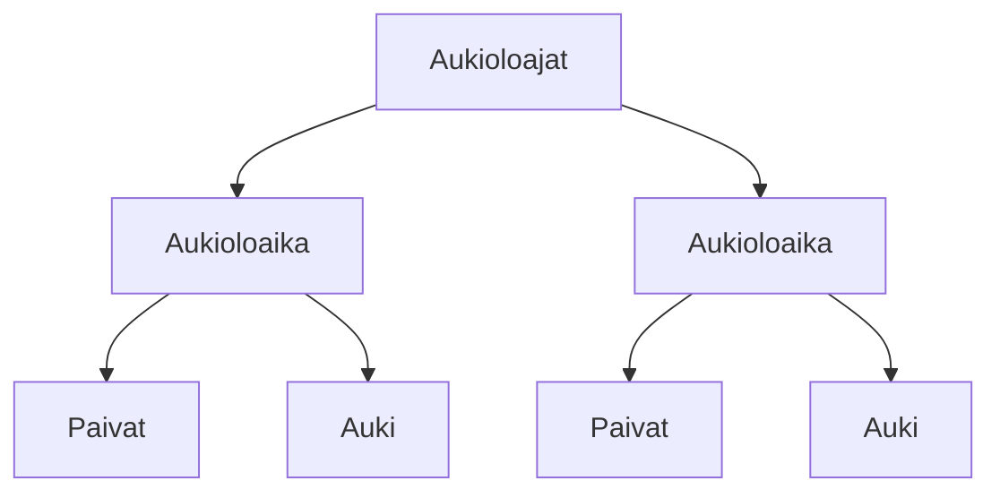

### Tehtävä 12 - verkkokaupan alapalkin aukioloajat

Tässä tehtävässä luomme `Aukioloajat`-komponentille alipuun.

`Aukioloajat`-komponentti näyttää yhden tai useamman `Aukioloaika`-komponentin. 
Tässä vaiheessa lisäämme niitä kaksi kappaletta, mutta tulemme myöhemmin vaihtelemaan niiden määrää tapauskohtaisesti.

Jokaisella `Aukioloaika`-komponentilla on kaksi omaa alikomponenttia:

* `Paivat` - kertoo päivät, joihin aukioloaikatieto kohdistuu,
* `Auki` - kertoo miten tuntien osalta aukioloaika toimii.

Referenssistä näemme, että lopullisessa muodossaan `Aukioloajat`-komponentti saattaisi näyttää seuraavat tekstit sivulla:

```
Ma-Ke 9:00-17:00
La 10:00-12:00
```

Emme vielä tässä lisää näitä tekstejä, vaan lisäämme vain alikomponentit, joilla myöhemmin voimme tuottaa nämä tekstit.

#### Komponenttipuu




#### Palautettavat tiedostot

**palautettavien tiedostojen ja kansioiden nimet:** 

* tiedosto: `teht12/aukioloajat.svelte` (kansiossa: `harjoitukset/02-javascript/01-svelte/teht12/aukioloajat.svelte`)
* tiedosto: `teht12/aukioloaika.svelte` (kansiossa: `harjoitukset/02-javascript/01-svelte/teht12/aukioloaika.svelte`)
* tiedosto: `teht12/paivat.svelte` (kansiossa: `harjoitukset/02-javascript/01-svelte/teht12/paivat.svelte`)
* tiedosto: `teht12/auki.svelte` (kansiossa: `harjoitukset/02-javascript/01-svelte/teht12/auki.svelte`)

#### Tehtävä

Tee tehtävän 3.1 mukaisesti yllä määritettyihin tiedostoihin komponenttipuuta vastaava rakenne.

Käytä komponenteissa alikomponentteina niitä komponentteja, joita komponenttipuun mukaan siinä tulisi käyttää.
