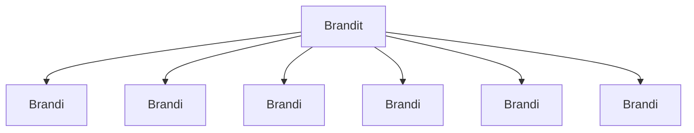

### Tehtävä 16 - shop-in-shops -listaus

Tässä tehtävässä luomme shop-in-shops -osioomme listauksen.

Näitä listauksia tulee sivullemme referenssin mukaisesti kaksi kappaletta.

Teemme tässä vaiheessa kuitenkin vain yhden listauksen, kuudella alikomponentilla.

#### Komponenttipuu

#### Palautettavat tiedostot

**palautettavien tiedostojen ja kansioiden nimet:** 

* tiedosto: `teht16/brandi.svelte` (kansiossa: `harjoitukset/02-javascript/01-svelte/teht16/brandi.svelte`)
* tiedosto: `teht16/brandit.svelte` (kansiossa: `harjoitukset/02-javascript/01-svelte/teht16/brandit.svelte`)

#### Tehtävä

Tee tehtävän 3.1 mukaisesti yllä määritettyihin tiedostoihin komponenttipuuta vastaava rakenne.

Käytä komponenteissa alikomponentteina niitä komponentteja, joita komponenttipuun mukaan siinä tulisi käyttää.
