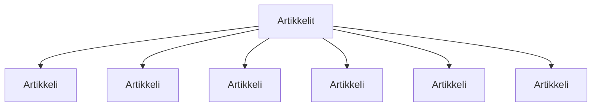

### Tehtävä 17 - artikkelit ja blogit -listaus

Tässä tehtävässä luomme `Artikkelit`-komponentin avulla artikkelilistauksen, joka näkyy sivun alapalkissa.

Referenssissä artikkeleita on vain kaksi, mutta nyt lisäämme niitä kuusi, koska se on mahdollista.

#### Komponenttipuu

#### Palautettavat tiedostot

**palautettavien tiedostojen ja kansioiden nimet:** 

* tiedosto: `teht17/artikkeli.svelte` (kansiossa: `harjoitukset/02-javascript/01-svelte/teht17/artikkeli.svelte`)
* tiedosto: `teht17/artikkelit.svelte` (kansiossa: `harjoitukset/02-javascript/01-svelte/teht17/artikkelit.svelte`)

#### Tehtävä

Tee tehtävän 3.1 mukaisesti yllä määritettyihin tiedostoihin komponenttipuuta vastaava rakenne.

Käytä komponenteissa alikomponentteina niitä komponentteja, joita komponenttipuun mukaan siinä tulisi käyttää.
