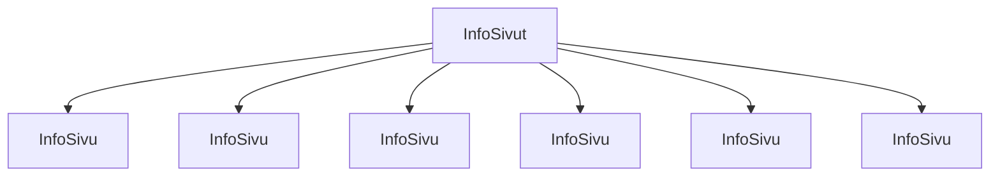

### Tehtävä 18 - infot-listaus

Tässä tehtävässä luomme Info-listauksen.

Info-listauksesta vastaa `InfoSivut`-komponentti.

Taas, ensimmäisen versiomme `InfoSivu`-komponenttien lukumäärä on referenssistä poikkeava. Tämä korjataan myöhemmin.

#### Komponenttipuu

#### Palautettavat tiedostot

**palautettavien tiedostojen ja kansioiden nimet:** 

* tiedosto: `teht18/info-sivu.svelte` (kansiossa: `harjoitukset/02-javascript/01-svelte/teht18/info-sivu.svelte`)
* tiedosto: `teht18/info-sivut.svelte` (kansiossa: `harjoitukset/02-javascript/01-svelte/teht18/info-sivut.svelte`)

#### Tehtävä

Tee tehtävän 3.1 mukaisesti yllä määritettyihin tiedostoihin komponenttipuuta vastaava rakenne.

Käytä komponenteissa alikomponentteina niitä komponentteja, joita komponenttipuun mukaan siinä tulisi käyttää.
