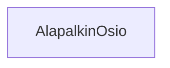

### Tehtävä 21 - alapalkin osio

Tässä tehtävässä luomme apukomponentin nimellä `AlapalkinOsio`. 

`AlapalkinOsio`-komponentti vastaa alapalkissa näytettävien osioiden yhteisistä tyyleistä.
Se pitää sisällään otsikon ja sitä vastaavan sisällön.

Teemme sen osalta myöhemmin muutaman tempun, mutta nyt se jää vielä tyhjäksi.

#### Komponenttipuu

#### Palautettavat tiedostot

**palautettavien tiedostojen ja kansioiden nimet:** 

* tiedosto: `teht21/alapalkin-osio.svelte` (kansiossa: `harjoitukset/02-javascript/01-svelte/teht21/alapalkin-osio.svelte`)

#### Tehtävä

Tee tehtävän 3.1 mukaisesti yllä määritettyihin tiedostoihin komponenttipuuta vastaava rakenne.

Käytä komponenteissa alikomponentteina niitä komponentteja, joita komponenttipuun mukaan siinä tulisi käyttää.
