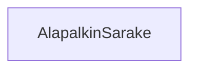

### Tehtävä 22 - alapalkin sarake

Tässä tehtävässä luomme alapalkissa käytettävät sarakkeet. 
Huomaa, että vaikka suurin osa sarakkeista pitää sisällään vain yhden otsikon, osa sarakkeista pitää sisällään useamman otsikon.

#### Komponenttipuu

#### Palautettavat tiedostot

**palautettavien tiedostojen ja kansioiden nimet:** 

* tiedosto: `teht22/alapalkin-sarake.svelte` (kansiossa: `harjoitukset/02-javascript/01-svelte/teht22/alapalkin-sarake.svelte`)

#### Tehtävä

Tee tehtävän 3.1 mukaisesti yllä määritettyihin tiedostoihin komponenttipuuta vastaava rakenne.

Käytä komponenteissa alikomponentteina niitä komponentteja, joita komponenttipuun mukaan siinä tulisi käyttää.
