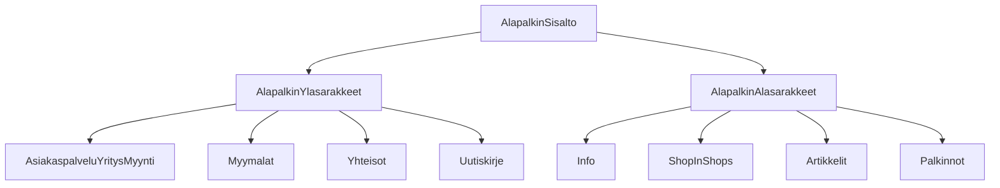
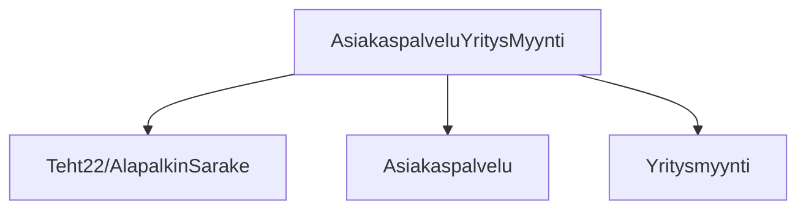
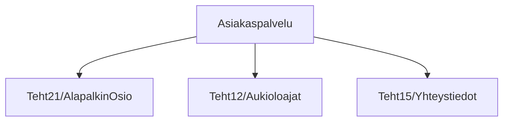
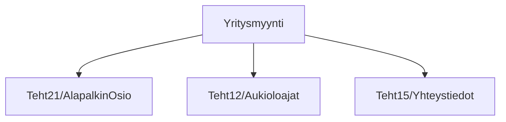
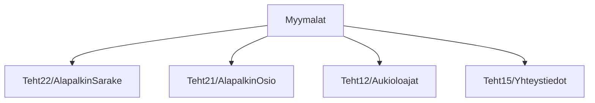
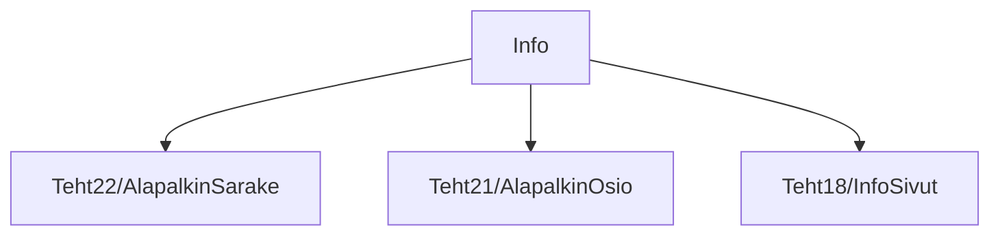
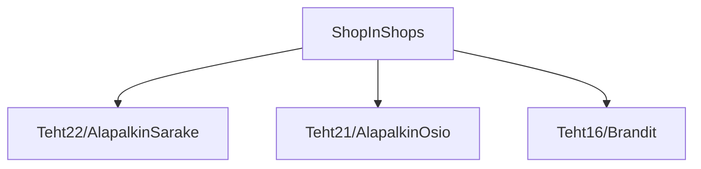
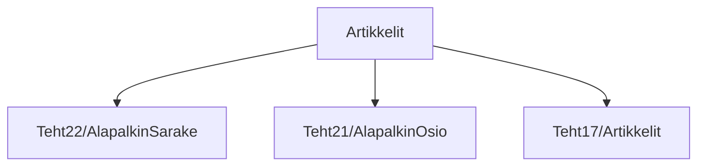
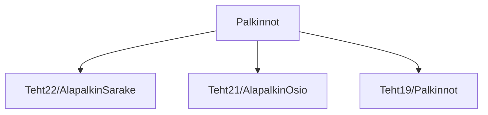
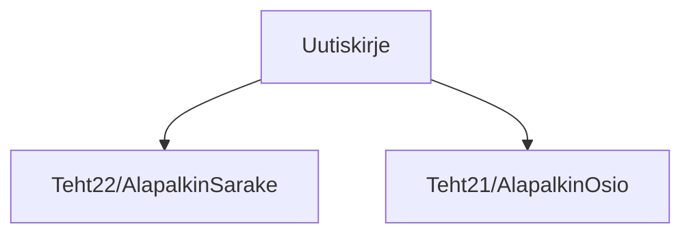

### Tehtävä 23 - alapalkin sisältö

Tässä tehtävässä luomme rakenteet kaikille alapalkin osioille.

Käytämme apuna aiempia `AlapalkinOsio`- ja `AlapalkinSarake`-apukomponentteja.

Tehtävä on tällä kertaa vähän isompi, mutta melko suoraviivainen, koska meille riittää taas vain komponenttihierarkian rakentaminen.
Jätämme sisältöjen määrittämisen taas myöhemmäksi.

#### Komponenttipuu

#### Palautettavat tiedostot

**palautettavien tiedostojen ja kansioiden nimet:** 

* tiedosto: `teht23/alapalkin-sisalto.svelte` (kansiossa: `harjoitukset/02-javascript/01-svelte/teht23/alapalkin-sisalto.svelte`)
* tiedosto: `teht23/alapalkin-ylasarakkeet.svelte` (kansiossa: `harjoitukset/02-javascript/01-svelte/teht23/alapalkin-ylasarakkeet.svelte`)
* tiedosto: `teht23/alapalkin-alasarakkeet.svelte` (kansiossa: `harjoitukset/02-javascript/01-svelte/teht23/alapalkin-alasarakkeet.svelte`)
* tiedosto: `teht23/asiakaspalvelu-yritysmyynti.svelte` (kansiossa: `harjoitukset/02-javascript/01-svelte/teht23/asiakaspalvelu-yritysmyynti.svelte`)
* tiedosto: `teht23/asiakaspalvelu.svelte` (kansiossa: `harjoitukset/02-javascript/01-svelte/teht23/asiakaspalvelu.svelte`)
* tiedosto: `teht23/yritysmyynti.svelte` (kansiossa: `harjoitukset/02-javascript/01-svelte/teht23/yritysmyynti.svelte`)
* tiedosto: `teht23/myymalat.svelte` (kansiossa: `harjoitukset/02-javascript/01-svelte/teht23/myymalat.svelte`)
* tiedosto: `teht23/yhteisot.svelte` (kansiossa: `harjoitukset/02-javascript/01-svelte/teht23/yhteisot.svelte`)
* tiedosto: `teht23/uutiskirje.svelte` (kansiossa: `harjoitukset/02-javascript/01-svelte/teht23/uutiskirje.svelte`)
* tiedosto: `teht23/info.svelte` (kansiossa: `harjoitukset/02-javascript/01-svelte/teht23/info.svelte`)
* tiedosto: `teht23/shop-in-shops.svelte` (kansiossa: `harjoitukset/02-javascript/01-svelte/teht23/shop-in-shops.svelte`)
* tiedosto: `teht23/artikkelit.svelte` (kansiossa: `harjoitukset/02-javascript/01-svelte/teht23/artikkelit.svelte`)
* tiedosto: `teht23/palkinnot.svelte` (kansiossa: `harjoitukset/02-javascript/01-svelte/teht23/palkinnot.svelte`)

#### Tehtävä

Tee tehtävän 3.1 mukaisesti yllä määritettyihin tiedostoihin komponenttipuuta vastaava rakenne.

Käytä komponenteissa alikomponentteina niitä komponentteja, joita komponenttipuun mukaan siinä tulisi käyttää.
