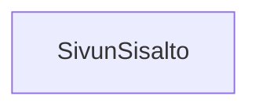

### Tehtävä 26 - sivun sisältö

Tässä tehtävässä tarkastelemme `SivunSisalto`-komponenttia.
`SivunSisalto`-komponentti vastaa sivun varsinaisesta sisällöstä, 
joka on jätetty tämän tehtäväsarjan ulkopuolelle, samoin kuin edellisessä html+css-tehtäväsarjassa.

`SivunSisalto`-komponentti vastaa siis ylä- ja alapalkin väliin jäävän tyhjän tilan toteuttamisesta.

Voit myöhemmin määrittää tälle komponentille haluamasi sisällön. 
Tärkeää, lopullisessa versiossa on, että tämä komponentti toimii rajaajana ylä- ja alapalkin välissä,
ja auttaa näyttämään missä niiden reunat menevät.

#### Komponenttipuu

#### Palautettavat tiedostot

**palautettavien tiedostojen ja kansioiden nimet:** 

* tiedosto: `teht26/sivun-sisalto.svelte` (kansiossa: `harjoitukset/02-javascript/01-svelte/teht26/sivun-sisalto.svelte`)

#### Tehtävä

Tee tehtävän 3.1 mukaisesti yllä määritettyihin tiedostoihin komponenttipuuta vastaava rakenne.

Käytä komponenteissa alikomponentteina niitä komponentteja, joita komponenttipuun mukaan siinä tulisi käyttää.
