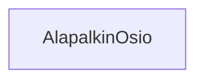

# Div:in kaltainen komponentti: AlapalkinOsio



**palautettavien tiedostojen ja kansioiden nimet:** 

* tiedosto: `teht21/alapalkin-osio.svelte` (kansiossa: `harjoitukset/02-javascript/01-svelte/teht21/alapalkin-osio.svelte`)

## Kuvaus

Komponentti, joka vastaa otsikon ja otsikkoa vastaavan sisällön näyttämisestä.

Komponentti on näppärä apuväline, kun halutaan määrittää kaikille otsikollisille osioille alapalkissa saman verran tyhjää tilaa ympärille.

## Parametrit

Saa parametrina:

* `otsikko` - sarakkeen otsikko.
* saa komponentin sisältönä (eli lapsena) osion sisällön.

## Toteutus

Näyttää otsikon, jonka tekstiksi asettaa `otsikko`-parametrin arvon.

`alapalkin-osio.svelte`-komponentin pitäisi tämän tehtävän lopussa palauttaa suurin piirtein seuraavan kaltainen html:

_`alapalkin-osio.svelte`:_

```svelte
<div class="alapalkin-osio">
  <h2 class="alapalkin-osio__otsikko">{otsikko}</h2>
  <div class="alapalkin-osio__sisältö">{sisältö}</div>
</div>
```

### Toteutus: `otsikko`-prop

Lähdemme aluksi kertaamaan propsien käyttöä,
ja toteuttamaan komponentille `otsikko`-propsin.

Lisätään siis komponentille alkuun `script`-elementti,
jonka sisällä ladataan `otsikko`-attribuutti komponentin käytettäväksi:

_`alapalkin-osio.svelte`:_

```svelte
<script>
    let { otsikko } = $props();
</script>
```

Tämän jälkeen, kun `otsikko` on otettu käytettäväksi, käytetään sitä:

_`alapalkin-osio.svelte`:_

```svelte
<div class="alapalkin-osio">
  <h2 class="alapalkin-osio__otsikko">{otsikko}</h2>
</div>
```

### Toteutus: komponentin lapset `children`-prop:in avulla

Toteutetaan seuraavaksi varsinainen `div`-elementin kaltainen ominaisuus.

#### Haluttu toiminnallisuus

Haluamme siis pystyä käyttämään tätä komponenttia kuten `div`-elementtiä:

_html:_

```html
<div>
    sisältö
</div>
```

Eli siis muodossa:

_svelte-komponentti:_

```svelte
<AlapalkinOsio>
    sisältö
</AlapalkinOsio>
```

Jos kuitenkin nyt kokeilemme tätä, 
`sisältö` ei koskaan tule näkyviin.

Voit kokeilla tätä esim. `teht23/artikkelit.svelte`-komponentissa:

_`teht23/artikkelit.svelte`:_

```svelte
```

Svelte vaatii, että meidän pitää eksplisiittisesti ladata sisältö,
ja sen jälkeen lisätä se haluamaamme kohtaan svelte-komponentin sisälle.
Tämä tapahtuu sveltessä käyttäen erityistä `children`-props:ia.

#### `children`-props:in luku käyttöön komponentin sisällä

`children`-props:i otetaan käyttöön komponentissa samalla tavalla kuin aikaisempi `otsikko`-propsi.
Lisätään se siis luettavaksi `$props`-muuttujasta:

_`alapalkin-osio.svelte`:_

```svelte
<script>
    let { otsikko, children } = $props();
</script>
```

#### `children`-props:in hahmontaminen

Tämän jälkeen meidän pitää vielä hahmontaa (engl. render), eli näyttää,
lapsisältö komponentin sisällä.
Tämä tapahtuu käyttäen erityistä `@render`-määrettä:

_svelte:_

```svelte
{@render children()}
```

Emme siis voikaan vain lisätä `children`-props:in sisältöä html:n sekaan:

_svelte:_

```svelte
<!-- Tämä ei toimi -->
{children}
```

Vaan se pitää erikseen hahmontaa käyttäen yllä olevaa koodia.

##### `children`-props:i voikin olla tyhjä, eli miten hahmonnamme sen vain jos se on annettu

Tämäkään ei kuitenkaan vielä riitä. 
Jos `children`-props onkin tyhjä,
eli komponentille ei ole annettu lapsisältöä,
aiempi koodimme kaatuu.

Tätä varten joudumme muokkaamaan hahmontavan koodimme seuraavaan muotoon:

_svelte:_

```svelte
{@render children?.()}
```

Huomaa edellä `?.`, joka määrittää, että kutsumme `children`-funktiota,
vain jos se ei ole tyhjä.

#### Lapsisisällön näyttäminen

Kun aikaisemmin komponentin html-osuus näytti seuraavalta:

_`alapalkin-osio.svelte`:_

```svelte
<div class="alapalkin-osio">
  <h2 class="alapalkin-osio__otsikko">{otsikko}</h2>
</div>
```

Lisäämme nyt tähän lapsisisällön näyttämisen:

_`alapalkin-osio.svelte`:_

```svelte
<div class="alapalkin-osio">
  <h2 class="alapalkin-osio__otsikko">{otsikko}</h2>
  <div class="alapalkin-osio__sisältö">
    {@render children?.()}
  </div>
</div>
```

### Toteutus: koko komponentti

Komponentin pitäisi nyt näyttää seuraavalta:

_`alapalkin-osio.svelte`:_

```svelte
<script>
    let { otsikko, children } = $props();
</script>

<section>
    <h2>{otsikko}</h2>

    <div>
        {@render children?.()}
    </div>
</section>

<!-- lisätään vielä yksinkertaiset css-säännöt -->
<style>
    section {
        display: flex;
        flex-direction: column;
    }
</style>
```

### Komponentin käyttö

Lisäsimme tässä tehtävässä `AlapalkinOsio.svelte`-komponentin käyttämään props:eja:

* `otsikko`
* `children`

Käytämme näitä seuraavasti, esimerkiksi teht23:sta löytyvän `Artikkelit.svelte`-komponentin sisällä:

_`teht23/artikkelit.svelte`:_

```svelte
<script>
    import AlapalkinOsio from '../teht21/alapalkin-osio.svelte';
    <!-- 
        `Artikkelit`-komponenttti, joka listaa näkyvät artikkelit artikkelit-osion sisällä: 
    -->
    import Artikkelit from '../teht17/artikkelit.svelte';
</script>

<AlapalkinOsio otsikko="Artikkelit ja blogi">
    <Artikkelit />
</AlapalkinOsio>
```

Yllä olevasta `Artikkelit.svelte`-komponentista (teht23:n komponentti) puuttuu kuitenkin vielä `AlapalkinSarake`-komponentin käyttö.
Lisäämme sen seuraavaksi.
