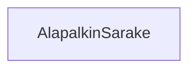

# Divin kaltainen komponentti: `AlapalkinSarake`

Seuraavaksi teemme saman `alapalkin-sarake.svelte`-komponentille,
joka löytyy kansiosta `teht22`.



**palautettavien tiedostojen ja kansioiden nimet:** 

* tiedosto: `teht22/alapalkin-sarake.svelte` (kansiossa: `harjoitukset/02-javascript/01-svelte/teht22/alapalkin-sarake.svelte`)

## Kuvaus

`AlapalkinSarake`-komponentti vastaa alapalkin sarakkeiden piirtämisestä.

Siis niiden otsikollisten sarakkeiden, joilla on sellaisia otsikoita kuin: "Yhteisöt" ja "Info",
mutta myös "Asiakaspalvelu"- ja "Yritysmyynti"-osioiden yhteisen sarakkeen näyttämisestä.

`AlapalkinSarake`-komponentin keskeinen vastuualue on varmistaa, 
että se viereisten sarakkeiden kanssa vie saman verran horisontaalista tilaa.

Tämä tapahtuu käyttäen `flex: 1;` -css-sääntöä.

## Parametrit

Saa parametrina:

* saa komponentin sisältönä (eli lapsena) sarakkeen sisällön.

Tehtävässä tarvitaan taas `@render`-riimua ja `children`-propia,
joista kerrottiin edellisessä tehtävässä.

## Totetutus

### Toteutus: lapsisältö

Edellisen tehtävän kaltaisesti,
komponentti saa `children`-props:in,
joka sisältää sille lapsisältönä annetun html-sisällön.

_`alapalkin-sarake.svelte`:_

```svelte
<script>
    let { children } = $props();
</script>
```

`children`-props:in käyttö tapahtuu samalla tavalla kuin viimeksikin:

_svelte:_

```svelte
{@render children?.()}
```

Eli koodissa:

_`alapalkin-sarake.svelte`:_

```svelte
<div>
    {@render children?.()}
</div>
```

### Toteutus: `flex: 1;` -css-sääntö

Tarkoituksemme on käyttää tätä komponenttia varmistamaan,
että jokainen alapalkin sarakkeista käyttää saman verran tilaa horisontaalisesti.

Tämän toteutamme lisäämällä yllä määritettyyn `div`-elementtiin `flex: 1;` -css-säännön:

_`alapalkin-sarake.svelte`:_

```svelte
<style>
    div {
        flex: 1;
    }
</style>
```

### Toteutus: koko komponentti

Komponentin pitäisi nyt näyttää seuraavalta:

_`alapalkin-sarake.svelte`:_

```svelte
<script>
    let { children } = $props();
</script>

<div>
    {@render children?.()}
</div>

<style>
    div {
        flex: 1;
    }
</style>
```

### Toteutus: komponentin käyttö

Lisäsimme tässä tehtävässä `AlapalkinSarake.svelte`-komponentin käyttämään props:eja:

* `children`

Käytämme näitä seuraavasti, esimerkiksi teht23:sta löytyvän `Artikkelit.svelte`-komponentin sisällä.

Edellisessä tehtävässä jätimme `Artikkelit.svelte`-komponentin seuraavan näköiseksi:

_`artikkelit.svelte`:_

```svelte
<script>
    import AlapalkinSarake from '../teht22/alapalkin-sarake.svelte';
    import AlapalkinOsio from '../teht21/alapalkin-osio.svelte';
    <!-- 
        `Artikkelit`-komponenttti, joka listaa näkyvät artikkelit artikkelit-osion sisällä: 
    -->
    import Artikkelit from '../teht17/artikkelit.svelte';
</script>

<AlapalkinSarake />
<AlapalkinOsio otsikko="Artikkelit ja blogi">
    <Artikkelit />
</AlapalkinOsio>
```

Nyt lisäämme siihen vielä samalla tavalla `AlapalkinSarake`-komponentin.

_`artikkelit.svelte`:_

```svelte
<AlapalkinSarake>
    <AlapalkinOsio otsikko="Artikkelit ja blogi">
        <Artikkelit />
    </AlapalkinOsio>
</AlapalkinSarake>
```

Tämän jälkeen `Artikkelit.svelte`-komponentin pitäisi näyttää seuraavalta:

_`artikkelit.svelte`:_

```svelte
<script>
    import AlapalkinSarake from '../teht22/alapalkin-sarake.svelte';
    import AlapalkinOsio from '../teht21/alapalkin-osio.svelte';
    <!-- 
        `Artikkelit`-komponenttti, joka listaa näkyvät artikkelit artikkelit-osion sisällä: 
    -->
    import Artikkelit from '../teht17/artikkelit.svelte';
</script>

<AlapalkinSarake>
    <AlapalkinOsio otsikko="Artikkelit ja blogi">
        <Artikkelit />
    </AlapalkinOsio>
</AlapalkinSarake>
```

## Seuraavaksi

Seuraavaksi muokkaamma `teht23`-kansion muut komponentit käyttämään näitä komponentteja.
