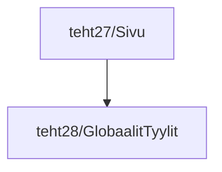

# Tehtäväsarja 5: tehtävä 2 - globaalien tyylien käyttöönotto `sivu.svelte`-komponentissa

Edellisessä tehtävässä otettiin käyttöön globaalit tyylit muilla svelte-komponenteilla storybookissa.
Nyt otetaan vielä lopuksi samat globaalit tyylit käyttöön `sivu.svelte`-komponentillamme.

Tämä on erityisen tärkeää, koska `sivu.svelte` on pääkomponenttimme, jonka näytämme sovelluksemme juuressa, 
sitten lopulta, kun julkaisemme sivumme.

Jotta tyylimme toimisivat myös storybook:in ulkopuolella, julkaistulla sivulla, 
meidän pitää lisätä globaalit tyylit sivullemme, siis juurikin sivun juureen, eli `sivu.svelte`-komponenttiin.

**muokattavien tiedostojen ja kansioiden nimet:** 

* tiedosto: `teht28/globaalit-tyylit.svelte` (kansiossa: `harjoitukset/02-javascript/01-svelte/teht28/globaalit-tyylit.svelte`)

Tämä `globaalit-tyylit.svelte`-komponentti on jo lisätty tarinoiden osalta kaikkiin muihin tarinoihin, 
paitsi `sivu.svelte`-komponentin tarinoihin.

`globaalit-tyylit.svelte`-komponentti on siis käytössä tarinoissa,
mutta koska tarinat eivät näy lopullisella sivustolla,
lopullisessa sivustossa se ei kuitenkaan vielä ole käytössä.

Otetaan siis vielä lopuksi `globaalit-tyylit.svelte`-komponentti käyttöön `sivu.svelte`-komponentissa,
jotta se tulee käyttöön myös lopullisessa sivustossa.

## Tehtävänanto

Muuta `sivu.svelte`-komponenttia siten, että se renderöi `globaalit-tyylit.svelte`-komponentin.
Voit ottaa mallia tämän dokumentin alussa olevasta graafista.

## Seuraavaksi

Tähän asti olemme vasta tehneet alustavaa työtä komponenttisivuston käyttöä varten.

Seuraavaksi alamme rakentamaan komponenteista niiden oikeampia versioita,
ja täyttämään niitä oikealla sisällöllä.

Seuraavaksi: [Tehtäväsarja 5: komponenttien varsinainen toteutus](../06-tehtavasarja-6/README.md)
