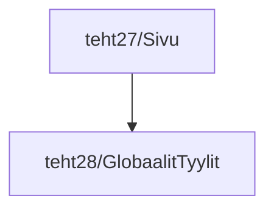

# Tehtäväsarja 4: tehtävä 3

**palautettavien tiedostojen ja kansioiden nimet:** 

* tiedosto: `teht28/globaalit-tyylit.svelte` (kansiossa: `harjoitukset/02-javascript/01-svelte/teht28/globaalit-tyylit.svelte`)

Tämä `globaalit-tyylit.svelte`-komponentti on jo lisätty tarinoiden osalta kaikkiin muihin tarinoihin, 
paitsi `sivu.svelte`-komponentin tarinoihin.

`globaalit-tyylit.svelte`-komponentti on siis käytössä tarinoissa,
mutta koska tarinat eivät näy lopullisella sivustolla,
lopullisessa sivustossa se ei kuitenkaan vielä ole käytössä.

Otetaan siis vielä lopuksi `globaalit-tyylit.svelte`-komponentti käyttöön `sivu.svelte`-komponentissa,
jotta se tulee käyttöön myös lopullisessa sivustossa.

## Tehtävänanto

Muuta `sivu.svelte`-komponenttia siten, että se renderöi `globaalit-tyylit.svelte`-komponentin.
Voit ottaa mallia tämän dokumentin alussa olevasta graafista.

## Seuraavaksi

Tähän asti olemme vasta tehneet alustavaa työtä komponenttisivuston käyttöä varten.

Seuraavaksi alamme rakentamaan komponenteista niiden oikeampia versioita,
ja täyttämään niitä oikealla sisällöllä.

Seuraavaksi: [Tehtäväsarja 5: komponenttien varsinainen toteutus](./05-00-tehtavasarja-5.md)
