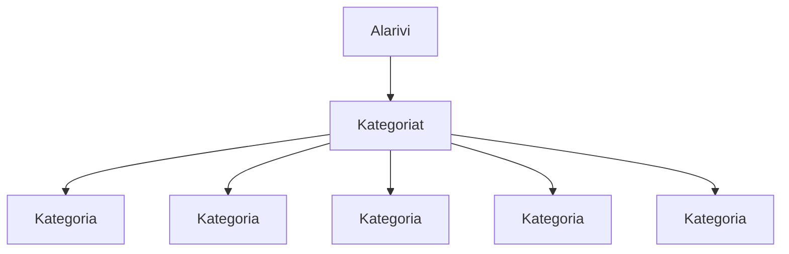

### `teht07`-kansio - verkkokaupan yläpalkin alarivi, eli tuotekategoriat



**palautettavien tiedostojen ja kansioiden nimet:** 

* tiedosto: `teht07/alarivi.svelte` (kansiossa: `harjoitukset/02-javascript/01-svelte/teht07/alarivi.svelte`)
* tiedosto: `teht07/kategoria.svelte` (kansiossa: `harjoitukset/02-javascript/01-svelte/teht07/kategoria.svelte`)
* tiedosto: `teht07/kategoriat.svelte` (kansiossa: `harjoitukset/02-javascript/01-svelte/teht07/kategoriat.svelte`)

Aiemmassa tehtävässä tehtiin verkkokaupan ylä- ja alapalkkia perinteisellä html:llä ja css:llä.

Nyt voitaisiinkin lähteä siirtämään osaa tästä aiemmin tehdystä sivusta komponenttien muotoon.

Aloitetaan tämä yläpalkin alarivistä, joka sisältää kategoriat.

Luomme aluksi kategorialle oman komponentin:

`teht07/kategoria.svelte`:

```svelte
<script>
  let { nimi, url } = $props(); 
</script>

<style>
  /* 
  Lisää tähän tyylit kategorialle. 
  */
</style>

<div>
  <a href={url}>{nimi}</a>
</div>
```

Nyt kun meillä on olemassa kategoria-komponentti, 
voimme käyttää sitä kategoriat-komponentin sisällä, useampaan kertaan.

`teht07/kategoriat.svelte`:

```svelte
<script>
  import Kategoria from './kategoria.svelte';
</script>

<style>
  /* 
  Lisää tähän tyylit kategoriat-komponentille. 
  */
</style>

<ul>
  <li>
    <Kategoria nimi="tietokone" url="#" />
  </li>
  <li>
    <Kategoria nimi="komponentit" url="#" />
  </li>
  <li>
    <Kategoria nimi="oheislaitteet" url="#" />
  </li>
  <li>
    <Kategoria nimi="pelaaminen" url="#" />
  </li>
  <li>
    <Kategoria nimi="sim racing" url="#" />
  </li>
  <li>
    <Kategoria nimi="verkkotuotteet" url="#" />
  </li>
  <li>
    <Kategoria nimi="tarvikkeet" url="#" />
  </li>
  <li>
    <Kategoria nimi="erikoistuotteet" url="#" />
  </li>
  <li>
    <Kategoria nimi="ohjelmistot" url="#" />
  </li>
  <li>
    <Kategoria nimi="palvelut" url="#" />
  </li>
  <li>
    <Kategoria nimi="kampanjat" url="#" />
  </li>
</ul>
```

Lopuksi voimme käyttää kategoriat osaa alarivillämme.

`teht07/alarivi.svelte`:

```svelte
<script>
  import Kategoriat from './kategoriat.svelte';
</script>

<style>
  /* 
  Lisää tähän tyylit kategoriat-komponentille. 
  */
</style>

<Kategoriat />
```

#### Lisätehtävä

Huomaa, että tässä vaiheessa olemme vielä, `kategoriat.svelte`-komponentissa, kovakoodanneet `ul`-elementin sisällön svelten html-elementeiksi.

Yleensä `ul`-elementin sisältö kuitenkin määritellään datasta, jonka komponentti saa propsinaan.

Voit myöhemmin, kun olemme oppineet käyttämään svelten `each`-rakennetta, palata `kategoriat.svelte`-komponenttiin, 
ja muuttaa sen määrittämään kategoriat taulukossa, josta `li`-elementit rakennetaan käyttäen svelten `each`-rakennetta.

Voit kuitenkin toistaiseksi jättää `kategoriat.svelte`-komponentin aiemmin määritettyyn muotoonsa.
