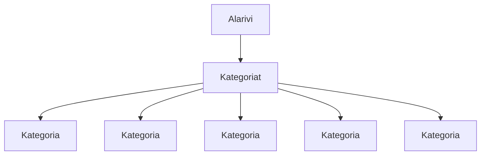

# Tehtäväsarja 6: Tehtävä 1 - `teht07`-kansio - verkkokaupan yläpalkin alarivi, eli tuotekategoriat


```mermaid
graph TD;
  Alarivi-->Kategoriat;
  Kategoriat-->Kategoria1[Kategoria];
  Kategoriat-->Kategoria2[Kategoria];
  Kategoriat-->Kategoria3[Kategoria];
  Kategoriat-->Kategoria4[Kategoria];
  Kategoriat-->Kategoria5[Kategoria];
```

**muokattavien tiedostojen ja kansioiden nimet:** 

* tiedosto: `teht07/alarivi.svelte` (kansiossa: `harjoitukset/02-javascript/01-svelte/teht07/alarivi.svelte`)
* tiedosto: `teht07/kategoria.svelte` (kansiossa: `harjoitukset/02-javascript/01-svelte/teht07/kategoria.svelte`)
* tiedosto: `teht07/kategoriat.svelte` (kansiossa: `harjoitukset/02-javascript/01-svelte/teht07/kategoriat.svelte`)

## `Kategoria`-komponentti

Haluamme antaa jokaiselle kategorialle kaksi asiaa: tekstin ja url:n johon kategorian linkki johtaa.

### propsit:

* `url` - teksti
* `nimi` - teksti

### käyttö

Huomaa, että annamme kategorialle oletusarvot, jotta sen teksti ja linkki näkyvät, vaikka unohtaisimme antaa ne propsina.

Komponentti ottaa propsit vastaan:

`teht07/kategoria.svelte`:

```svelte
<script>
  let { nimi="kategoria", url="#" } = $props(); 
</script>
```

Ja näyttää ne `a`-elementin avulla:

`teht07/kategoria.svelte`:

```svelte
<div>
  <a href={url}>{nimi}</a>
</div>
```

## `Kategoriat`-komponentti

Nyt kun `kategoria`-komponentti ottaa dataa vastaan, 
voimme lopulta laittaa `kategoriat`-komponentin näyttämään oikeat `kategoria`-komponentit, oikeilla linkeillä ja oikeilla teksteillä.

Myöhemmässä tehtäväsarjassa muokkaamme `kategoriat`-komponentin ottamaan tiedon näyttämistään komponenteista props:ina,
mutta nyt riittää, että kovakoodaamme kategoriat seuraavalle datalle:

`teht07/kategoriat.svelte`:

```svelte
<script>
  import Kategoria from './kategoria.svelte';
</script>

<ul>
  <li>
    <Kategoria nimi="tietokone" url="#" />
  </li>
  <li>
    <Kategoria nimi="komponentit" url="#" />
  </li>
  <li>
    <Kategoria nimi="oheislaitteet" url="#" />
  </li>
  <li>
    <Kategoria nimi="pelaaminen" url="#" />
  </li>
  <li>
    <Kategoria nimi="sim racing" url="#" />
  </li>
  <li>
    <Kategoria nimi="verkkotuotteet" url="#" />
  </li>
  <li>
    <Kategoria nimi="tarvikkeet" url="#" />
  </li>
  <li>
    <Kategoria nimi="erikoistuotteet" url="#" />
  </li>
  <li>
    <Kategoria nimi="ohjelmistot" url="#" />
  </li>
  <li>
    <Kategoria nimi="palvelut" url="#" />
  </li>
  <li>
    <Kategoria nimi="kampanjat" url="#" />
  </li>
</ul>
```
