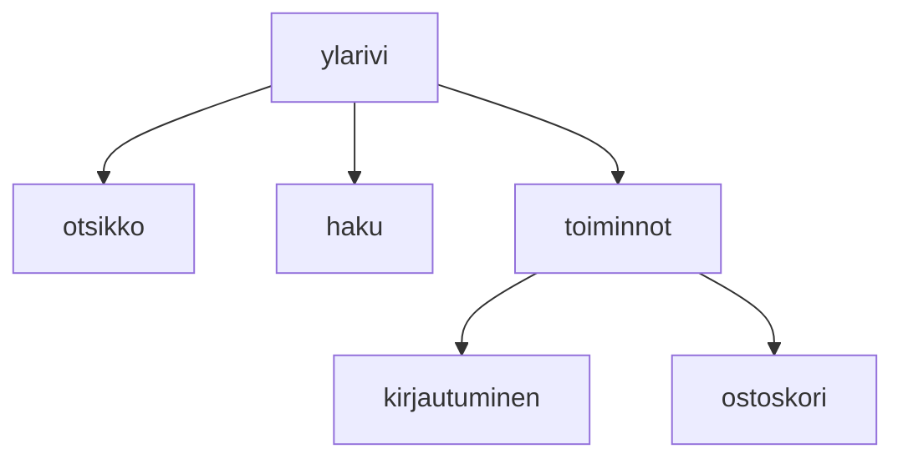

### Tehtäväsarja 6: Tehtävä 2 - `teht8`-kansio - verkkokaupan yläpalkin ylärivi



**muokattavien tiedostojen ja kansioiden nimet:** 

* tiedosto: `teht08/ylarivi.svelte` (kansiossa: `harjoitukset/02-javascript/01-svelte/teht08/ylarivi.svelte`)
* tiedosto: `teht08/otsikko.svelte` (kansiossa: `harjoitukset/02-javascript/01-svelte/teht08/otsikko.svelte`)
* tiedosto: `teht08/haku.svelte` (kansiossa: `harjoitukset/02-javascript/01-svelte/teht08/haku.svelte`)
* tiedosto: `teht08/toiminnot.svelte` (kansiossa: `harjoitukset/02-javascript/01-svelte/teht08/toiminnot.svelte`)
* tiedosto: `teht08/kirjautuminen.svelte` (kansiossa: `harjoitukset/02-javascript/01-svelte/teht08/kirjautuminen.svelte`)
* tiedosto: `teht08/ostoskori.svelte` (kansiossa: `harjoitukset/02-javascript/01-svelte/teht08/ostoskori.svelte`)

## `Otsikko`-komponentti

Teemme otsikosta vähän samanlaisen kuin aiemmasta `teht07/kategoria.svelte`-komponentista.

### propsit:

* `url` - teksti
* `otsikko` - teksti

### käyttö

Komponentti ottaa propsit vastaan:

Huomaa taas, että annamme otsikolle oletusarvon, jotta sen teksti näkyy, vaikka unohtaisimme antaa sille otsikon tekstin.

`teht08/otsikko.svelte`:

```svelte
<script>
  let { otsikko="Otsikko", url="#" } = $props(); 
</script>
```

Ja näyttää ne `h1` ja `a`-elementin avulla:

`teht08/otsikko.svelte`:

```svelte
<h1>
  <a href={url}>{otsikko}</a>
</h1>
```
