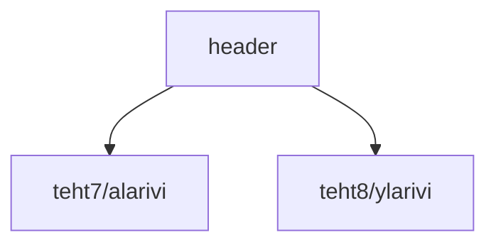

### Tehtäväsarja 6: Tehtävä 3 - `teht09`-kansio - verkkokaupan yläpalkki



**muokattavien tiedostojen ja kansioiden nimet:** 

* tiedosto: `teht09/header.svelte` (kansiossa: `harjoitukset/02-javascript/01-svelte/teht09/header.svelte`)


## `Header`-komponentti

Harjoittelemme tässä komponentissa datan putkittamista komponentilta toiselle.

Annamme `header.svelte`-komponentille dataa, jota se ei itse näytäkään, vaan jonka se antaa edelleen eteenpäin alikomponentilleen.

### propsit:

* `nimiSivu` - teksti

### käyttö

Komponentti ottaa propsit vastaan:

`teht09/header.svelte`:

```svelte
<script>
  let { nimiSivu } = $props(); 
</script>
```

Ja antaa ne eteenpäin `ylarivi.svelte`-komponentille:

`teht09/header.svelte`:

```svelte
<!-- sillä aikaa jossain päin sivua -->
  <Ylarivi otsikko={nimiSivu} />
<!-- ja sivu jatkuu eteenpäin -->
```

Huomaa, että tässä `<!-- -->` on html:n kommentti, joka näkyy sivun lähdekoodissa kehittäjätyökaluilla selaimessa, 
mutta jota selain ei näytä lopullisella sivulla.

Toisin sanoen, se on edelleen julkista tietoa, joka ei katoa julkaisun yhteydessä, mutta käyttäjän pitää osata etsiä sitä sivun lähdekoodista nähdäkseen sen.
