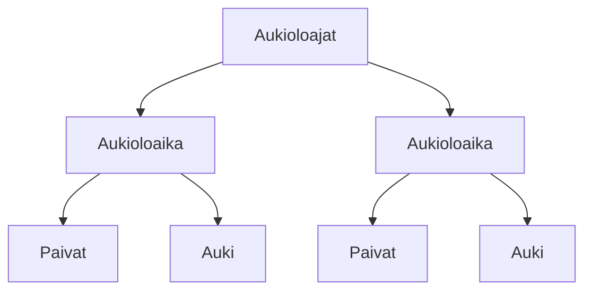

### Tehtäväsarja 6: Tehtävä 6 - `teht12`-kansio - verkkokaupan alapalkin aukioloajat


```mermaid
graph TD;
  Aukioloajat-->Aukioloaika1[Aukioloaika];
  Aukioloajat-->Aukioloaika2[Aukioloaika];
  Aukioloaika1[Aukioloaika]-->Paivat1[Paivat];
  Aukioloaika1[Aukioloaika]-->Auki1[Auki];
  Aukioloaika2[Aukioloaika]-->Paivat2[Paivat];
  Aukioloaika2[Aukioloaika]-->Auki2[Auki];
```

**muokattavien tiedostojen ja kansioiden nimet:** 

* tiedosto: `teht12/aukioloajat.svelte` (kansiossa: `harjoitukset/02-javascript/01-svelte/teht12/aukioloajat.svelte`)
* tiedosto: `teht12/aukioloaika.svelte` (kansiossa: `harjoitukset/02-javascript/01-svelte/teht12/aukioloaika.svelte`)
* tiedosto: `teht12/paivat.svelte` (kansiossa: `harjoitukset/02-javascript/01-svelte/teht12/paivat.svelte`)
* tiedosto: `teht12/auki.svelte` (kansiossa: `harjoitukset/02-javascript/01-svelte/teht12/auki.svelte`)

#### `Paivat`-komponentti

### propsit:

* `päivät` - teksti

### käyttö

Komponentti ottaa propsit vastaan:

Huomaa taas, että annamme tekstille oletusarvon.

`teht12/paivat.svelte`:

```svelte
<script>
  let { päivät="Ma-Su" } = $props(); 
</script>
```

Ja näyttää ne:

`teht12/paivat.svelte`:

```svelte
<div>{päivät}</div>
```

#### Auki-komponentti

### propsit:

* `auki` - teksti

### käyttö

Komponentti ottaa propsit vastaan:

Huomaa taas, että annamme tekstille oletusarvon.

`teht12/auki.svelte`:

```svelte
<script>
  let { auki="24 / 7" } = $props(); 
</script>
```

Ja näyttää ne:

`teht12/auki.svelte`:

```svelte
<div>{auki}</div>
```

#### Aukioloaika-komponentti

`aukioloaika.svelte`-komponentti on yksinkertainen komponentti.

Se renderöi seuraavat komponentit:

* `paivat.svelte`
* `auki.svelte`

#### Aukioloajat-komponentti

`Aukioloajat`-komponentti näyttää yhden kappaleen `Aukioloaika`-komponentteja.

Myöhemmin muokkaamme tämänkin komponentin käyttämään javascriptina saatua dataa, useamman aukioloajan näyttämiseen.

Nyt kuitenkin riittää yhden aukioloajan näyttäminen.
