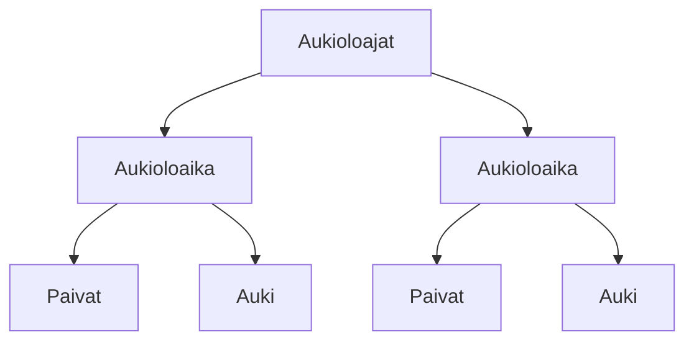

### Tehtävä 12 - verkkokaupan alapalkin aukioloajat



**palautettavien tiedostojen ja kansioiden nimet:** 

* tiedosto: `teht12/aukioloajat.svelte` (kansiossa: `harjoitukset/02-javascript/01-svelte/teht12/aukioloajat.svelte`)
* tiedosto: `teht12/aukioloaika.svelte` (kansiossa: `harjoitukset/02-javascript/01-svelte/teht12/aukioloaika.svelte`)
* tiedosto: `teht12/paivat.svelte` (kansiossa: `harjoitukset/02-javascript/01-svelte/teht12/paivat.svelte`)
* tiedosto: `teht12/auki.svelte` (kansiossa: `harjoitukset/02-javascript/01-svelte/teht12/auki.svelte`)

#### `Paivat`-komponentti

`Paivat`-komponentti näyttää tekstin:

```svelte
Ma-Su
```

Myöhemmin, `Paivat`-komponentti muokataan käyttämään propseina saamiaan arvoja näytettävien päivien valikoimiseen.
Nyt kuitenkin riittää yllä oleva kovakoodattu arvo. 

#### Auki-komponentti

`Auki`-komponentti näyttää tekstin:

```svelte
24 / 7
```

Myöhemmin, `Auki`-komponentti muokataan käyttämään propseina saamiaan arvoja näytettävien aukioloaikojen valikoimiseen.
Nyt kuitenkin riittää taas yllä oleva kovakoodattu arvo.

#### Aukioloaika-komponentti

`aukioloaika.svelte`-komponentti on yksinkertainen komponentti.

Se renderöi seuraavat komponentit:

* `paivat.svelte`
* `auki.svelte`

#### Aukioloajat-komponentti

`Aukioloajat`-komponentti näyttää yhden kappaleen `Aukioloaika`-komponentteja.

Myöhemmin muokkaamme tämänkin komponentin käyttämään javascriptina saatua dataa, useamman aukioloajan näyttämiseen.

Nyt kuitenkin riittää yhden aukioloajan näyttäminen.
