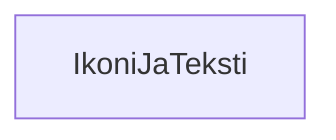

# Tehtäväsarja 6: Tehtävä 7 - `teht13`-kansio - ikoni-ja-teksti -komponentti


```mermaid
graph TD;
  IkoniJaTeksti;
```

**muokattavien tiedostojen ja kansioiden nimet:** 

* tiedosto: `teht13/ikoni-ja-teksti.svelte` (kansiossa: `harjoitukset/02-javascript/01-svelte/teht13/ikoni-ja-teksti.svelte`)

## `IkoniJaTeksti`-komponentti

Tätä komponenttia käytetään sivulla useammassa paikassa apuna. 
Sitä käytetään osoitetietoihin sekä info-sivujen näyttämiseen.

Komponentti näyttää sille annetun kuvan tekstin vasemmalla puolella.

### propsit:

Komponentti saa parametrit:

* `kuva` - kuva
* `teksti` - merkkijono, eli teksti

### käyttö

Komponentti ottaa propsit vastaan:

`teht13/ikoni-ja-teksti.svelte`:

```svelte
<script>
  let { kuva, teksti } = $props(); 
</script>
```

Ja näyttää ne, vaikka seuraavasti:

`teht13/ikoni-ja-teksti.svelte`:

```svelte
<div class="ikoni-ja-teksti">
	
	<div class="ikoni-ja-teksti__teksti">{teksti}</div>
</div>
```
