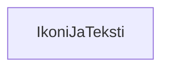

### `teht13`-kansio - ikoni-ja-teksti -komponentti



**palautettavien tiedostojen ja kansioiden nimet:** 

* tiedosto: `teht13/ikoni-ja-teksti.svelte` (kansiossa: `harjoitukset/02-javascript/01-svelte/teht13/ikoni-ja-teksti.svelte`)

Komponentti saa parametrit:

* `kuva` - kuva
* `teksti` - merkkijono

Tätä komponenttia käytetään sivulla useammassa paikassa apuna. 
Sitä käytetään osoitetietoihin sekä info-sivujen näyttämiseen.

Komponentti näyttää sille annetun kuvan tekstin vasemmalla puolella.

```svelte
<div class="ikoni-ja-teksti">
	
	<div class="ikoni-ja-teksti__teksti">{teksti}</div>
</div>
```
