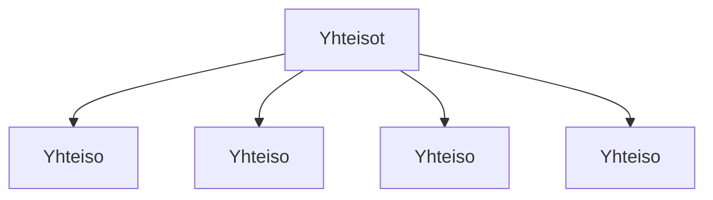

# Tehtäväsarja 6: Tehtävä 8 - `teht14`-kansio - sosiaalisen median yhteisöt


```mermaid
graph TD;
  Yhteisot-->Yhteiso1[Yhteiso]
  Yhteisot-->Yhteiso2[Yhteiso]
  Yhteisot-->Yhteiso3[Yhteiso]
  Yhteisot-->Yhteiso4[Yhteiso]
```

**muokattavien tiedostojen ja kansioiden nimet:** 

* tiedosto: `teht14/yhteiso.svelte` (kansiossa: `harjoitukset/02-javascript/01-svelte/teht14/yhteiso.svelte`)
* tiedosto: `teht14/yhteisot.svelte` (kansiossa: `harjoitukset/02-javascript/01-svelte/teht14/yhteisot.svelte`)

## yhteisö-komponentti

Näyttää sosiaalisen median yhteisön ikonin ja linkin kyseisen yhteisön tiliin.

### propsit:

`yhteiso.svelte`-komponentti saa parametrit:

* `kuva` - merkkijono, pitää sisällään polun kuvaan (muotoa: `/harjoitukset/<kuvan nimi>.png`)
* `nimi` - merkkijono, pitää sisällään sosiaalisen median yhteisön nimen
* `url` - url merkkijonona, joka johtaa yhteisössä olevalle tilille

### käyttö

Komponentti ottaa propsit vastaan:

`teht14/yhteiso.svelte`:

```svelte
<script>
  let { kuva, nimi, url="#" } = $props(); 
</script>
```

Ja näyttää ne, vaikka seuraavasti:

`teht14/yhteiso.svelte`:

```svelte
<a href={url} class="yhteiso">
	
</a>
```

Huomaa, että komponentti tekee myös nimestä linkin, käyttäen `url`-parametrina annettua arvoa.

## yhteisöt-listakomponentti

`teht14/yhteisot.svelte`-komponentti kokoaa yksittäiset `yhteiso.svelte`-komponentit listaksi.

Huomaa siis, että `li`-elementit ovat tämän komponentin sisällä.

Sillä missä `li`-elementit lopulta ovat, ei oikeastaan ole väliä. 
Sisällyttämällä ne tämän elementin sisälle, voisimme teoriassa, halutessamme,
käyttää `yhteiso.svelte`-komponenttia myös jossain muussa paikassa kuin tämän komponentin sisällä.

### käyttö

Komponentti näyttää useamman `Yhteiso`-komponentin:

`teht14/yhteisot.svelte`:

```svelte
<ul>
  <li>
    <Yhteiso nimi="facebook" url="" kuva="" />
  </li>
  <li>
    <Yhteiso nimi="instagram" url="" kuva="" />
  </li>
  <li>
    <Yhteiso nimi="x" url="" kuva="" />
  </li>
  <li>
    <Yhteiso nimi="jne" url="" kuva="" />
  </li>
</ul>
```

Komponenttia käytetään:

_`teht23/yhteisot.svelte`:_

```svelte
<Yhteisot />
```
