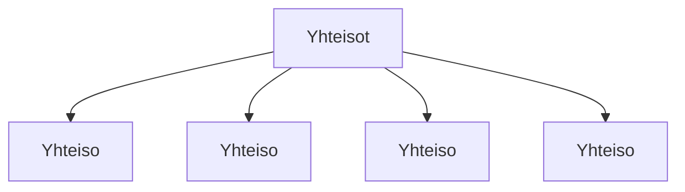

### `teht14`-kansio - sosiaalisen median yhteisöt



**palautettavien tiedostojen ja kansioiden nimet:** 

* tiedosto: `teht14/yhteiso.svelte` (kansiossa: `harjoitukset/02-javascript/01-svelte/teht14/yhteiso.svelte`)
* tiedosto: `teht14/yhteisot.svelte` (kansiossa: `harjoitukset/02-javascript/01-svelte/teht14/yhteisot.svelte`)

#### yhteisö-komponentti

`yhteiso.svelte`-komponentti saa parametrit:

* `kuva` - merkkijono, pitää sisällään polun kuvaan (muotoa: `/harjoitukset/<kuvan nimi>.png`)
* `nimi` - merkkijono, pitää sisällään sosiaalisen median yhteisön nimen
* `url` - url merkkijonona, joka johtaa yhteisössä olevalle tilille

Komponenttia käytetään:

_`yhteisot.svelte`:_

```svelte
<Yhteiso nimi="" url="" kuva="" />
```

Komponentti tekee myös nimestä linkin, käyttäen `url`-parametrina annettua arvoa.

#### yhteisöt-listakomponentti

Komponentti näyttää useamman `Yhteiso`-komponentin:

_`yhteisot.svelte`:_

```svelte
<ul>
  <li>
    <Yhteiso nimi="" url="" kuva="" />
  </li>
  <li>
    <Yhteiso nimi="" url="" kuva="" />
  </li>
  <li>
    <Yhteiso nimi="" url="" kuva="" />
  </li>
  <li>
    <Yhteiso nimi="" url="" kuva="" />
  </li>
</ul>
```

Komponenttia käytetään:

_`teht23/yhteisot.svelte`:_

```svelte
<Yhteisot />
```
