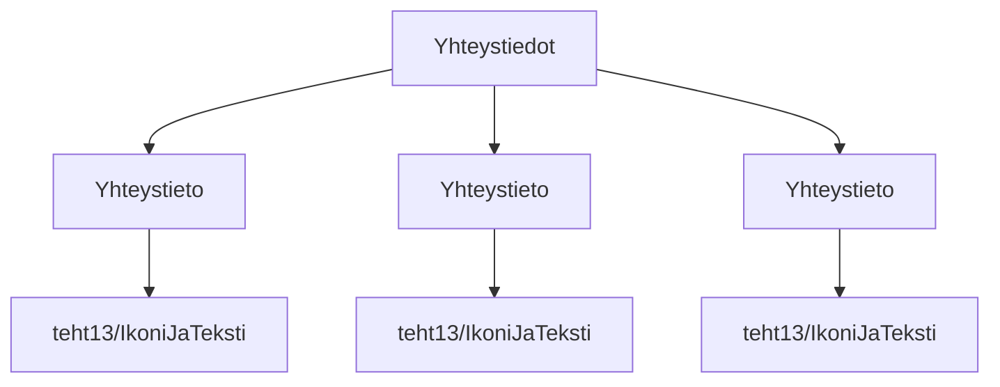

### `teht15`-kansio - yhteystiedot



**palautettavien tiedostojen ja kansioiden nimet:** 

* tiedosto: `teht15/yhteystieto.svelte` (kansiossa: `harjoitukset/02-javascript/01-svelte/teht15/yhteystieto.svelte`)
* tiedosto: `teht15/yhteystiedot.svelte` (kansiossa: `harjoitukset/02-javascript/01-svelte/teht15/yhteystiedot.svelte`)

#### yhteystieto-komponentti

`yhteystieto.svelte`-komponentti saa parametrit:

* `kuva` - [merkkijono] kuvan osoite (luultavasti `"/harjoitukset/"`-alkuinen)
* `teksti` - [merkkijono] kuvan vieressä näytettävä teksti

Komponenttia käytetään:

_`yhteystiedot.svelte`:_

```svelte
<Yhteystieto kuva="" teksti="" />
```

Komponentti näyttää `kuva`-parametrina annetun ikonin (siis kuvan).

Voit itse valita mitä ikoneita haluat näyttää mitäkin tyyppiä kohden.

Näyttää `ikoni-ja-teksti.svelte`-komponentin, jolle antaa `kuva`- ja `teksti`-parametreina jatkojalostamansa tiedot.
`teksti`-parametrin arvon voi antaa eteenpäin sellaisenaan.

#### yhteystiedot-komponentti

Yhteystiedot näyttää useamman `yhteystieto.svelte`-komponentin,
samaan tapaan kuin edellisessä tehtävässä näytettiin `yhteiso.svelte`-komponentteja.
