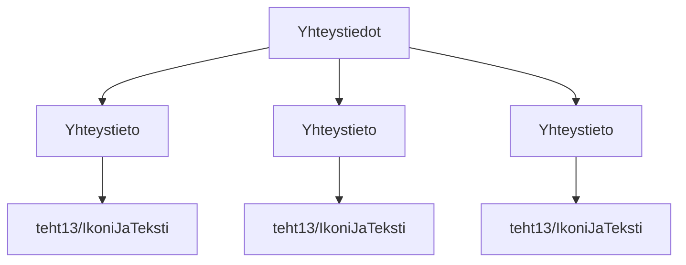

# Tehtäväsarja 6: Tehtävä 9 - `teht15`-kansio - yhteystiedot


```mermaid
graph TD;
  Yhteystiedot-->Yhteystieto1[Yhteystieto];
  Yhteystiedot-->Yhteystieto2[Yhteystieto];
  Yhteystiedot-->Yhteystieto3[Yhteystieto];
  Yhteystieto1[Yhteystieto]-->ti1[teht13/IkoniJaTeksti];
  Yhteystieto2[Yhteystieto]-->ti2[teht13/IkoniJaTeksti];
  Yhteystieto3[Yhteystieto]-->ti3[teht13/IkoniJaTeksti];
```

**muokattavien tiedostojen ja kansioiden nimet:** 

* tiedosto: `teht15/yhteystieto.svelte` (kansiossa: `harjoitukset/02-javascript/01-svelte/teht15/yhteystieto.svelte`)
* tiedosto: `teht15/yhteystiedot.svelte` (kansiossa: `harjoitukset/02-javascript/01-svelte/teht15/yhteystiedot.svelte`)

## yhteystieto-komponentti

Yhteystieto-komponentti vastaa yhteystietojen näyttämisestä mm. asiakaspalvelu- ja yritysmyynti-osioissa.

Komponentti näyttää `kuva`-parametrina annetun ikonin (siis kuvan).

Voit itse valita mitä ikoneita haluat näyttää mitäkin tyyppiä kohden.

Näyttää `ikoni-ja-teksti.svelte`-komponentin, jolle antaa `kuva`- ja `teksti`-parametreina jatkojalostamansa tiedot.
`teksti`-parametrin arvon voi antaa eteenpäin sellaisenaan.

### propsit:

`teht15/yhteystieto.svelte`-komponentti saa parametrit:

* `kuva` - [merkkijono] kuvan osoite (luultavasti `"/harjoitukset/"`-alkuinen)
* `teksti` - [merkkijono] kuvan vieressä näytettävä teksti

### käyttö

Komponentti lukee `ikoni-ja-teksti`-komponentin ja ottaa propsit vastaan:

`teht15/yhteystieto.svelte`:

```svelte
<script>
  import IkoniJaTeksti from "teht13/ikoni-ja-teksti.svelte";

  let { kuva, teksti } = $props(); 
</script>
```

Ja näyttää ne, vaikka seuraavasti:

`teht15/yhteystieto.svelte`:

```svelte
<IkoniJaTeksti kuva={kuva} teksti={teksti} />
```

Komponenttia itseään käytetään:

_`teht15/yhteystiedot.svelte`:_

```svelte
<Yhteystieto kuva="" teksti="" />
```

## yhteystiedot-komponentti

Yhteystiedot näyttää useamman `yhteystieto.svelte`-komponentin listassa,
samaan tapaan kuin edellisessä tehtävässä näytettiin `yhteiso.svelte`-komponentteja.
