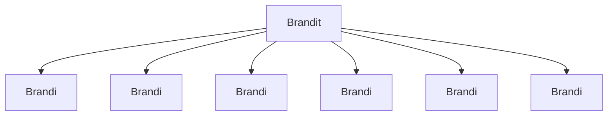

### `teht16`-kansio - shop-in-shops -listaus

**palautettavien tiedostojen ja kansioiden nimet:** 

* tiedosto: `teht16/brandi.svelte` (kansiossa: `harjoitukset/02-javascript/01-svelte/teht16/brandi.svelte`)
* tiedosto: `teht16/brandit.svelte` (kansiossa: `harjoitukset/02-javascript/01-svelte/teht16/brandit.svelte`)

Brandi-komponentti saa parametrina:

* `url` - url brandin sivulle
* `nimi` - nimi

Huomaa, että tarvitset kaksi `ul`-elementtiä.

Tyylittelyn apuna tarvitset taas luultavasti seuraavia sääntöjä:

* `flex-wrap: wrap;`
