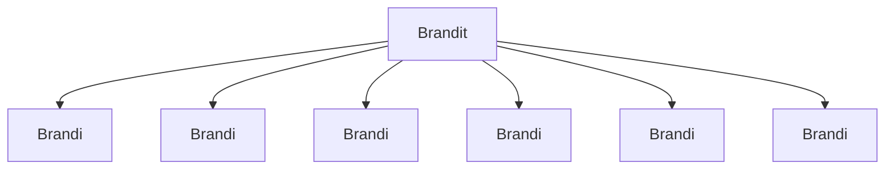

# Tehtäväsarja 6: Tehtävä 10 - `teht16`-kansio - shop-in-shops -listaus

Tässä tehtävässä luomme komponentit joiden avulla pystymme näyttämään shop is shops -osion listat.

```mermaid
graph TD;
  Brandit-->Brandi1[Brandi];
  Brandit-->Brandi2[Brandi];
  Brandit-->Brandi3[Brandi];
  Brandit-->Brandi4[Brandi];
  Brandit-->Brandi5[Brandi];
  Brandit-->Brandi6[Brandi];
```

**muokattavien tiedostojen ja kansioiden nimet:**

* tiedosto: `teht16/brandi.svelte` (kansiossa: `harjoitukset/02-javascript/01-svelte/teht16/brandi.svelte`)
* tiedosto: `teht16/brandit.svelte` (kansiossa: `harjoitukset/02-javascript/01-svelte/teht16/brandit.svelte`)

## Brandi-komponentti

### propsit:

`teht16/brandi.svelte`-komponentti saa parametrit:

* `url` - url brandin sivulle
* `nimi` - nimi

## Brandit-komponentti

Tältä osin voit valita vastaako `teht16/brandit.svelte`-komponentti yhden vai kahden listan tekemisestä.

Referenssistä voit tarkistaa, että shop in shops -osiossa olisi tarkoitus näyttää allekkain, kaksi samanlaista listaa.

Voi tältä osin päättää, näyttääkö tämä komponentti vain yksittäisen sellaisen listan, vai näyttääkö se molemmat.

Jos tämä tiedosto vastaa vain yhden listan näyttämisestä, silloin molempien listojen näyttämisestä tulee vastata `teht23/shop-in-shops.svelte`-tiedostossa. Toisin sanoen, silloin `shop-in-shops.svelte` näyttää kaksi kertaa tämän komponentin. Tämä on ehkä suositeltava tapa toteuttaa listat.
