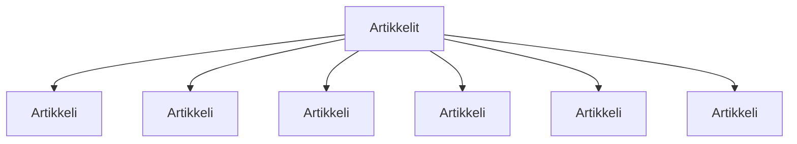

### `teht17`-kansio - artikkelit ja blogit -listaus

Nämä komponentit määrittävät "Artikkelit ja blogit"-otsikon alla näkyvän artikkeli listauksen.

Referenssissä artikkeleja on vain kaksi,
mutta voit halutessasi listata niitä enemmänkin.

**palautettavien tiedostojen ja kansioiden nimet:** 

* tiedosto: `teht17/artikkeli.svelte` (kansiossa: `harjoitukset/02-javascript/01-svelte/teht17/artikkeli.svelte`)
* tiedosto: `teht17/artikkelit.svelte` (kansiossa: `harjoitukset/02-javascript/01-svelte/teht17/artikkelit.svelte`)

Artikkeli-komponentti saa parametrina:

* `url` - url artikkeliin
* `nimi` - artikkelin nimi

Tee komponentit taas samoin kuin edellisissä tehtävissä.
