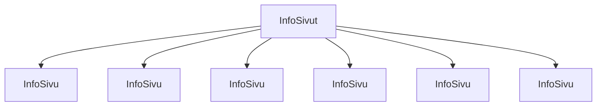

### `teht18`-kansio - infot-listaus

Alapalkin "info"-otsikon alla näkyvä info-listaus.

**palautettavien tiedostojen ja kansioiden nimet:** 

* tiedosto: `teht18/info-sivu.svelte` (kansiossa: `harjoitukset/02-javascript/01-svelte/teht18/info-sivu.svelte`)
* tiedosto: `teht18/info-sivut.svelte` (kansiossa: `harjoitukset/02-javascript/01-svelte/teht18/info-sivut.svelte`)

info-sivu -komponentti saa parametrina:

* `url` - url sivulle
* `nimi` - nimi

Käytä `info-sivu.svelte`-komponentissa apuna `ikoni-ja-teksti.svelte`-komponenttia.

Tee komponentit taas samoin kuin edellisissä tehtävissä.
