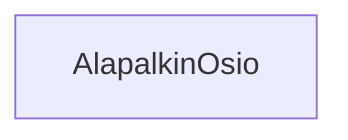

### Tehtäväsarja 6: Tehtävä 14 - `teht21`-kansio - alapalkin osio

**muokattavien tiedostojen ja kansioiden nimet:** 

* tiedosto: `teht21/alapalkin-osio.svelte` (kansiossa: `harjoitukset/02-javascript/01-svelte/teht21/alapalkin-osio.svelte`)

Komponentti, joka vastaa otsikon ja otsikkoa vastaavan sisällön näyttämisestä.

## Tehtävä

Olemmekin jo aiemmin toteuttaneet tämän komponentin perustoiminnallisuuden.

Tarkista vielä, tarvitseeko komponentin html-rakenne muutoksia. Jos tarvitsee, nyt on siihen oiva paikka.
