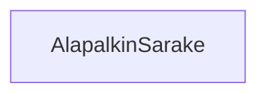

# `teht22`-kansio - alapalkin sarake

**palautettavien tiedostojen ja kansioiden nimet:** 

* tiedosto: `teht22/alapalkin-sarake.svelte` (kansiossa: `harjoitukset/02-javascript/01-svelte/teht22/alapalkin-sarake.svelte`)

Vastaa alapalkin sarakkeiden piirtämisestä. Keskeinen vastuualue on varmistaa, 
että viereisten sarakkeiden kanssa vie saman verran horisontaalista tilaa.

## Tehtävä

Olemmekin jo aiemmin toteuttaneet tämän komponentin perustoiminnallisuuden.

Tällä kertaa riittää miettiä,
millaisia tyylejä komponentti tarvitsisi