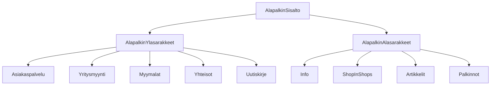

### `teht23`-kansio - alapalkin sisältö

Kansio sisältää komponentit,
joilla määritetään alapalkin harmaa osio.

Näissä komponenteissa ei tulisi käyttää juurikaan html-elementtejä,
vaan toteuttaa toiminnallisuudet käyttäen aiemmin luotuja komponentteja.
Voit kuitenkin mahdollisesti pienimuotoisesti tarvita näissäkin html-elementtejä.

**palautettavien tiedostojen ja kansioiden nimet:** 

* tiedosto: `teht23/alapalkin-sisalto.svelte` (kansiossa: `harjoitukset/02-javascript/01-svelte/teht23/alapalkin-sisalto.svelte`)
* tiedosto: `teht23/alapalkin-ylasarakkeet.svelte` (kansiossa: `harjoitukset/02-javascript/01-svelte/teht23/alapalkin-ylasarakkeet.svelte`)
* tiedosto: `teht23/alapalkin-alasarakkeet.svelte` (kansiossa: `harjoitukset/02-javascript/01-svelte/teht23/alapalkin-alasarakkeet.svelte`)
* tiedosto: `teht23/asiakaspalvelu-yritysmyynti.svelte` (kansiossa: `harjoitukset/02-javascript/01-svelte/teht23/asiakaspalvelu-yritysmyynti.svelte`)
* tiedosto: `teht23/asiakaspalvelu.svelte` (kansiossa: `harjoitukset/02-javascript/01-svelte/teht23/asiakaspalvelu.svelte`)
* tiedosto: `teht23/yritysmyynti.svelte` (kansiossa: `harjoitukset/02-javascript/01-svelte/teht23/yritysmyynti.svelte`)
* tiedosto: `teht23/myymalat.svelte` (kansiossa: `harjoitukset/02-javascript/01-svelte/teht23/myymalat.svelte`)
* tiedosto: `teht23/yhteisot.svelte` (kansiossa: `harjoitukset/02-javascript/01-svelte/teht23/yhteisot.svelte`)
* tiedosto: `teht23/uutiskirje.svelte` (kansiossa: `harjoitukset/02-javascript/01-svelte/teht23/uutiskirje.svelte`)
* tiedosto: `teht23/info.svelte` (kansiossa: `harjoitukset/02-javascript/01-svelte/teht23/info.svelte`)
* tiedosto: `teht23/shop-in-shops.svelte` (kansiossa: `harjoitukset/02-javascript/01-svelte/teht23/shop-in-shops.svelte`)
* tiedosto: `teht23/artikkelit.svelte` (kansiossa: `harjoitukset/02-javascript/01-svelte/teht23/artikkelit.svelte`)
* tiedosto: `teht23/palkinnot.svelte` (kansiossa: `harjoitukset/02-javascript/01-svelte/teht23/palkinnot.svelte`)

`alapalkin-sisalto.svelte`-komponentti näyttää kaiken alapalkin sisällön, joka näkyy alapalkin harmaalla alueella.

`alapalkin-ylasarakkeet.svelte`-komponentti näyttää kaikki alapalkin yläosan sarakkeet: 

* asiakaspalvelu ja yritysmyynti,
* myymälät,
* yhteisöt,
* uutiskirje

`alapalkin-ylasarakkeet.svelte`-komponentti näyttää kaikki alapalkin alaosan sarakkeet:

* info
* shop-in-shops
* artikkelit
* palkinnot 

Muut sarakekomponentit näyttävät saman nimisen sarakkeen tai sarakkeen osan (asiakaspavelu, yritysmyynti) alapalkista.

## Huomioita toteutuksesta

Käytä tähän aiemmin luotuja komponentteja, ja syötä niille parametrit, 
joilla saat tehtyä alapalkista referenssiä vastaavan näköisen.
Voit käyttää linkkien osoitteiden arvona `"#"`- relatiivista urlia.

`alapalkin-sisalto`-komponentti ei itse saa suoraan käyttää yhtään html-elementtiä, 
vaan kaikkien elementtien tulee olla määritetty muiden komponenttien sisällä.
