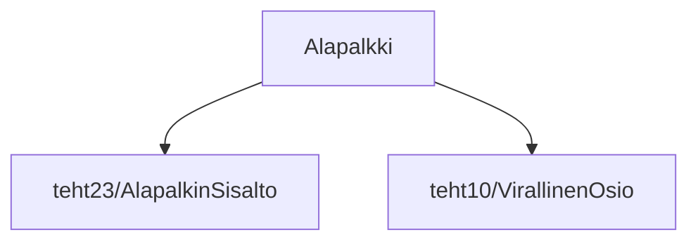

### `teht24`-kansio - alapalkki

Komponentti, joka sitoo yhteen alapalkin harmaan ja mustan osion.

**palautettavien tiedostojen ja kansioiden nimet:** 

* tiedosto: `teht24/alapalkki.svelte` (kansiossa: `harjoitukset/02-javascript/01-svelte/teht24/alapalkki.svelte`)

Näyttää `alapalkin-sisalto.svelte`- ja `virallinen-osio.svelte`-komponentit.
