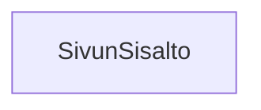

### Tehtäväsarja 6: Tehtävä 18 - `teht26`-kansio - sivun sisältö

Näyttää sivun varsinaisen sisällön, siis valkoisella taustalla olevan osuuden ylä- ja alapalkin välissä.

Tällä kertaa riittää, että sivu näyttää ruudulla tekstin "Tästä löytyy sivun varsinainen sisältö."



**muokattavien tiedostojen ja kansioiden nimet:** 

* tiedosto: `teht26/sivun-sisalto.svelte` (kansiossa: `harjoitukset/02-javascript/01-svelte/teht26/sivun-sisalto.svelte`)

## Toteutus: `main`-elementti

Käytä tässä komponentissa `main`-elementtiä.

`main`-elementti kertoo semanttisesti,
että se sisältää sivun keskeisen sisällön.

```svelte
<main>
    [Tämä osio jätetty tarkoituksella tyhjäksi.]
</main>
```
